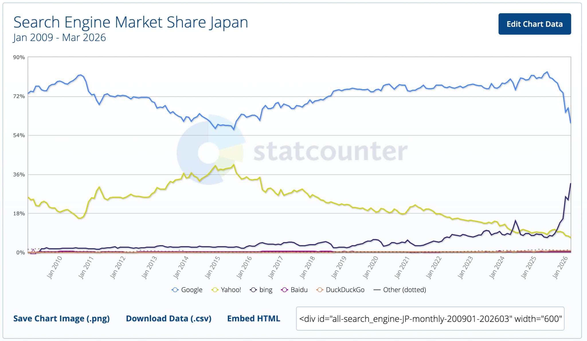

# 第1章　SEO概要

> フェーズ: basic ／ 目安: 約12分

SEOとは何か、検索エンジンの歴史とGoogleの位置づけ、企業がSEOに取り組む目的と課題、SEOで実現できることを理解する

## 学習目標

- SEO（検索エンジン最適化）の定義と、Googleが重視する基本方針を説明できる
- 検索エンジンの歴史と、日本におけるGoogleの位置づけを理解する
- 企業がSEOに取り組む目的と、直面しやすい課題を整理できる
- SEOで実現できること・できないことを区別できる
- 広告（リスティング広告）との違いと使い分けの考え方を理解する

## 本文

### 1. SEOとは

**SEO（Search Engine Optimization／検索エンジン最適化）**とは、GoogleやBingなどの検索エンジンで、ユーザーが検索したキーワードに対して自社のサイトやページが**上位に表示されやすくなるよう、コンテンツやサイト構造を最適化する取り組み**全般を指します。

**【用語定義】**

**SEO（検索エンジン最適化）**
検索エンジンがサイトの内容を正しく理解できるようにし、ユーザーが検索を通じてそのサイトを見つけ、訪問するかどうかを判断しやすくするための一連の施策。「順位を上げるテクニック」ではなく、「検索エンジンとユーザーの両方に価値を伝える設計」がその本質です。

Google自身も公式のSEOスターターガイドで、SEOの目的を次のように位置づけています。

| 用語 | 言い換え | 意味していること |
| --- | --- | --- |
| クロール（Crawling） | 「サイトを見て回る」 | 検索エンジンのロボットがWeb上のページを巡回し、情報を発見すること |
| インデックス（Indexing） | 「情報を登録・整理する」 | クロールした内容を理解し、検索結果に表示できる状態でデータベース化すること |
| ランキング（Ranking） | 「順位をつける」 | 検索クエリに対して、関連性・品質の高いページから順に並べて表示すること |

- **クロール**：サイトを発見・巡回する

- **インデックス**：内容を理解し登録する

- **ランキング**：検索意図に沿って順位付け

- **ユーザー**：検索結果からサイトを訪問

*（図）図1：検索エンジンがページをユーザーに届けるまでの基本プロセス*

**【Point】**

Googleは「ユーザーに焦点を絞れば、他のものはみな後からついてくる」という考え方を基本方針として掲げています。SEOの出発点は検索順位のハックではなく、ユーザーにとって価値のあるコンテンツと使いやすいサイトを作ることです。

### 2. 検索エンジンの歴史とGoogleの位置づけ

SEOを学ぶうえでまず理解しておきたいのが、「相手」である検索エンジンがどのような歴史をたどり、現在どのような位置づけにあるかです。古くから伝わる兵法書「孫子」には「彼を知り己を知れば百戦殆からず」という言葉がありますが、SEOにおいてもまず理解すべき相手は検索エンジンそのものといえます。

検索エンジンの歴史は1994年、米国でYahoo!が開発されたことに始まります。日本では1996年に「Yahoo! JAPAN」が登場し、Webサイトを人力で1つずつ登録・分類する**ディレクトリ型検索**が主流でした。一方、1995年に登場したAltaVistaを先駆けとして、情報収集プログラムが自動的にWebページを巡回し収集する**ロボット型検索**が台頭します。1990年代後半のインターネットの爆発的な成長に人力での分類が対応しきれなくなったことで、1998年に登場したGoogleを中心にロボット型検索エンジンが主流となっていきました。

**【用語定義】**

**ディレクトリ型検索**
Webサイトを人力で確認し、カテゴリごとにツリー構造で分類・登録する検索方式。初期のYahoo!カテゴリなどで採用されていました。

**ロボット型検索**
クローラーと呼ばれる自動巡回プログラムがWebページの情報を収集し、キーワードごとにデータベース化する検索方式。人力に頼らず、Web全体の急激な増加に対応できる点が特徴で、現在の検索エンジンの主流です。

日本国内でも、Yahoo! JAPANは2010年10月にGoogleの検索エンジンを採用し、これによりGoogleが日本の検索エンジンシェアで実質的な主導権を握ることになりました。2018年にはYahoo!カテゴリのサービス自体が終了し、ディレクトリ型検索は歴史的な役割を終えています。

**【Note】**

StatCounterなどの計測データによれば、日本国内の検索エンジン経由の流入は現在もGoogleが最大シェアを占めています。加えて、Yahoo! JAPANも検索エンジンにGoogleの技術を採用しているため、日本で使われている検索の約65〜70％が実質的にGoogleのアルゴリズムで処理されているといわれています。本コースでも、この前提に基づき主にGoogleを対象にSEOを解説します。

*（図）図：日本の検索エンジン市場シェアの推移（2009〜2026年）。Googleが最大シェアを維持し続けている（出典：StatCounter）*

**【Point】**

個別の検索エンジンのシェアの数字を覚えることよりも重要なのは、「人力の時代」から「機械が自動でWebを理解する時代」へと検索エンジンが進化してきたという大きな流れを理解しておくことです。この流れは、後の章で学ぶAI検索の時代にもつながっています。

### 3. SEOの目的

企業がSEOに取り組む目的は、**広告費をかけずに、購買意欲の高い見込み顧客を継続的にサイトへ集客すること**にあります。検索結果で上位に表示されることで、能動的に情報を探しているユーザーとの接点を増やせる点が最大の特徴です。

SEOと広告（リスティング広告）の違い

🌱 SEO（資産型）
- 効果が出るまで数カ月単位の時間がかかる
- 一度上位表示されれば、追加費用なく効果が持続しやすい
- コンテンツが資産として蓄積される

⚡ リスティング広告（即効型）
- 出稿後すぐに検索結果へ表示される
- 掲載順位は入札額・広告の品質に依存する
- 出稿を止めると露出も同時に止まる

**【Note】**

SEOと広告は競合する手段ではなく、補完し合う関係にあります。「今すぐ成果が欲しい施策は広告」「中長期で集客基盤を育てる施策はSEO」というように、事業のフェーズや目的に応じて使い分けることが実務上のセオリーです。

### 4. 企業の課題

SEOは費用対効果に優れる一方で、企業が取り組む際には次のような課題に直面しやすい施策です。

| 課題 | 内容 |
| --- | --- |
| 成果が出るまでに時間がかかる | 新規ページが評価され、順位が安定するまで一般的に3カ月以上かかるとされ、短期的な成果を求める経営判断と摩擦が生じやすい |
| 継続的なメンテナンスが必要 | アルゴリズムの変動や競合の動きに応じて、コンテンツの更新・改善を継続する必要がある |
| 質の低い施策は逆効果になりうる | キーワードの詰め込みや不自然な被リンクなど、検索エンジンのガイドラインに反する手法は、評価を下げるリスクがある |
| 専門知識・人的リソースの不足 | アルゴリズムやツールの理解、コンテンツ制作・分析の体制を社内に持つことが難しい企業も多い |

**【Warning】**

「早く順位を上げたい」という焦りから、検索エンジンを欺くような手法（**スパム的な手法**）に頼ると、一時的に順位が上がってもペナルティによって大きく順位を落とすリスクがあります。中長期の視点を持つことがSEOでは特に重要です。

### 5. SEOでできること

◎

中長期の集客基盤構築

◎

見込み顧客との接点創出

◎

企業・ブランドの信頼構築

SEOによって実現できる主な効果は次のとおりです。

- **能動的なユーザーとの接点を作る：**すでに課題やニーズを持って検索しているユーザーにアプローチできるため、広告よりも成約率が高くなりやすい
- **コンテンツが資産になる：**一度作成し評価されたページは、追加コストをかけずに集客し続けてくれる
- **ブランドや専門性への信頼構築：**有益な情報を継続的に発信することで、企業やサービスへの信頼・認知が高まる

一方で、SEOには**できないこと・不得意なこと**もあります。正しく理解しておくことで、過度な期待や誤った施策を避けられます。

- 掲載順位や集客数を確約すること（検索エンジンのアルゴリズムは非公開かつ変動するため）
- 即日〜数日で大きな成果を出すこと（短期的な即効性は広告の方が高い）
- 需要そのものが存在しないキーワードから新たな需要を生み出すこと

## まとめ

- SEOは検索順位を「買う」ものではなく、検索エンジンとユーザー双方に価値を伝えるための最適化の取り組みである
- 検索エンジンは人力のディレクトリ型からロボット型へと進化し、日本ではYahoo! JAPANもGoogleの検索エンジンを採用しているため、SEOは実質的にGoogle検索への最適化が中心となる
- SEOは中長期で資産として蓄積される集客基盤であり、即効性のある広告とは補完関係にある
- 成果が出るまでの時間、継続メンテナンス、スパム的手法のリスクといった課題を正しく理解しておく必要がある
- SEOは順位や集客数を確約するものではなく、ユーザーの検索意図に応え続けることが本質である

## 確認テスト

### Q1（単一選択）

SEO（検索エンジン最適化）の説明として、最も適切なものはどれか。

- A. 検索エンジンとユーザーの双方にコンテンツの価値が伝わりやすい状態を整え、自然検索での見つけやすさを高める取り組み　✅**（正解）**
- B. 検索結果の広告枠に入札し、費用を払って上位に表示されやすくする取り組み
- C. 対策キーワードを購入した被リンクで補強し、特定キーワードでの1位を確実に取る取り組み
- D. 本文中のキーワード出現率（密度）を一定に保ち、アルゴリズムの計算式に合わせて調整する取り組み

**解説**：SEOは検索エンジンとユーザー双方に価値が伝わる状態を整える取り組みです。広告枠への入札はリスティング広告、被リンク購入やキーワード密度調整はスパム的・時代遅れの手法で、順位の確約もできません。

### Q2（単一選択）

検索エンジンがページをユーザーに届けるまでのプロセスの説明として、正しいものはどれか。

- A. クロールとインデックスは同じ工程であり、その後にランキングが一度だけ行われる
- B. クロールでページを発見し、インデックスで内容を解析・登録し、ランキングで検索クエリに応じて順位付けする　✅**（正解）**
- C. インデックス済みのページだけをクロールし、順位はユーザーのクリック数のみで決まる
- D. 公開したページは自動的にすべてインデックスされ、順位はドメインの古さで決まる

**解説**：処理は「クロール（発見）→インデックス（解析・登録）→ランキング（順位付け）」の順です。クロールとインデックスは別工程で、順位はクリック数やドメインの古さだけで決まるものではありません。

### Q3（単一選択）

検索エンジンの歴史に関する説明として、最も適切なものはどれか。

- A. ロボット型は精度が低く一時的に使われただけで、現在は再びディレクトリ型が主流に戻っている
- B. ディレクトリ型とロボット型はほぼ同時期に登場し、現在も両者が同程度に使われている
- C. 初期は人力でサイトを分類するディレクトリ型が使われたが、Webの急増を背景にロボット型が主流になった　✅**（正解）**
- D. 検索エンジンは当初から全文検索のロボット型のみで、人力による分類が行われたことはない

**解説**：初期はディレクトリ型（人力分類）が主流でしたが、Webの急激な増加に対応するためロボット型（自動巡回）が主流になりました。現在はロボット型が中心です。

### Q4（単一選択）

日本におけるGoogleの位置づけに関する説明として、最も適切なものはどれか。

- A. Yahoo! JAPANはMicrosoftのBingを採用しているため、日本ではBing向けの対策が中心になる
- B. 日本ではGoogleとYahoo!がそれぞれ独自エンジンで拮抗しており、別々のアルゴリズムで動いている
- C. Yahoo! JAPANは2010年以降Googleの採用をやめ、独自エンジンに戻している
- D. Yahoo! JAPANも検索エンジンにGoogleの技術を採用しており、日本の検索の多くが実質的にGoogleのアルゴリズムで処理されている　✅**（正解）**

**解説**：Yahoo! JAPANは2010年からGoogleの検索技術を採用しており、日本の検索の多くが実質的にGoogleのアルゴリズムで処理されています。BingやYahoo!独自エンジンが中心という説明は誤りです。

### Q5（単一選択）

SEOとリスティング広告の違いに関する説明として、正しいものはどれか。

- A. SEOは成果が出るまで時間がかかるが、上位化後は追加費用なく効果が持続しやすく、中長期の費用対効果に優れる傾向がある　✅**（正解）**
- B. 広告は出稿を止めても効果が持続するが、SEOは対策を止めると順位が即座に消える
- C. SEOは即効性が高く、広告は効果が出るまで数カ月かかるのが一般的である
- D. SEOも広告も、表示順位は入札額の高さで決まる点が共通している

**解説**：SEOは時間がかかる一方、蓄積されて中長期の費用対効果に優れます。即効性は広告の特徴で、出稿を止めると露出も止まります。入札額で順位が決まるのは広告のみです。

### Q6（複数選択）

企業がSEOに取り組む際に直面しやすい課題として、正しいものをすべて選べ。

- A. 出稿を停止すると同時に、それまでの効果もすべて消える
- B. 費用を支払えば、Googleに掲載順位を確約してもらえる
- C. ガイドラインに反する質の低い施策は、評価を下げるリスクがある　✅**（正解）**
- D. アルゴリズムの変動に応じた継続的なメンテナンスが必要になる　✅**（正解）**
- E. 成果が出るまでに一定の時間がかかる　✅**（正解）**

**解説**：時間・継続メンテナンス・スパム的手法のリスクはSEOの課題です。『出稿停止で効果が消える』のは広告の特徴であり、順位を費用で確約することはできません。

### Q7（単一選択）

SEOで「できないこと」として、最も適切なものはどれか。

- A. ユーザーの検索意図に合わせてコンテンツを継続的に改善すること
- B. 特定キーワードでの掲載順位や集客数を確約すること　✅**（正解）**
- C. 構造化データを用いてリッチリザルト表示の対象になりうる状態を整えること
- D. 内部リンクを整理してクローラーの巡回や回遊性を高めること

**解説**：アルゴリズムは非公開かつ変動するため、順位や集客数の『確約』はできません。B・C・DはいずれもSEOで実際に取り組める（できる）ことです。

### Q8（単一選択）

Google SEOスターターガイドが「Googleが重要でない（ランキングにほぼ影響しない）と考えている」としているものはどれか。

- A. 内部リンクでサイト内のページ同士を適切につなぐこと
- B. ページのタイトル（title要素）を内容に合わせて設定すること
- C. keywords（キーワード）メタタグに対策キーワードを列挙すること　✅**（正解）**
- D. ユーザーの検索意図に合った本文コンテンツを用意すること

**解説**：Google検索は keywords（キーワード）メタタグをランキングに利用しません。内部リンク・title・検索意図に合うコンテンツはいずれも有効な施策です。（スターターガイド『Googleが重要でないと考えること』）

### Q9（単一選択）

公開したばかりのページがGoogle検索結果に表示されるまでの考え方として、ガイドの記述に最も近いものはどれか。

- A. 公開すれば通常は数分以内に必ず表示される
- B. サイトマップを送信した瞬間に全ページが反映される
- C. Search Consoleでリクエストすれば即座に上位表示される
- D. クロールとインデックスに数日〜数週間かかることがあり、必ず表示される保証もない　✅**（正解）**

**解説**：検索結果への反映にはクロール・インデックスの工程があり、数日〜数週間かかることがあります。そもそもインデックスされる保証もありません。（スターターガイド『検索結果への反映にかかる時間』）
