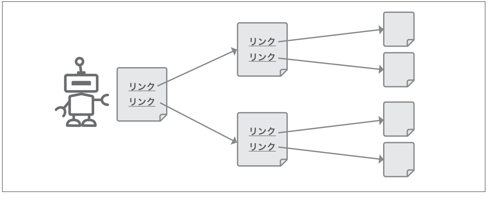

# 第2章　Googleの検索の仕組み

> フェーズ: basic ／ 目安: 約16分

検索エンジンがWebページを発見し、ユーザーに届けるまでの3つのプロセスと、検索意図の考え方を理解する

## 学習目標

- クローリング・インデックス・ランキングという3段階のプロセスをそれぞれ説明できる
- クローラーがサイトを発見・巡回する仕組みの基本を理解する
- インデックスされないとどうなるかを理解する
- 検索意図（Know・Do・Go・Buyクエリ）の考え方を理解し、コンテンツ設計に活かせる
- 検索クエリのより詳細な分類（Website・Visit-in-Person・Commercial query）とゼロクリック検索の考え方を理解する

## 本文

### 1. クローリング：サイトを発見・巡回する

Googleが新しいページを検索結果に表示するには、まずそのページの存在を**発見**する必要があります。この最初のプロセスが**クローリング（Crawling）**です。

**【用語定義】**

**クローラー（Crawler）**
Webページを自動的に巡回し、内容を収集するプログラム。Googleのクローラーは「Googlebot」と呼ばれます。既知のページに含まれるリンクをたどったり、サイト運営者が送信したXMLサイトマップを手がかりにしたりして、新しいページを発見します。

*（図）図：クローラーは既知のページに含まれるリンクをたどり、次々に新しいページを発見していく*

クローラーは発見したページのHTML・画像・動画などのコンテンツを取得し、次のインデックスの工程に渡します。ただし、`robots.txt`で明示的にブロックされたページや、サーバーエラーが頻発するページはクロールされない、または後回しにされることがあります。

Webサイトは新しいページの追加や更新など常に変化しているため、クロール処理はGoogleによって常時実行されています。Googleは、過去にクロールしたページがどのくらいの頻度で更新されているかを学習し、更新頻度の高いサイトはより頻繁に、更新の少ないサイトはやや間隔を空けてクロールするなど、**クロールの頻度を対象ごとに調整している**とされています。

**【Note】**

新しく公開したページがすぐにクロールされるとは限りません。サイトの更新頻度や規模、他のページからのリンク状況などによってクロールされるタイミングは変わります。

### 2. インデックス：内容を理解し登録する

クロールされたページは、その内容が解析され、Googleの巨大なデータベースに登録されます。このプロセスを**インデックス（Indexing）**と呼びます。

**【用語定義】**

**インデックス（索引）**
Googleがクロールしたページの内容を解析し、「このページはどんなキーワードに関連する、どんな内容か」を検索用データベースに登録すること。インデックスに登録されて初めて、そのページは検索結果に表示される対象になります。

| 状態 | 検索結果への影響 |
| --- | --- |
| クロールされ、インデックスされている | 検索結果に表示される可能性がある |
| クロールされたが、インデックスされていない | 検索結果には表示されない（重複コンテンツ、低品質と判断された場合など） |
| そもそもクロールされていない | 検索結果には表示されない |

**【Note】**

Googleのインデックスには数千億ページ規模のWebページが登録されているといわれます。このような膨大な情報を素早く検索結果に反映するため、Googleは2010年に「Caffeine」と呼ばれるインデックスシステムを構築し、検索結果の鮮度と更新速度を大きく向上させました。現在の検索エンジンは、新しい情報をより早く検索結果に反映できる仕組みの上に成り立っています。

**【Warning】**

ページを作成しただけでは検索結果に表示されません。**インデックスに登録されているかどうか**は、後の章で学ぶSearch Consoleの「URL検査」ツールで確認できます。

### 3. ランキング：検索意図に沿って順位付け

ユーザーが検索キーワードを入力すると、Googleはインデックスの中から関連性の高いページを抽出し、**ランキング（Ranking）**という順位付けの処理を行います。この処理は、大きく分けると次の3つのステップで構成されているとされています。

- **検索クエリの分析：**機械学習モデルを用いて、入力された検索クエリの意味や意図を解釈する
- **検索意図に基づく情報の抽出：**文脈や関連性、過去の検索傾向などを考慮しながら、インデックスの中から候補となるページを絞り込む
- **ページのランキング：**絞り込まれたページ群を、検索クエリに対して有益である可能性が高いと推定される順に並び替える

Google自身の説明によれば、ランキングは単一の指標ではなく、**検索クエリとの関連性、コンテンツの品質、ユーザーにとっての有用性**など、数多くの要素（シグナル）を組み合わせて決定される仕組みです。個々のシグナルの正確な計算式や重み付けは公開されていません。

- **クローリング**：ページを発見する

- **インデックス**：内容を解析・登録する

- **ランキング**：関連性・品質で順位付け

*（図）図1：検索結果が表示されるまでの3段階*

**【Point】**

「ランキング要因を1つハックすれば上位表示される」という単純な仕組みではありません。ユーザーの検索意図に合致した、質の高いコンテンツを提供することが、遠回りに見えて最も確実なアプローチです。

### 4. 検索クエリの意図を理解する仕組み

Googleは、検索クエリの背後にある意図をより正確に理解するため、機械学習を活用したシステムを検索に組み込んでいます。Google Search Central（公式ドキュメント）では、代表的なものとして次のシステムが紹介されています。

**【用語定義】**

**RankBrain**
2015年に導入された機械学習ベースのシステム。検索クエリに含まれる単語をそのまま一致させるのではなく、クエリ全体の意味や文脈を解釈し、単語同士がどのような概念と関連しているかを理解する助けとなります。過去に例が少ない、新規・珍しい検索クエリの処理に強みを持ちます。

**BERT**
2018年に導入された双方向の言語モデル。単語の組み合わせが表す意味や意図の違いを理解するために使われます。文中の単語同士の関係性を踏まえて文脈に沿った意図の理解を助け、特に長文や会話的な検索クエリの解釈に強みを持ちます。

**ニューラルマッチング**
2018年に導入された、検索クエリとWebページの内容を意味的に関連付ける仕組み。クエリに含まれる語句とページ内の表現が完全に一致していなくても、概念的に近い内容であれば関連性を見いだせる点が特徴です。

**MUM（Multitask Unified Model）**
2021年に発表された、複数の言語や情報形式（テキスト・画像・動画など）を横断して理解できるモデル。より複雑な検索意図の解釈に活用されています。

**パッセージランキングシステム**
2021年に導入された仕組みで、長文記事や解説記事の中から、検索クエリに最も関連性の高い一部分（パッセージ）を評価・抽出します。ページ全体ではなく、内容の一部を単位として関連性を判断できる点が特徴です。

この他にも、Googleは災害時の情報提供に関わるシステムや、重複コンテンツの整理、最新情報の優先表示、独自性の高いコンテンツの優遇、低品質コンテンツの排除など、目的に応じた多数の検索システムを組み合わせて運用しているとされています。

**【Note】**

これらはGoogleが検索クエリの意図を理解するために活用している技術の一例であり、検索ランキングの仕組み全体からすればごく一部です。個別の技術名を覚えることよりも、**「Googleは単語の完全一致だけでなく、意図や文脈を理解しようとしている」**という方向性を理解しておくことが実務では重要です。これらのシステムはいずれも機械学習・深層学習といったAI技術を前提としており、後の章で学ぶ生成AIとも技術的に地続きの延長線上にあります。

### 5. 検索意図：ユーザーが何を求めているか

同じキーワードで検索しても、ユーザーが本当に求めているもの（**検索意図**）はさまざまです。SEO・コンテンツ設計の実務では、検索クエリを次の4種類に分類して考える方法がよく使われます。

| 分類 | ユーザーの意図 | クエリ例 |
| --- | --- | --- |
| **Know（知りたい）** | 特定のトピックについて知識や情報を得たい | 「SEO とは」「クローリング 意味」 |
| **Do（したい）** | 特定の行動・作業を行いたい | 「画像 圧縮 方法」「確定申告 やり方」 |
| **Go（行きたい）** | 特定のサイト・場所に到達したい（指名検索） | 「〇〇株式会社 公式サイト」「〇〇駅 カフェ」 |
| **Buy（買いたい）** | 商品・サービスを購入・申し込みしたい | 「〇〇 料金」「〇〇 申し込み」 |

この分類は業界で広く使われている考え方であり、Google自身が公式にこの4分類を定義しているわけではありませんが、**コンテンツを作る前に「このキーワードで検索する人は何を求めているか」を具体的に想像するための実務的な枠組み**として役立ちます。

**【Note】**

検索意図とズレたコンテンツ（例：Knowクエリに対して商品購入ページだけを用意する）は、たとえ文章の質が高くても評価されにくい傾向があります。次章以降のキーワード戦略・ライティングSEOでも、この検索意図の考え方が土台になります。

### 6. 検索クエリのさらに詳しい分類と、ゼロクリック検索

Know・Do・Go・Buyの4分類は実務でよく使われる大まかな枠組みですが、より詳細に検索クエリを捉える考え方も知っておくと、コンテンツ設計の精度が上がります。特に「Go（行きたい）」クエリは、実務上さらに2つに分けて考えられることがあります。

| 分類 | ユーザーの意図 | クエリ例 |
| --- | --- | --- |
| Website query（ナビゲーションクエリ） | 特定の1つのWebサイト・ページに到達したい | 「Amazon」「〇〇株式会社」 |
| Visit-in-Person query（訪問目的クエリ） | 自分の近くにある、特定ジャンルの店舗・施設を探したい | 「ラーメン屋」「歯科医」「ガソリンスタンド」 |

Website queryが「1つに特定されるサイト」を探しているのに対し、Visit-in-Person queryは「近くにある複数の候補」を探している点が異なります。モバイル検索の普及にともない、外出先での「近くの〇〇」というローカル検索が増えたことを背景に、このように細分化して捉える考え方が広まりました。

また、購入を検討している段階で比較・レビューなどの情報を探す**Commercial query（比較検討クエリ）**という分類も、SEO業界でよく使われます。「ノートパソコン 比較」「〇〇 評判」のように、単純な情報収集（Know）よりも購買意欲が高く、Knowと購買行動（Do・Buy）の中間に位置するクエリです。

**【用語定義】**

**ゼロクリック検索（Zero-click Search）**
検索結果ページ上で強調スニペットやナレッジパネル、AI Overviewなどによって疑問が解決し、ユーザーがどのサイトもクリックしないまま検索行動が完結すること。特に「富士山 標高」のような一文で答えが出る簡潔な質問（Know Simple Query）で発生しやすいとされています。

**【Point】**

ゼロクリック検索が増えている背景には、モバイル検索や音声検索、AI検索の普及があります。「上位表示させて終わり」ではなく、「検索結果上でどう信頼される答えを示すか」「クリックして訪れたユーザーにどんな付加価値を提供できるか」まで考えることが、これからのコンテンツ設計では重要になります。この視点は第14章（AI OverviewとAI Mode）でさらに詳しく扱います。

## まとめ

- Googleの検索結果は「クローリング（発見）→インデックス（登録）→ランキング（順位付け）」という3段階のプロセスを経て表示される
- クロールされていない、またはインデックスされていないページは検索結果に表示されない
- ランキングは単一の指標ではなく、関連性・品質・有用性など多数のシグナルの組み合わせで決まる
- GoogleはRankBrain・BERT・ニューラルマッチング・MUMなどのAIシステムを活用し、単語の完全一致だけでなく検索クエリの意図や文脈を理解しようとしている
- 検索意図はKnow・Do・Go・Buyの4種類に分類して考えることができ、コンテンツ設計の出発点になる
- Go（行きたい）クエリはWebsite query（指名検索）とVisit-in-Person query（近くの店舗を探す検索）に細分化でき、購入検討段階のCommercial queryという分類もある
- ゼロクリック検索の増加を踏まえ、検索結果上での信頼される見え方と、訪問後の付加価値の両方を意識したコンテンツ設計が重要になっている

## 確認テスト

### Q1（単一選択）

クローリング（Crawling）の説明として、最も適切なものはどれか。

- A. 検索エンジンのロボットがWebページを発見・巡回し、内容を収集するプロセス　✅**（正解）**
- B. 検索結果に表示するページの順位を決めるプロセス
- C. ユーザーが入力した検索キーワードを解析するプロセス
- D. ページの表示速度を計測するプロセス

**解説**：クローリングは検索エンジン（クローラー）がWebページを発見・巡回し、内容を収集する最初のプロセスです。

### Q2（単一選択）

「クロールはされたが、インデックスはされていない」ページについての説明として、正しいものはどれか。

- A. 検索結果に必ず1位で表示される
- B. 検索結果には表示されない　✅**（正解）**
- C. クロールされていないページより優先的に表示される
- D. インデックスの有無は検索結果の表示に影響しない

**解説**：インデックスに登録されて初めて検索結果に表示される対象になります。クロールされてもインデックスされなければ表示されません。

### Q3（単一選択）

Googleのランキングの仕組みに関する説明として、最も適切なものはどれか。

- A. たった1つの指標だけで検索順位がすべて決まる
- B. ページの公開日が新しいページが常に最上位に表示される
- C. 関連性・品質・有用性など、数多くのシグナルを組み合わせて順位が決まる　✅**（正解）**
- D. 広告費を支払ったページが自動的に自然検索結果の1位になる

**解説**：Googleのランキングは単一の指標ではなく、関連性・品質・ユーザーにとっての有用性など多数のシグナルを組み合わせて決定される仕組みです。

### Q4（複数選択）

Google Search Centralで紹介されている、検索クエリの意図理解に使われるシステムとして、正しいものをすべて選べ。

- A. Core Web Vitals
- B. BERT　✅**（正解）**
- C. RankBrain　✅**（正解）**
- D. ニューラルマッチング　✅**（正解）**

**解説**：RankBrain・BERT・ニューラルマッチングはいずれも、検索クエリの意図や文脈の理解を助けるAIシステムです。Core Web Vitalsはページ体験の指標であり、意図理解の仕組みとは異なります。

### Q5（複数選択）

検索意図の分類として、一般的に使われているものをすべて選べ。

- A. Do（したい）　✅**（正解）**
- B. Know（知りたい）　✅**（正解）**
- C. Go（行きたい）　✅**（正解）**
- D. Sell（売りたい）

**解説**：検索意図はKnow（知りたい）・Do（したい）・Go（行きたい）・Buy（買いたい）の4分類で考えるのが一般的です。「Sell（売りたい）」はユーザー側ではなく提供者側の意図であり、検索意図の分類には含まれません。

### Q6（単一選択）

「〇〇株式会社 公式サイト」という検索クエリが該当する検索意図の分類として、最も適切なものはどれか。

- A. Know（知りたい）
- B. Do（したい）
- C. Buy（買いたい）
- D. Go（行きたい）　✅**（正解）**

**解説**：特定のサイトや場所に到達したいという指名検索は「Go（行きたい）」クエリに分類されます。

### Q7（単一選択）

Website queryとVisit-in-Person queryの違いに関する説明として、最も適切なものはどれか。

- A. Website queryは1つに特定されるサイトを探しており、Visit-in-Person queryは近くにある特定ジャンルの複数の店舗・施設を探している　✅**（正解）**
- B. 両者に違いはなく、完全に同じ意味である
- C. Website queryはモバイル検索専用の分類であり、PCでは発生しない
- D. Visit-in-Person queryは購入意欲が最も高いクエリに分類される

**解説**：Website queryは「Amazon」のように1つに特定されるサイトへの到達を目的とするのに対し、Visit-in-Person queryは「近くのラーメン屋」のように特定ジャンルに属する複数の候補を探すクエリです。

### Q8（単一選択）

ゼロクリック検索（Zero-click Search）の説明として、最も適切なものはどれか。

- A. 検索結果に一切ページが表示されない状態のこと
- B. 検索結果ページ上で疑問が解決し、ユーザーがどのサイトもクリックしないまま検索行動が完結すること　✅**（正解）**
- C. 検索エンジンがクロールを一切行わなくなる現象のこと
- D. 広告費がゼロで検索結果に表示される仕組みのこと

**解説**：ゼロクリック検索とは、強調スニペットやナレッジパネル、AI Overviewなどによって検索結果ページ上で疑問が解決し、サイトへのクリックが発生しないまま検索が完結する行動を指します。

### Q9（単一選択）

特定のページをGoogleの検索結果に表示させたくない場合の対応として、ガイドの記述に最も適切なものはどれか。

- A. title要素を空にしてインデックスから外す
- B. ページを一時的にサーバーエラー（5xx）にし続ける
- C. robots.txt での不許可や noindex など、適切な方法でクロール/インデックスを制御する　✅**（正解）**
- D. そのページへの内部リンクをすべて外す

**解説**：表示したくないページは robots.txt でのブロックや noindex など、目的に応じた適切な方法で制御します。リンクを外す・title空・エラー化などは確実な除外方法ではありません。（スターターガイド『Googleの検索結果から除外したい場合』）
