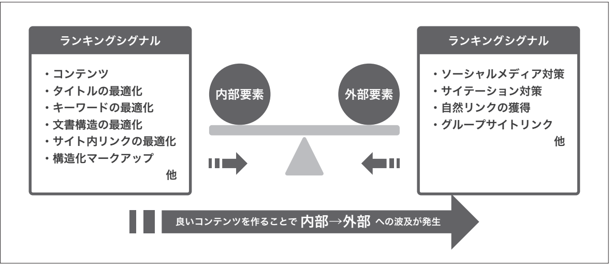

# 第3章　Googleアルゴリズム

> フェーズ: basic ／ 目安: 約14分

Googleの理念、コアアップデートの位置づけ、Googleが重視する品質評価の考え方を理解する

## 学習目標

- Googleの理念と、SEOにおいて取り組むべき3つのプロセスを理解する
- コアアップデートとは何かを説明できる
- コアアップデートが特定のサイトを狙い撃ちするものではないことを理解する
- Googleが重視する「有用で信頼できるコンテンツ」の考え方を理解する
- コンテンツの独自性がなぜ評価に関わるのかを説明できる
- 評価要素を「内部要素」「外部要素」の2つの視点で整理して理解する

## 本文

### 1. Googleの理念とSEOの3つのプロセス

Googleのランキングアルゴリズムを理解するうえで、まず押さえておきたいのが同社が掲げる理念です。Googleは創業当初から**「世界中の情報を整理し、世界中の人がアクセスできて使えるようにする」**というミッションを掲げてきました。この理念は、検索技術やAIの活用が進んだ現在でも、同社のプロダクト開発の根幹に位置づけられているとされています。

Googleの共同創業者であるLarry Page氏は、検索エンジンのあるべき姿について次のように述べたとされています。

**【Note】**

「完璧な検索エンジンとは、ユーザーの意図を正確に把握し、ユーザーのニーズに一致するものを返すエンジンである」

この考え方が示す通り、Googleにとって重要なのは情報を自ら完結させることではなく、**ユーザーの意図を正しく理解し、それに最も適した情報へと導くこと**です。この理念をSEOに落とし込むと、取り組むべきプロセスは次の3つに整理できます。

- **①意図の把握**：求められている情報と、その背後にある意図を把握する

- **②情報の用意**：意図を過不足なく満たす、独自性・信頼性のある情報を用意する

- **③構造の整備**：検索エンジンや生成AIに正しく理解・参照される状態を整える

*（図）図1：Googleの理念から整理される、SEOで取り組むべき3つのプロセス*

**【Point】**

この3つはいずれか1つでも欠けると、検索結果でもAIによる要約・回答でも十分な評価や露出にはつながらないとされています。SEOとは、検索エンジンや生成AIなど情報にたどり着く多様な経路を通じて、ユーザーにとって意味のある情報を適切に届けるための取り組みだといえます。次節以降で学ぶコアアップデートや品質評価の考え方は、いずれもこの理念の延長線上にあります。

### 2. コアアップデートとは

Googleは検索アルゴリズムやランキングシステムを年間を通じて継続的に調整していますが、その中でも特に大規模な変更を**コアアップデート（Core Update）**と呼びます。Google Search Central（公式ドキュメント）では、コアアップデートについて次のように説明されています。

**【用語定義】**

**コアアップデート**
Googleが検索結果の全体的な有用性・信頼性を高めることを目的に行う、検索アルゴリズムおよび関連システムへの広範な変更。特定のサイトや個別のページを狙い撃ちするものではなく、Web全体のコンテンツの変化に合わせてGoogleの評価システムを見直すために実施されます。

**【Point】**

コアアップデートの実施後に自社サイトの順位が変動することがありますが、これは「ペナルティを受けた」という意味ではありません。Googleは、コアアップデートによって多くのサイトは影響を意識しないことが一般的であるとしています。順位が下がった場合は、コンテンツの品質や有用性を見直す機会と捉えるのが実務上の考え方です。

### 3. 品質評価の考え方

Googleは、検索結果の品質を継続的に検証するために、外部の評価者向けの内部マニュアル（一般に「検索品質評価ガイドライン」と呼ばれる）を運用しています。このガイドライン自体が検索順位を直接決めるアルゴリズムではありませんが、**Googleがどのような基準で「良いページ」を判断しようとしているか**を知る手がかりになります。詳しくは第5章「ライティングSEO」でも扱います。

また、Googleは一般のサイト運営者・コンテンツ制作者向けに「役立つコンテンツ」の考え方も公式に公開しています。ここで共通して強調されているのが、次のような視点です。

- そのページは、検索するユーザーにとって**本当に役立つ内容**になっているか
- 専門知識を持つ人物・情報源によって作られているか
- 他のページには無い、**独自の視点・データ・分析**が含まれているか
- 検索エンジン向けにキーワードを詰め込んだだけの、ユーザー不在のコンテンツになっていないか

**【Note】**

Google公式の説明によれば、多くのページの品質は「コンテンツの作成に費やされた労力・独創性・専門性」によって左右されるとされています。他サイトの内容を要約しただけのコンテンツより、独自の情報や視点を加えたコンテンツが重視される傾向にあります。

この考え方が重視されるようになった背景として、2016年のカンファレンス「SMX West」で、Googleの検索アルゴリズムエンジニアであるPaul Haahr氏が語った次の言葉がよく知られています。

**【Note】**

「関連性の評価基準を高くしていたので、2009〜2011年頃には質の低いコンテンツが蔓延してしまった。私たち（Google）は必要なものを測定していなかった」

かつては検索キーワードとの関連性ばかりが重視され、関連性さえ高ければ低品質なコンテンツでも上位表示されてしまうことがありました。この反省を踏まえ、Googleは**コンテンツそのものの品質**を評価する仕組みを強化してきた、という経緯が背景にあります。

### 4. 評価要素を整理する2つの視点：内部要素と外部要素

Googleのランキングアルゴリズムが実際にどの要素をどう重み付けしているかは公開されていません。そのためSEOの実務では、評価に関わる要素を理解しやすくするために、**「内部要素」「外部要素」**という2つの視点に整理して捉えるのが一般的です。この章以降の各テーマは、このどちらか（または両方）に位置づけられます。

- **内部要素**：サイトの中身そのもの
（コンテンツ、E-E-A-T、表示速度、構造化マークアップ など）

- **外部要素**：サイトの外からの評価
（他サイトからのリンクや引用 など）

- **総合的な評価**：複数の要素が組み合わさって判断される

*（図）図1：内部要素と外部要素が組み合わさって評価される*

**内部要素**は、サイト自身でコントロールできる範囲の評価要素です。代表的な例として、次のようなものが挙げられます。

- コンテンツがユーザーニーズを満たしているか
- E-E-A-T（経験・専門性・権威性・信頼性）が担保されているか
- セキュリティ対応がされているか
- 表示速度は十分に高速か、モバイルフレンドリーか
- ユーザー体験は良いものか（Core Web Vitals）
- タイトルタグ・meta description タグの記述が適切か
- 構造化マークアップに対応しているか

これらはあくまで代表的な例であり、この本編では第6章（テクニカルSEO）、第7章（E-E-A-T）などで扱っています。

**外部要素**は、他サイトからどのように参照・引用されているかを示す評価要素です。Googleは「Web上の民主主義は機能する」という考え方のもと、サイトやページがWeb上でどう参照・引用されているかを、情報の信頼性や重要性を判断する手がかりの一つとして扱っています。ただし重視されるのは引用の量そのものではなく、どのような文脈・信頼性を持つサイトから参照されているかという質的な側面です。人工的に作成したサイトからリンクを集めるような手法は、Googleのガイドラインに反する高リスクな行為とされており、業界内で権威あるデータや独自性のあるコンテンツを発信し、結果として自然に被リンクや引用が生まれる状態を目指すことが重要とされています。外部要素については第19章（被リンク・ブランドSEO）で扱っています。

*（図）図2：内部要素（コンテンツ・構造など）の充実が、外部要素（自然な被リンク・引用）へと波及していく*

**【Point】**

重要なのは、内部要素・外部要素いずれも個々の項目を機械的に満たすことではなく、ユーザーにとって価値のある情報が検索エンジンに正しく理解・評価される状態を全体として整えることです。

**【Note】**

2024年には、Googleの検索システムに関する内部文書が漏洩し、Googleが収集している可能性のあるデータの多さが話題になったことがあります。しかし、どのデータが実際のランキングにどの程度使われているかは明らかにされておらず、Google自身も断片的な情報に基づく解釈には注意を促しています。評価要素を理解するうえでは、こうした断片的な情報や推測に依存するのではなく、Googleが公式に発信している資料やガイドラインを継続的に確認する姿勢が大切です。

## まとめ

- Googleは「世界中の情報を整理し、世界中の人がアクセスできて使えるようにする」という理念を掲げており、SEOはこの理念に沿って「意図の把握」「情報の用意」「構造の整備」の3プロセスに取り組むことといえる
- コアアップデートは検索結果全体の有用性・信頼性を高めるためにGoogleが実施する広範なアルゴリズム変更であり、特定サイトへのペナルティではない
- コアアップデート後の順位変動は、コンテンツの品質や有用性を見直す機会と捉えるのが実務上の考え方
- Googleは検索品質評価者向けのガイドラインを運用しており、これは「良いページ」の基準を知る手がかりになる。過去には関連性偏重で低品質コンテンツが蔓延した反省から、品質評価の重要性が増してきた経緯がある
- コンテンツの独自性（独自の視点・データ・分析）は、Googleが重視する品質評価の観点の一つである
- 評価要素はサイトの中身に関する「内部要素」と、外部からの参照・引用に関する「外部要素」の2つの視点で整理できる

## 確認テスト

### Q1（単一選択）

Googleの共同創業者Larry Page氏が述べたとされる「完璧な検索エンジン」の説明として、最も適切なものはどれか。

- A. 広告収益を最大化するエンジン
- B. 最も文字数の多いページを上位表示するエンジン
- C. 検索結果を表示せず、常に1つの答えだけを提示するエンジン
- D. ユーザーの意図を正確に把握し、ユーザーのニーズに一致するものを返すエンジン　✅**（正解）**

**解説**：Larry Page氏は、完璧な検索エンジンとは「ユーザーの意図を正確に把握し、ユーザーのニーズに一致するものを返すエンジンである」と述べたとされています。

### Q2（複数選択）

Googleの理念から整理される、SEOで取り組むべき3つのプロセスとして、正しいものをすべて選べ。

- A. 検索エンジンや生成AIに正しく理解・参照される状態に構造を整える　✅**（正解）**
- B. 検索エンジンを欺く手法で、短期間に順位を押し上げる
- C. 求められている情報と、その背後にある意図を把握する　✅**（正解）**
- D. 意図を過不足なく満たす、独自性・信頼性のある情報を用意する　✅**（正解）**

**解説**：SEOで取り組むべきプロセスは「意図の把握」「情報の用意」「構造の整備」の3つに整理できます。検索エンジンを欺く手法は、これらのいずれにも該当しません。

### Q3（単一選択）

コアアップデートの説明として、最も適切なものはどれか。

- A. 検索結果全体の有用性・信頼性を高めることを目的とした、広範なアルゴリズム変更　✅**（正解）**
- B. 特定の1サイトをターゲットにしてGoogleが行う個別のペナルティ処置
- C. サイト運営者が自分で申請することで受けられる順位向上の施策
- D. 月に一度、必ず同じ日に実施されると決まっている更新

**解説**：コアアップデートは特定のサイトを狙い撃ちするものではなく、検索結果全体の有用性・信頼性を高めることを目的とした広範なアルゴリズム変更です。

### Q4（単一選択）

コアアップデート後に自社サイトの順位が下がった場合の考え方として、最も適切なものはどれか。

- A. 必ずGoogleからペナルティを受けたことを意味する
- B. コンテンツの品質や有用性を見直す一つの機会と捉えるのが実務上の考え方である　✅**（正解）**
- C. 順位が下がった場合は何もせず、Googleに直接抗議すべきである
- D. コアアップデートとサイトの順位変動には一切関係がない

**解説**：コアアップデートによる順位変動は「ペナルティ」ではなく、コンテンツの品質や有用性を見直す機会と捉えるのが実務上の考え方です。

### Q5（複数選択）

Googleが「役立つコンテンツ」を判断する際に重視するとされる観点として、正しいものをすべて選べ。

- A. 検索エンジン向けにキーワードをできる限り多く詰め込んでいるか
- B. 検索するユーザーにとって本当に役立つ内容になっているか　✅**（正解）**
- C. 専門知識を持つ人物・情報源によって作られているか　✅**（正解）**
- D. 他のページには無い、独自の視点・データ・分析が含まれているか　✅**（正解）**

**解説**：ユーザーへの有用性、専門性、独自性が重視される観点です。キーワードを詰め込んだだけのユーザー不在のコンテンツは、むしろ評価されにくい傾向にあります。

### Q6（単一選択）

「検索品質評価ガイドライン」に関する説明として、正しいものはどれか。

- A. 検索順位を自動的に決定するアルゴリズムそのものである
- B. サイト運営者が自分のサイトを自己採点するための公式スコアリングツールである
- C. 外部の評価者向けにGoogleが運用している内部マニュアルであり、Googleが重視する品質の基準を知る手がかりになる　✅**（正解）**
- D. コアアップデートとは無関係の、広告審査専用の文書である

**解説**：検索品質評価ガイドラインは外部評価者向けの内部マニュアルであり、それ自体がランキングアルゴリズムではありませんが、Googleが重視する品質基準を知る手がかりになります。

### Q7（単一選択）

コンテンツの独自性に関するGoogleの考え方として、最も適切なものはどれか。

- A. 他サイトの内容を要約しただけのコンテンツが最も高く評価される
- B. 独自性は検索順位に一切関係しない
- C. 文章の長さだけが独自性の判断基準になる
- D. 独自の視点・データ・分析を含むコンテンツは、品質評価において重視される傾向にある　✅**（正解）**

**解説**：Googleは、独自の視点・データ・分析を含む「そのページでしか得られない価値」があるコンテンツを重視する傾向にあります。

### Q8（複数選択）

「内部要素」に含まれるものとして、正しいものをすべて選べ。

- A. コンテンツがユーザーニーズを満たしているか　✅**（正解）**
- B. 表示速度やモバイル対応　✅**（正解）**
- C. 他サイトからのリンクや引用（サイテーション）
- D. E-E-A-Tが担保されているか　✅**（正解）**

**解説**：内部要素はサイト自身でコントロールできる範囲の評価要素です。他サイトからのリンクや引用は「外部要素」に分類されます。

### Q9（単一選択）

「外部要素」の評価において重視される点として、最も適切なものはどれか。

- A. どのような文脈・信頼性を持つサイトから参照されているかという質的な側面　✅**（正解）**
- B. 他サイトから言及される回数が多ければ多いほど良い
- C. 外部要素はGoogleの評価に一切関係しない
- D. 自社で作成した別サイトから大量にリンクを送ることが最も有効な対策である

**解説**：外部要素で重視されるのは言及の量そのものではなく、どのような文脈・信頼性を持つサイトから参照されているかという質的な側面です。
