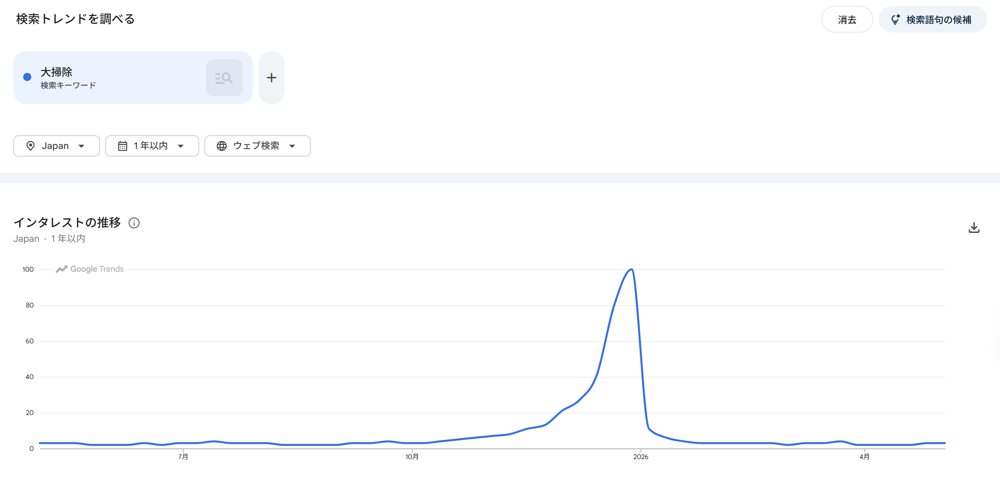
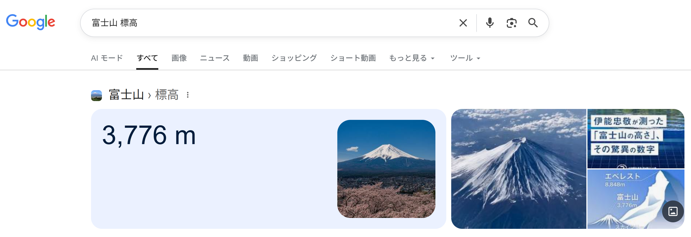
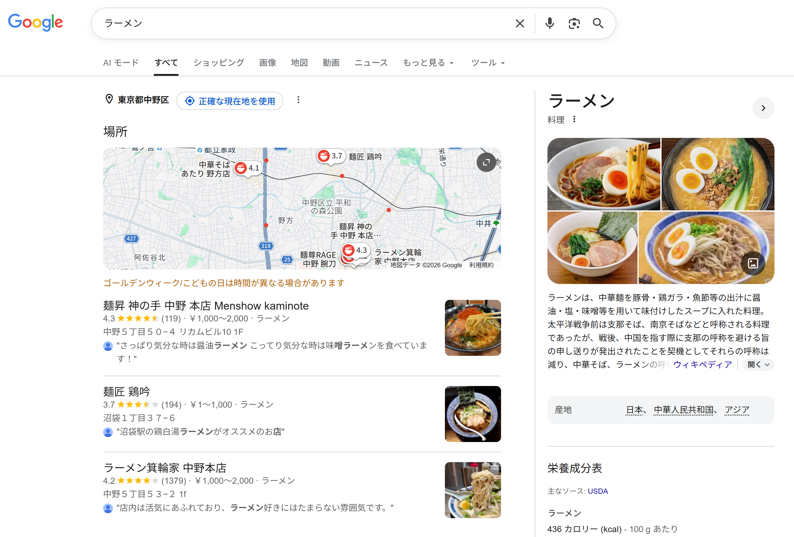
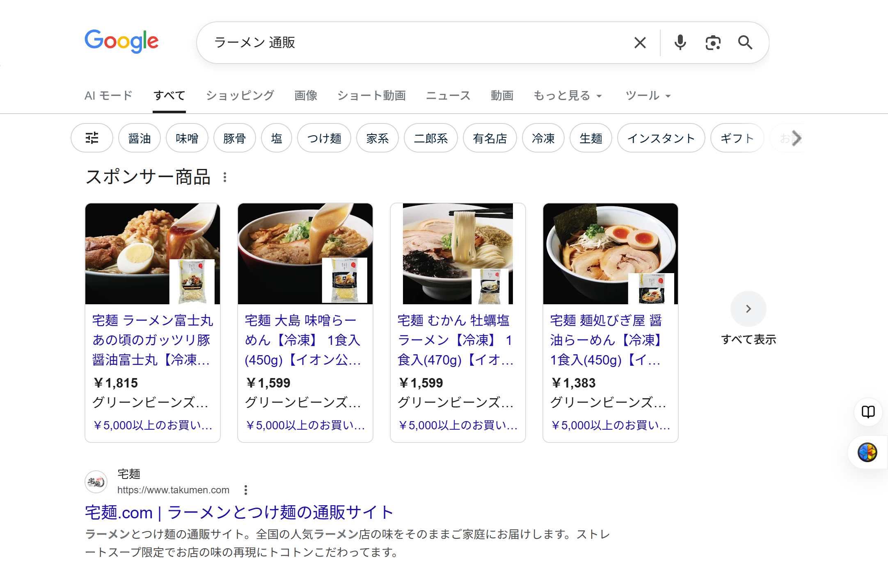
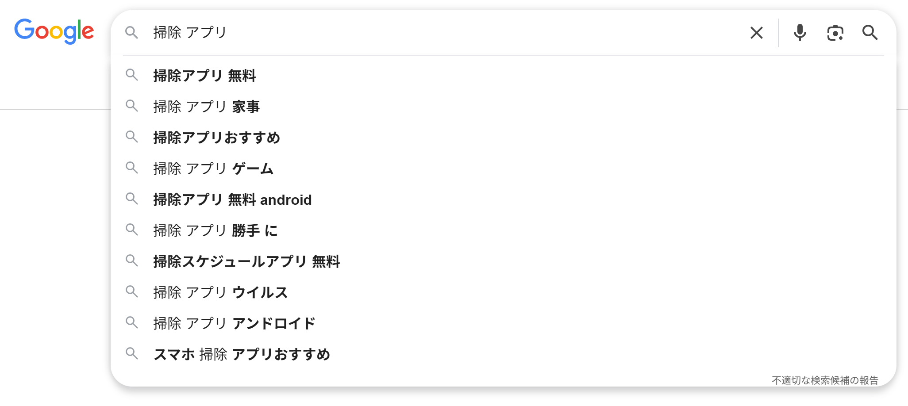
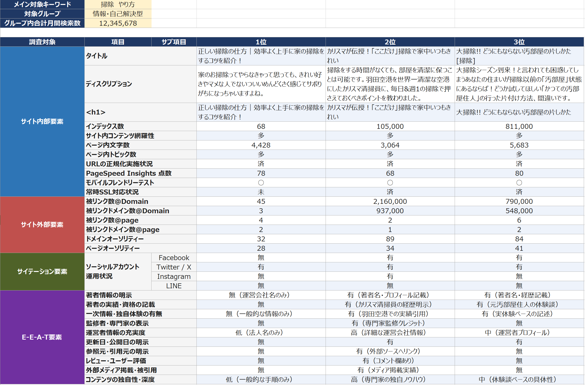
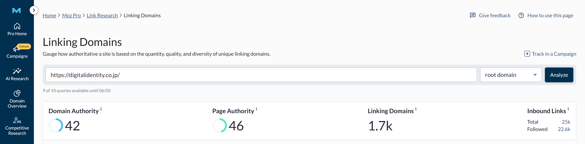
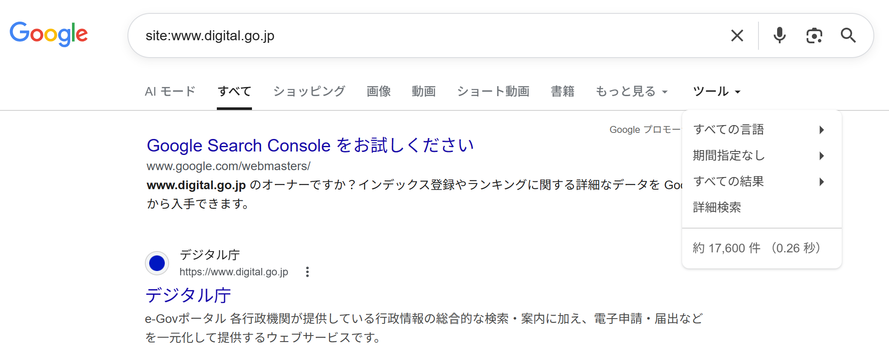

# 第4章　キーワード戦略

> フェーズ: basic ／ 目安: 約18分

検索キーワードの調査方法、検索意図の読み解き方、市場調査によるニーズの把握、トピック設計、競合分析の基本を理解する

## 学習目標

- 検索ボリュームとキーワード調査の基本的な進め方を理解する
- メインキーワードとロングテールキーワードの違いを説明できる
- 軸キーワードからのキーワード洗い出しと、ニーズごとのグルーピングの考え方を理解する
- 想起度・行動意欲によるニーズグループのマッピングの考え方を理解する
- トピッククラスター（ピラーページとクラスターページ）の考え方を理解する
- 競合分析・コンテンツギャップ分析の基本的な考え方を理解する

## 本文

### 1. 調査：検索キーワードの調べ方

SEOのコンテンツ設計は、まず「どんなキーワードで検索されているか」を調べることから始まります。この際によく使われる指標が**検索ボリューム**です。

**【用語定義】**

**検索ボリューム**
特定のキーワードが、一定期間（多くの場合1ヶ月）に検索エンジンで検索された回数の目安。GoogleキーワードプランナーなどのツールでGoogle広告のデータをもとに確認できます。

キーワード調査は、一般的に次のような手順で進められます。

- **メインキーワードの選定：**サイトやコンテンツのテーマと関連性の高い、軸となるキーワードを決める
- **複合キーワードの洗い出し：**メインキーワードに関連する複数語の組み合わせ（サジェストキーワードなど）を広げる
- **検索ボリューム・競合性の確認：**ツールを使って、それぞれのキーワードがどの程度検索されているか、上位表示の難易度はどうかを確認する

**【Note】**

検索ボリュームが大きいキーワードほど流入のポテンシャルは大きい一方、競合も多く上位表示の難易度が上がる傾向があります。ボリュームと難易度のバランスを見ながら狙うキーワードを選ぶことが重要です。

例：あるユーザーが「近くのカフェを探す」ために、検索する言葉をだんだん具体的にしていく様子

- **カフェ**：検索回数：多い
競合：強い

- **カフェ 新宿**：場所を追加
検索回数：中くらい

- **カフェ 新宿 深夜営業**：条件を追加
検索回数：少ない＝狙い目

*（図）図1：検索する人は「カフェ」→「カフェ 新宿」→「カフェ 新宿 深夜営業」のように、自分の状況（場所・条件）を言葉に足しながら絞り込んでいく。言葉が増えるほど検索回数は減るが、競合も弱くなり上位表示を狙いやすくなる*

*（図）図2：Googleトレンドで季節性のあるキーワード「大掃除」の検索インタレスト推移を確認した例。年末に需要が急増するとわかる*

### 2. 検索意図をキーワード調査に活かす

第2章で学んだ検索意図（Know・Do・Go・Buy）の考え方は、キーワード調査の段階でも重要です。同じ検索ボリュームのキーワードでも、検索意図が異なれば用意すべきコンテンツは変わります。

| キーワード例 | 推定される検索意図 | 用意すべきコンテンツの方向性 |
| --- | --- | --- |
| 「SEO とは」 | Know（知りたい） | 基礎知識を解説する記事 |
| 「SEO 対策 やり方」 | Do（したい） | 手順を示すハウツー記事 |
| 「SEO ツール 比較」 | Buyに近いDo | 比較・検討を助けるコンテンツ |

**【Point】**

キーワード単体の検索ボリュームだけでなく、「そのキーワードで検索する人が本当は何を求めているか」を合わせて考えることで、狙うべきコンテンツの形が明確になります。

*（図）図：Know（知りたい）意図の「富士山 標高」では、答えを端的に示すナレッジパネルが表示される*

*（図）図：Go（近くで探したい）意図の「ラーメン」では、地図と店舗一覧が表示される*

*（図）図：Buy（買いたい）意図の「ラーメン 通販」では、ショッピング広告や通販サイトが上位に表示される*

### 3. 調査：軸キーワードからのキーワード洗い出し

個別のキーワードを思いつくままに調べるのではなく、サイト全体の市場を俯瞰するには、まず**軸キーワード**を起点に、関連キーワードを網羅的に広げていく進め方が有効です。

**【用語定義】**

**軸キーワード**
自社にとって重要かつ関連性が最も高い、検索意図の幅が広い単一のキーワード。例えば掃除機の販売サイトであれば「掃除機」、賃貸不動産サイトであれば「賃貸」が該当します。複数語の組み合わせにすると検索意図が限定されすぎるため、まずは幅広い単語を軸に選びます。

軸キーワードを決めたら、次の2つの方法でキーワードを膨らませます。

- **サジェストキーワードの抽出：**検索窓にキーワードを入力したときに表示される候補キーワード（オートコンプリート）を収集する方法。「軸キーワード＋あ〜ん」のように五十音を組み合わせて調べると、より多くの候補を取得できます
- **関連キーワードツールの活用：**Googleキーワードプランナーなどの広告向けツールを使い、軸キーワードに関連するキーワード群と、その月間検索ボリュームを取得する方法

*（図）図：検索窓への入力で表示されるサジェスト（オートコンプリート）の例。ユーザーが実際に検索している複合キーワードを収集できる*

このほか、自社サイトの流入キーワード（Search Consoleで確認）、広告のコンバージョンキーワード、Q&Aサイトやクチコミ・SNSでの言及、競合サイトの対策キーワードなども、見落としがちなニーズを発見する手がかりになります。

**【Note】**

この段階では、キーワードの精査よりも**網羅的に数を集めること**を優先します。整理・グルーピングは後の工程で行うため、まずは質より量を意識して洗い出しましょう。

### 4. 調査：ニーズのグルーピングとマッピング

キーワードを洗い出したら、各キーワードの検索ボリュームを調べ、**「ニーズの大きさ」**を把握します。そのうえで、同じニーズを表すキーワード同士を1つのグループにまとめる**グルーピング**という作業を行います。

例えば掃除機の販売サイトであれば、「商品名（ルンバ）」「業界カテゴリ（掃除機、掃除ロボット）」「機能・デザイン（コードレス掃除機）」「悩み・課題（掃除 面倒）」のように、検索意図の近さでキーワードをグループ化していきます。単純に検索ボリュームの大きい順にキーワードを並べるだけでは、同じニーズが複数の表現に分散してしまい、ニーズごとの大きさを正しく把握できません。

**【Point】**

キーワードだけから検索意図が判断しづらい場合は、実際にそのキーワードで検索してみて、表示される検索結果の顔ぶれから意図を推測するのが実務的な方法です。

グルーピングしたニーズは、さらに**「想起度」**という軸でユーザー層を整理すると、サイト全体の戦略が立てやすくなります。

| 想起度の強さ | ユーザー層 | 特徴 |
| --- | --- | --- |
| 最も強い | 指名検索ユーザー | 自社の商品名・ブランド名で検索する、行動意欲が最も高い層 |
| 強い | 手段顕在ユーザー | 商品カテゴリは意識しているが、特定の商品名までは至っていない層 |
| やや弱い | ニーズ顕在ユーザー | 課題は自覚しているが、解決手段が明確ではない層 |
| 最も弱い | 潜在ユーザー | ニーズに無自覚で、近似ジャンルやライフステージに関するキーワードで検索する層 |

想起度に加えて、購入意欲などの**「行動意欲」**を2軸目に用いてマッピングすると、各ニーズグループがビジネスのゴールにどれだけ近いかを可視化でき、対策の優先順位を判断しやすくなります。

**【Note】**

すべてのニーズグループにコンテンツを用意するのは、リソースの観点から現実的ではないことがほとんどです。検索ボリューム（ニーズの大きさ）と、購買・成約への近さ（ニーズの内容）を踏まえた**費用対効果（ROI）**の視点で優先順位をつけることが実務では重要です。

### 5. 設計：トピック設計（トピッククラスター）

個別のキーワードごとにバラバラに記事を作るのではなく、関連するテーマをまとめて設計する考え方に**トピッククラスター**があります。

**【用語定義】**

**ピラーページ**
あるトピックを網羅的に扱う中心となるページ。比較的広いキーワード（ビッグキーワード）を対象にすることが多い。

**クラスターページ**
ピラーページの中の1トピックを深掘りする、より具体的なページ。検索意図がはっきりしたロングテールキーワードを狙うことが多く、ピラーページと内部リンクでつなげる。

**ロングテールキーワード**
2語・3語以上を組み合わせた、より具体的で検索ボリュームが比較的小さいキーワード。検索意図が明確で、競合が少ない傾向がある。

- **ピラーページ**：トピック全体を網羅

- **クラスターページA**：具体的なサブテーマ

- **クラスターページB**：具体的なサブテーマ

*（図）図1：ピラーページとクラスターページを内部リンクでつなぐ構造*

**【Note】**

この構造により、サイト全体としてテーマへの網羅性・専門性を示しやすくなり、クローラーの巡回のしやすさにもつながるとされています。

### 6. 分析：競合分析

キーワード戦略を立てる際は、自社だけでなく**競合サイトの状況**も合わせて確認します。ここでの「競合」は、必ずしもビジネス上の競合企業とは限りません。

**【Point】**

SEOにおける競合分析では、「対策したいキーワードで実際に上位表示されているサイト」を競合として見るのが基本的な考え方です。ビジネス上のライバル企業とは限らず、比較サイトやメディアが競合になっていることもあります。

競合分析では、対策したいキーワードで上位表示されている5〜10サイト程度を対象に、自社サイトとの差分を確認します。代表的な比較項目は次のとおりです。

| 分類 | 比較する項目 |
| --- | --- |
| サイト内部要素 | インデックス数、コンテンツの網羅性、title・description・見出しなどの基本的な内部対策状況 |
| 外部要素 | 被リンク数・被リンクドメイン数、ドメイン／ページの評価指標、SNSアカウントの運用状況 |

*（図）図：上位表示されている競合サイトと自社を、内部要素・外部要素・E-E-A-Tなどの観点で比較した分析表の例*

*（図）図：外部ツールでドメインの評価指標（ドメインオーソリティ・被リンクドメイン数など）を確認した例*

**【用語定義】**

**site:コマンド**
「site:ドメイン」の形式で検索すると、そのドメイン内でインデックス登録されているURLの一覧が返される、Googleの検索演算子。正確なインデックス数と完全に一致するわけではありませんが、競合サイトのおおよその規模やコンテンツの網羅性を把握する手がかりとして使われます。ドメインにキーワードを加えて「site:ドメイン "キーワード"」とすると、特定トピックのコンテンツ量も推測できます。

*（図）図：「site:ドメイン」で検索して、対象サイトのインデックス状況やおおよその規模を把握した例*

競合分析でよく行われるのが**コンテンツギャップ分析**です。

**【用語定義】**

**コンテンツギャップ**
競合サイトが上位表示されているにもかかわらず、自社サイトがカバーできていないキーワード・トピックのこと。ツールを使って競合ドメインと自社ドメインを比較し、差分を洗い出す方法が一般的です。

洗い出したギャップは、検索ボリューム・競合性・自社の検索意図との合致度などを基準に優先順位をつけ、コンテンツ制作計画に反映していきます。

**【Note】**

上位競合サイトのSEO対策の状況が弱ければ、最低限の対策でも上位表示を狙える可能性がありますが、対策が強い競合が並ぶキーワードでは、自社サイトも相応の作り込みが必要になります。競合との差分を把握することは、施策の優先順位だけでなく、**どの程度の工数や期間を見込むべきか**を判断する材料にもなります。

## まとめ

- キーワード調査は、メインキーワードの選定 → 複合キーワードの洗い出し → 検索ボリューム・競合性の確認という手順で進める
- 同じキーワードでも検索意図（Know・Do・Go・Buy）によって用意すべきコンテンツの方向性は変わる
- 市場調査では、軸キーワードを起点にサジェスト・関連キーワードツールで網羅的に洗い出し、ニーズごとにグルーピングする
- グルーピングしたニーズは、想起度・行動意欲の2軸でマッピングすることで、対策の優先順位を判断しやすくなる
- トピッククラスターは、ピラーページとクラスターページを内部リンクでつなぎ、テーマへの網羅性・専門性を示す設計手法である
- 競合分析では「対策キーワードで実際に上位表示されているサイト」を競合と捉え、site:コマンドなどでコンテンツギャップを洗い出して優先順位をつける

## 確認テスト

### Q1（単一選択）

検索ボリュームの説明として、最も適切なものはどれか。

- A. そのキーワードで上位表示されているサイトの数
- B. 特定のキーワードが一定期間に検索された回数の目安　✅**（正解）**
- C. 検索結果ページに表示される広告の数
- D. サイトの表示速度を数値化した指標

**解説**：検索ボリュームは、特定のキーワードが一定期間（多くの場合1ヶ月）に検索された回数の目安を示す指標です。

### Q2（単一選択）

「SEO 対策 やり方」というキーワードに対応する検索意図として、最も適切なものはどれか。

- A. Know（知りたい）
- B. Go（行きたい）
- C. Do（したい）　✅**（正解）**
- D. 検索意図は考える必要がない

**解説**：「やり方」は特定の行動・作業を行いたいという意図を示すため、Do（したい）クエリに該当します。

### Q3（単一選択）

「軸キーワード」の説明として、最も適切なものはどれか。

- A. 検索意図が最も限定された、複数語からなるキーワード
- B. 競合サイトだけが使用しているキーワード
- C. 検索ボリュームが常にゼロのキーワード
- D. 自社にとって重要かつ関連性が最も高い、検索意図の幅が広い単一のキーワード　✅**（正解）**

**解説**：軸キーワードは、自社にとって重要かつ関連性が最も高い、検索意図の幅が広い単一のキーワードです。ここから関連キーワードを網羅的に広げていきます。

### Q4（複数選択）

軸キーワードからキーワードを広げる方法として、正しいものをすべて選べ。

- A. Googleキーワードプランナーなどの関連キーワードツールを活用する　✅**（正解）**
- B. サジェストキーワード（オートコンプリート）を収集する　✅**（正解）**
- C. 軸キーワードと関係のないキーワードだけをあえて優先的に集める
- D. 自社サイトの流入キーワードや競合サイトの対策キーワードを確認する　✅**（正解）**

**解説**：サジェストキーワードの収集、関連キーワードツールの活用、自社の流入キーワードや競合の対策キーワードの確認は、いずれもキーワードを網羅的に広げるための有効な方法です。

### Q5（単一選択）

キーワードの「グルーピング」の目的として、最も適切なものはどれか。

- A. 同じニーズを表すキーワード同士をまとめ、ニーズごとの大きさを正しく把握するため　✅**（正解）**
- B. 検索ボリュームが大きい順にキーワードを並べるだけで十分なので、グルーピングは不要である
- C. 検索エンジンにキーワードを大量に送信し、インデックスを促進するため
- D. 競合サイトのキーワードをすべて自社サイトのタイトルに含めるため

**解説**：同一のニーズでも異なる表現のキーワードで検索されることが多いため、グルーピングによってニーズごとの検索ボリュームを正しく把握できるようになります。

### Q6（単一選択）

「想起度」を軸にしたユーザー層の分類のうち、最も行動意欲が高いとされる層はどれか。

- A. 潜在ユーザー
- B. 指名検索ユーザー　✅**（正解）**
- C. ニーズ顕在ユーザー
- D. 手段顕在ユーザー

**解説**：指名検索ユーザーは自社の商品名・ブランド名で検索しており、想起度・行動意欲がともに最も高い層とされています。

### Q7（複数選択）

トピッククラスターの考え方として、正しいものをすべて選べ。

- A. クラスターページはピラーページと一切関連付けてはならない
- B. ピラーページはトピック全体を網羅的に扱う中心的なページである　✅**（正解）**
- C. クラスターページはピラーページの中の具体的なサブテーマを扱う　✅**（正解）**
- D. ピラーページとクラスターページは内部リンクでつなげる　✅**（正解）**

**解説**：トピッククラスターは、ピラーページ（網羅的な中心ページ）とクラスターページ（具体的なサブテーマのページ）を内部リンクでつなげる設計手法です。

### Q8（単一選択）

ロングテールキーワードの特徴として、最も適切なものはどれか。

- A. 1語のみで構成され、検索ボリュームが非常に大きい
- B. 検索エンジンには一切認識されないキーワード
- C. 2語・3語以上を組み合わせた具体的なキーワードで、検索意図が明確な傾向がある　✅**（正解）**
- D. 必ず商品名だけで構成されるキーワード

**解説**：ロングテールキーワードは複数語を組み合わせた具体的なキーワードで、検索意図が明確になりやすく、競合が少ない傾向があります。

### Q9（単一選択）

SEOにおける「競合」の考え方として、最も適切なものはどれか。

- A. 常に自社と同じ業界・業種の企業のみが競合になる
- B. 競合は分析する必要がなく、自社の施策だけを考えればよい
- C. 検索結果に表示されないサイトほど強い競合である
- D. 対策したいキーワードで実際に上位表示されているサイトを競合として捉える　✅**（正解）**

**解説**：SEOの競合分析では、ビジネス上のライバル企業とは限らず、「対策したいキーワードで実際に上位表示されているサイト」を競合として見るのが基本的な考え方です。

### Q10（単一選択）

Googleのsite:コマンドに関する説明として、最も適切なものはどれか。

- A. site:ドメインの形式で検索すると、そのドメイン内でインデックス登録されているURLの一覧を確認する手がかりになる　✅**（正解）**
- B. site:コマンドを使うと、競合サイトの正確な検索順位が分かる
- C. site:コマンドはリスティング広告の入札額を調べるための機能である
- D. site:コマンドは有料ツールでしか利用できない

**解説**：site:コマンドは「site:ドメイン」の形式で検索することで、そのドメインでインデックス登録されているURLの一覧を確認できる、Googleの検索演算子です。正確なインデックス数と完全に一致するわけではありませんが、競合サイトの規模を把握する手がかりになります。
