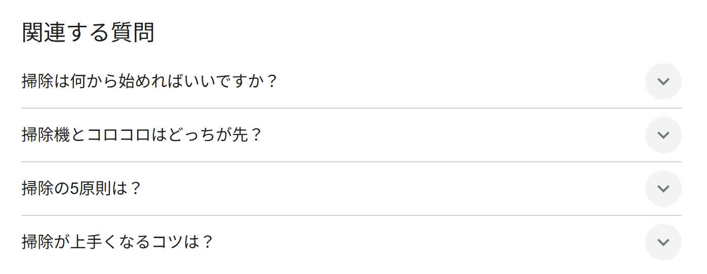

# 第5章　ライティングSEO

> フェーズ: basic ／ 目安: 約12分

検索エンジンとユーザーの両方に伝わるタイトル・見出し・内部リンク・FAQの書き方を理解する

## 学習目標

- タイトルタグがSEOにおいて重要な理由を説明できる
- 見出し（hタグ）を使った文章構造の作り方を理解する
- 内部リンク・アンカーテキストの基本的な考え方を理解する
- FAQコンテンツがSEOに役立つ理由を説明できる

## 本文

### 1. 記事設計：タイトルの書き方

ページの**タイトルタグ（title要素）**は、検索結果の見出しとして表示される、SEOにおいて特に重要な要素の一つです。

**【用語定義】**

**タイトルタグ（title要素）**
HTMLの`<title>`タグで指定する、ページのタイトル。検索結果の一覧やブラウザのタブに表示され、検索エンジンがページの内容を理解する手がかりの一つにもなります。

タイトルを書く際の基本的な考え方は次のとおりです。

- **ページの内容と一致させる：**本文の内容と乖離したタイトルは、ユーザーの離脱や評価の低下につながりやすい
- **対策したいキーワードを含める：**検索意図に合ったキーワードを、不自然にならない範囲で含める
- **他のページと重複させない：**サイト内で同じ・似たタイトルが並ぶと、検索エンジンがページを区別しにくくなる

**【Note】**

検索結果に表示されるタイトルの長さには限りがあり、長すぎる部分は「…」で省略されます。表示可能な文字数はデバイスや文字幅によって変わるため厳密な固定値はありませんが、**概ね30文字前後を目安に、要点を前半に置く**と安全です。

### 2. 記事設計：見出しの使い方

本文中の**見出し（h1・h2・h3などのhタグ）**は、文章の構造をユーザーと検索エンジンの両方に伝える役割を持ちます。

| タグ | 役割 |
| --- | --- |
| h1 | ページ全体のメインタイトル（通常1ページに1つ） |
| h2 | 大きなセクションの見出し |
| h3 | h2の中の、さらに細かいセクションの見出し |

**【Point】**

見出しは、h1→h2→h3という階層構造を保つことが基本です。階層を飛ばしたり、デザインの都合だけで見出しタグを使ったりすると、文章構造が分かりにくくなります。見出しだけを読んでも記事の流れが分かるように設計するのが理想です。

### 3. 内部リンクの基本

**内部リンク**とは、同じサイト内のページ同士をつなぐリンクのことです。第4章で学んだトピッククラスターも、この内部リンクによって成り立っています。

**【用語定義】**

**アンカーテキスト**
リンクとして表示される文字列のこと。「こちら」「詳しくはこちら」のような内容の分からないテキストではなく、**リンク先のページの内容が分かる、具体的な文字列**にすることが基本です。

- リンク元とリンク先のコンテンツが、内容的に関連していること
- アンカーテキストを見ただけで、リンク先に何があるか予測できること
- ユーザーが実際に「読みたい」と思うタイミング・文脈でリンクを設置すること

**【Note】**

内部リンクは、クローラーがサイト内の他のページを発見する手がかりにもなります。関連性の高いページ同士を適切につなぐことは、ユーザーの回遊性とクローラーの巡回性の両方を助けます。

### 4. FAQ（よくある質問）の活用

**FAQ（よくある質問）**コンテンツは、ユーザーの疑問に直接答える形式のため、検索意図に応えやすいコンテンツ形式の一つです。

**【Point】**

FAQを作る際は、実際にユーザーがどんな疑問を持っているかを調べることが出発点になります。検索エンジンのサジェスト機能や、関連する質問の一覧、Search Console（第10・11章で学びます）で確認できる実際の検索クエリなどが手がかりになります。

**【用語定義】**

**PAA（People Also Ask）**
Googleの検索結果に「他の人はこちらも質問」として表示される、関連する質問の一覧。ユーザーが同じテーマで抱きやすい疑問を反映しているため、FAQコンテンツを作成する際に、どのような質問を盛り込むべきかを知る手がかりになります。

*（図）図：検索結果に表示される「関連する質問（PAA）」の例。ユーザーが抱きやすい疑問がわかり、FAQに盛り込む質問の手がかりになる*

- **ユーザーの自己解決を助ける：**疑問がその場で解消されることで、サイトへの満足度や信頼につながる
- **ロングテールキーワードに対応しやすい：**「〇〇 とは」「〇〇 いくら」のような、具体的な疑問形のキーワードを自然にカバーできる

**【Note】**

FAQには専用の構造化データ（マークアップ）を付与できる場合があり、検索結果でリッチリザルトとして表示されることもあります。構造化データの具体的な実装方法は、第18章「構造化データ」で扱います。

## まとめ

- タイトルタグはページの内容と一致させ、対策キーワードを含め、サイト内で重複させないことが基本
- 見出し（h1→h2→h3）は階層構造を保ち、見出しだけで記事の流れが分かるように設計する
- 内部リンクは具体的なアンカーテキストで、関連性の高いページ同士をつなぐことが基本
- FAQコンテンツはユーザーの疑問に直接答え、ロングテールキーワードへの対応にも役立つ
- PAA（People Also Ask）は検索結果に表示される関連質問の一覧で、FAQに盛り込むべき質問を知る手がかりになる

## 確認テスト

### Q1（複数選択）

タイトルタグを書く際の基本的な考え方として、正しいものをすべて選べ。

- A. ページの内容と一致させる　✅**（正解）**
- B. 対策したいキーワードを、不自然にならない範囲で含める　✅**（正解）**
- C. サイト内の他のページと同じタイトルを使い回す
- D. 本文と乖離した、興味を引くためだけの内容にする

**解説**：タイトルはページの内容と一致させ、対策キーワードを含めることが基本です。他のページとの重複や、本文と乖離した内容は避けるべきとされています。

### Q2（単一選択）

見出し（hタグ）の使い方として、最も適切なものはどれか。

- A. 文字を大きく見せたい箇所に、階層を無視して見出しタグを使う
- B. h1→h2→h3のように階層構造を保ち、見出しだけで記事の流れが分かるようにする　✅**（正解）**
- C. 1ページ内にh1を複数置き、重要な語をできるだけ多く見出しにする
- D. 見出しタグは装飾用で、検索エンジンにもユーザーにも意味を持たない

**解説**：見出しは階層構造を保って使い、見出しだけで流れが分かる設計が理想です。装飾目的での使用や、意味を持たないという理解は誤りです。

### Q3（単一選択）

内部リンクのアンカーテキストの付け方として、最も適切なものはどれか。

- A. 「こちら」「詳しくはこちら」のような汎用的な表現で統一する
- B. 対策キーワードだけを羅列した文字列にする
- C. リンク先の内容が分かる、具体的な文字列にする　✅**（正解）**
- D. アンカーテキストは順位に無関係なので、何でもよい

**解説**：アンカーテキストはリンク先の内容が分かる具体的な文字列にします。『こちら』のような汎用表現やキーワードの羅列は避けるべきです。

### Q4（単一選択）

内部リンクを設置する際の基準として、最も適切なものはどれか。

- A. 関連性を問わず、とにかく多くのページへリンクを張る
- B. 内部リンクはクローラーの巡回には影響しないため、数だけ増やせばよい
- C. 内部リンクは記事末尾にまとめて置く形だけが正解である
- D. リンク元とリンク先のコンテンツの関連性を考えて設置する　✅**（正解）**

**解説**：内部リンクは関連性を踏まえて設置します。関連性を無視した大量リンクや、設置場所の画一的なルールが正解というわけではありません。

### Q5（単一選択）

FAQ（よくある質問）コンテンツがSEOに役立つとされる理由として、最も適切なものはどれか。

- A. ユーザーの疑問に直接答え、具体的な疑問形のロングテールキーワードにも対応しやすいため　✅**（正解）**
- B. 本文の文字数を稼ぐことが主目的で、内容の質は問われないため
- C. FAQ形式は検索エンジンに認識されず、競合に真似されにくいため
- D. 他ページの本文をそのまま転記すれば、手間なく作成できるため

**解説**：FAQはユーザーの疑問に直接答え、ロングテール対応にも役立ちます。文字数稼ぎやコピー転記が目的ではなく、検索エンジンにも認識されます。

### Q6（単一選択）

PAA（People Also Ask）の説明として、最も適切なものはどれか。

- A. ページの表示速度を計測するGoogleの公式ツール
- B. 検索結果に「他の人はこちらも質問」として表示される、関連する質問の一覧　✅**（正解）**
- C. 広告の入札額と品質スコアを管理するGoogleの機能
- D. 構造化データの記述ミスを検証するGoogleのツール

**解説**：PAA（People Also Ask）は検索結果の関連質問一覧です。表示速度計測（PageSpeed Insights）や広告管理、構造化データ検証とは別物です。

### Q7（単一選択）

画像の代替テキスト（alt属性）の付け方として、ガイドの推奨に最も近いものはどれか。

- A. 対策キーワードをできるだけ多く詰め込む
- B. すべての画像で同じ定型文を使い回す
- C. 画像の内容や文脈が伝わる、簡潔で具体的な説明を書く　✅**（正解）**
- D. SEOのため必ず長文で詳細に書く

**解説**：alt属性は画像の内容・文脈が伝わる簡潔で具体的な説明にします。キーワードの詰め込みや無意味な定型文は避けます。（スターターガイド『わかりやすい代替テキストを画像に追加する』）

### Q8（単一選択）

「興味深く有益なサイト」にするための考え方として、ガイドの記述に最も近いものはどれか。

- A. 主要コンテンツより広告を大きく目立たせて配置する
- B. 他サイトの文章をできるだけ多くコピーして情報量を増やす
- C. 専門家向けに、一般読者には伝わらない表現で書く
- D. 読者が使いそうな検索キーワードを予測し、その疑問に応える情報を用意する　✅**（正解）**

**解説**：読者の検索キーワードを予測して有益な情報を提供することが基本です。気が散る広告や独自性のないコピーは避けます。（スターターガイド『興味深く有益なサイトにする』）
