# 第6章　テクニカルSEO

> フェーズ: basic ／ 目安: 約55分

HTMLの基本構造・URL設計・内部リンク・クローラ制御・表示速度・Core Web Vitals・HTTPS化まで、サイトの技術的な基盤を体系的に理解する

## 学習目標

- 検索エンジンに情報を正しく伝えるHTMLの基本タグ（title・meta description・見出し・alt属性）の役割を理解する
- 「1URL1コンテンツの原則」と、URLの正規化（canonical・301リダイレクト）の使い分けを理解する
- MECEなカテゴリ設計と、検索エンジンに配慮したURL構造の基本的な考え方を理解する
- 内部リンク・パンくずリスト・XMLサイトマップがクローラビリティに与える影響を理解する
- meta robots・robots.txt・X-Robots-Tagによるクロール制御と、XMLサイトマップ等によるクロール促進の使い分けを理解する
- エラーページの適切な扱いと、代表的なスパム行為（コンテンツスパム・リンクスパム・クローラへの偽装）を理解する
- ネットワーク処理・レンダリング処理・サーバー処理という3領域の高速化の考え方を理解する
- Core Web Vitals（LCP・INP・CLS）の3指標の定義・しきい値・代表的な改善策を理解する
- Search Console・Lighthouse・PageSpeed Insightsという3つの計測ツールの違いと使い分けを理解する
- HTTPS化がSEOに与える影響について、Google公式の見解を理解する

## 本文

### 1. サイト構造：わかりやすいURL

Googleは公式のSEOスターターガイドで、**わかりやすく予測可能で、人間にも理解しやすいURL構造**を推奨しています。

**【用語定義】**

**サイト構造**
Webサイトの内容を分類し、階層構造で整理したもの。図書館が書籍をジャンル・テーマごとに分類して並べるのと同じように、Webサイトも「ユーザーが目的の情報を探しやすい形」にページを分類・整理する必要があります。

整理されたサイト構造を作る上で重要な考え方が**MECE（ミーシー）**です。詳しい設計手法は後の「サイト構造設計：MECEなカテゴリとURL命名」で扱いますが、まずは基本の考え方を押さえましょう。

**【用語定義】**

**MECE（Mutually Exclusive and Collectively Exhaustive）**
「重複なく、抜け漏れなく」分類されている状態を指す言葉。カテゴリ設計がMECEになっていないと、ユーザーが「知りたい情報がサイト内で見つからない」（抜け漏れ）、「同じような内容のページが複数存在してしまう」（重複）といった問題が起こりやすくなります。

また、URLの階層は、このカテゴリ構造をそのまま反映させるのが基本です。

- サイトの構造を反映した、短く明確なURLにする
- 意味の分からないランダムな文字列・数字の羅列を避ける
- 可能であれば、ページの内容が推測できる単語を含める

**【Note】**

URL構造は、一度決めて公開した後に大きく変更すると、リダイレクト設定などの追加対応が必要になります。サイト設計の初期段階で、カテゴリ構造とURL階層を一致させ、将来のページ追加も見据えた構造を検討しておくことが望ましいとされています。なお、記事メディアやニュースサイトなど、1つのページが複数カテゴリに属するようなサイトでは、カテゴリ構造とURL階層を一致させるのが難しい例外もあります。

### 2. URLの永続化：Cool URIs don't change

URL構造を適切に設計したら、次に重要なのが**URLの永続化**という考え方です。一度公開してインデックスされたページのURLは、そのページが存在し続ける限り、できるだけ変更しないことが望ましいとされています。

**【用語定義】**

**URLの永続化**
公開・インデックス済みのページのURLを、内容が存在する限り変更せずに使い続けること。Webの標準化を推進するW3C（World Wide Web Consortium）の創設者ティム・バーナーズ=リー氏は、1998年の論文で「Cool URIs don’t change（クールなURIは変わらない）」と述べています。

URLを変更すると、次のようなデメリットが生じます。

- それまで蓄積された被リンクの評価が引き継がれない、または大きく減少する
- 外部サイトやSNSからのリンクがリンク切れになる
- ユーザーがブックマークした情報にアクセスできなくなる

**【Warning】**

ブランド名の変更やサイトリニューアルなど、やむを得ずURLを変更する場合は、旧URLから新URLへ301リダイレクトを設定し、評価をできる限り引き継ぐようにします。意味もなくページを削除・URL変更することは、それまで蓄積したSEO評価を手放すことにつながるため、避けるべきとされています。

### 3. HTMLの基本構造と検索エンジンへの伝え方

SEOの内部施策で土台となるのが「検索エンジンに情報を適切に伝える」ことです。これを実現するには、**HTML（Hyper Text Markup Language）**の基礎知識が欠かせません。

**【用語定義】**

**HTML Living Standard**
Webページを記述するマークアップ言語の現行標準規格。策定団体WHATWGにより「生きた仕様」として継続的に更新されています。かつて標準化を担っていたW3CのHTML関連仕様（XHTML・HTML5など）は2021年1月にすべて廃止され、現在はHTML Living Standardに一本化されています。

HTMLファイルは、大きく分けると**DOCTYPE宣言**・**head要素**・**body要素**の3つで構成されます。書籍にたとえると、head要素は「表紙」、body要素は「本の中身」に相当します。head要素には、ユーザーには見えないものの検索エンジンがページ内容を理解する手がかりになる情報が多く含まれます。

| 要素 | 役割 | SEO上のポイント |
| --- | --- | --- |
| `` | ページタイトルを指定する。検索結果のリンクテキストやブラウザのタイトルバーに使われる | ページ内容を端的に表し、全角30文字程度に収め、サイト内でユニークにする |
| `` | ページ内容の要約。検索結果のスニペット（説明文）に使われることがある | 検索キーワードを含め、90文字程度に収め、ページごとにユニークにする |
| `` | ページの主要キーワードをカンマ区切りで指定する | 現在は検索順位に直接影響しないとされるが、乱用は評価を下げる要因になり得る |
| `〜` | 見出し。文章の階層構造を表す | 階層（`h1`→`h2`→`h3`…）を飛ばさず、装飾目的で使わない |
| `` | 他ページへのリンク（アンカー）を設置する | アンカーテキストはリンク先の内容を想起できる文言にする |
| `

`のalt属性 | 画像の代替テキスト。画像が表示できない場合やスクリーンリーダーで使われる | 画像の内容を具体的に記述し、装飾目的の画像は空でよい |

**title要素**は「本のタイトル」に相当する最重要要素です。検索キーワードによっては検索エンジン側で表示テキストが調整されることもありますが、ページ内容を端的に表す独自のタイトルを付けることが基本です。

**【Note】**

title・descriptionともに、文字数の上限は正確には決まっておらず、Googleは文字数ではなくピクセル幅で表示可否を判断しています。目安としてtitleは全角30文字程度、descriptionは90文字程度に収めると、検索結果で末尾が省略されにくくなります。

**h要素（見出し）**は、`<h1>`が最上位で`<h6>`まで6段階あり、文章の階層構造を表します。Googleは見出しの数や順序が多少崩れていても大きな問題にはならないと説明していますが、次の点には注意しましょう。

- 階層構造を守る（`h2`の前に`h3`が来る、などを避ける）
- 見出しを多用しすぎない（段落のまとまりを意識する）
- `h1`はページごとにユニークな内容にする（ロゴ画像の使い回しなどは避ける）
- フォントサイズや太さを変えたいだけの目的で使わない（デザインはCSSで行う）

**a要素（アンカーテキスト）**は、ユーザーや検索エンジンにリンク先の内容を伝える役割を持ちます。「こちら」「詳細へ」のような抽象的な文言や、URLそのものをアンカーテキストにするのではなく、リンク先の内容を想起できる具体的な文言が推奨されます。

**【用語定義】**

**alt属性**
画像が表示されない場合の代替テキストとして定義されているタグの属性。スクリーンリーダーの読み上げにも使われます。検索エンジンも画像内容を理解する手がかりとしてalt属性を利用しており、画像掲載ページのtitle・meta要素、画像周辺のテキスト、リンクのアンカーテキスト、画像ファイル名なども合わせて画像の意味を判断しています。

**【Warning】**

alt属性やアンカーテキストにキーワードを大量に詰め込むと、検索結果を不正操作するスパム行為と判断される可能性があります（詳しくは「エラー対応とスパムへの対策」で解説します）。あくまで内容を的確に説明することを目的に記述しましょう。

### 4. 1URL1コンテンツの原則と重複コンテンツの解消

検索エンジンはWebページを「URL単位」で識別します。そのため、URLが1文字でも異なれば別ページとして扱われます。この前提から導かれるのが**1URL1コンテンツの原則**です。

**【用語定義】**

**1URL1コンテンツの原則**
1つのURLには1つのまとまったコンテンツを対応させるべきという考え方。検索結果には基本的に同一ドメインから1ページしか表示されにくいため、同じキーワードを複数ページで対策しても評価が分散し、無駄になりやすいとされています。

この原則が崩れると、代表的に次の3パターンの問題が起こります。

| パターン | 具体例 | 主な対応 |
| --- | --- | --- |
| 同一URLに異なるコンテンツ | サイト内検索結果ページなどで、検索条件が違っても同じURL（例：`search.php`）が使われる | 検索条件ごとに異なるURLを付与する |
| 異なるURLに同一コンテンツ | http/https、wwwの有無、末尾スラッシュの有無、パラメータの有無などでURLが分岐する | URLの正規化（301リダイレクト／canonical） |
| 異なるURLに1コンテンツが分割 | 一覧ページのページネーション（1ページ目・2ページ目…） | 各ページを自己参照canonicalにし、前後リンクを設置する |

**URLの正規化**とは、重複コンテンツの中から「どのURLが正規のURLか」を検索エンジンに伝える対応です。次の3ステップで進めます。

*（図）URLの正規化のイメージ：複数URLの評価を1つの正規URLに集約する*

- **①重複コンテンツの発見**：Search Consoleの「ページ」レポートなどで確認

- **②正規ページの決定**：将来にわたって変わりにくいURLを選ぶ

- **③正規ページへ寄せる**：301リダイレクト、またはcanonical

*（図）図1：URL正規化の3ステップ*

**【用語定義】**

**301リダイレクト**
ページが恒久的に移転したことを示すステータスコード。ユーザーがアクセスすると自動的に正規URLへ転送され、評価もあわせて引き継がれます。

**canonicalタグ**
ユーザーを転送せず、非正規ページをそのまま閲覧させながら「正規のURLはこちら」と検索エンジンに伝えるタグ。ユーザーを正規URLへ強制的に遷移させたくない場合に使います。

Googleは基本的に301リダイレクトを推奨しており、301リダイレクトができない場合の代替としてcanonicalを使うよう案内しています。次の表に、URLの相違パターンごとの対応方法をまとめます。

| URLの相違パターン | 正規化の方向 | 対応方法 |
| --- | --- | --- |
| http ↔ https | httpsに統一 | 301リダイレクト |
| wwwの有無 | どちらでも可（統一） | 301リダイレクト |
| indexファイル名の有無 | index名なしに統一 | 301リダイレクト |
| 末尾スラッシュの有無 | スラッシュありに統一 | 301リダイレクト |
| URLパラメータの有無 | パラメータなしを正規に | canonical（アクセス解析用パラメータ等は消せないため） |
| モバイル版 ↔ PC版（別URL運用の場合） | PC版を正規に | 302リダイレクト＋canonical／alternate |

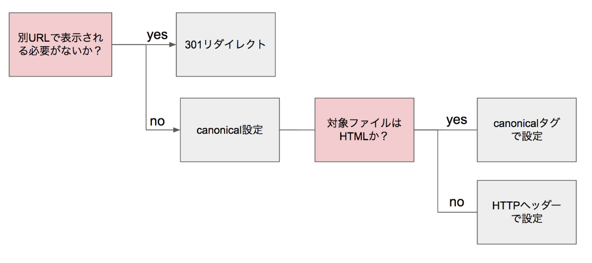

*（図）URLの正規化方法の決定フローチャート*

**【Warning】**

PC版とモバイル版を別URLで運用している場合、デバイスに応じた誘導には301ではなく302リダイレクトを使うべきとされています。301はキャッシュされる性質があるため、モバイル用URLのキャッシュとしてPC版ページが保存されてしまう可能性があるためです。なお、Googleはこうした別URL運用よりも、実装・維持が容易なレスポンシブWebデザインを推奨しています。

正規化にあたっては、canonicalタグは相対パスではなく**絶対パスで記述する**ことが推奨されています。また、非HTMLファイル（PDFや画像など）を正規化したい場合は、HTMLにcanonicalタグを書けないため、HTTPヘッダーで指定します。

**【Point】**

ページネーション（一覧ページの分割）を採用する場合は、各ページを自分自身に正規化（自己参照canonical）し、1ページ目に強制的にcanonicalしないことが重要です。またページ同士を`<a>`タグで前後リンクし、検索エンジンに一連のページであることを伝えましょう。Googleは、ページネーションされた一連のページで同じtitle/descriptionを使っても問題ないと説明していますが、ユーザビリティの観点からはユニーク化が望ましいとされています。

title・descriptionについても、内容の重複は「重複コンテンツ」と同様に扱われる可能性があります。ページごとにユニークな記述を心がけましょう。

### 5. サイト構造設計：MECEなカテゴリとURL命名

整理されたサイト構造を作るには、適切な軸でカテゴリを分類し、抜け漏れ・重複がないように設計することが重要です。この設計に役立つのが**ロジックツリー**というフレームワークです。

**【用語定義】**

**ロジックツリー**
上位概念から下位概念へ順番に分解していく思考フレームワーク。目的に応じて主に3種類の切り口があります。

| 種類 | 頂点に置くもの | 向いているサイト |
| --- | --- | --- |
| **WHATツリー** | 特定カテゴリ（商品カテゴリ・ブランドなど） | 通販サイト、コーポレートサイトなどほぼ全般 |
| **WHYツリー** | 解決したい問題・課題とその原因 | 課題解決型サイト、BtoB SaaSサイトなど |
| **HOWツリー** | 目標・目的とその手段 | FAQ、ヘルプページなど |

WHYツリーで設計したページは「問題の原因を探している潜在顧客」を、HOWツリーで設計したページは「解決策を求める顕在顧客」を集客しやすいとされ、両者を組み合わせる設計も有効です。

**【Point】**

MECEが崩れると、ユーザーは「知りたい情報が見つからない（抜け漏れ）」「同じような情報が複数ページに分散していて探しにくい（ダブり）」という不便を感じ、SEOの観点でも抜け漏れのあるキーワードで対策できない、または重複コンテンツとして評価が分散するというデメリットが生じます。

カテゴリ構造が固まったら、各ページに適切なURLを付与します。URLの命名で重要なポイントは次の4つです。

- **ページ内容と関連するキーワードを含める**（数字の羅列より、内容を推測できる単語）
- **短くする**（Googleは1,000文字以内を推奨。長すぎるURLはSNS共有時などに不信感を与える）
- **複数単語はハイフン（-）で区切る**（アンダースコアは単語の区切りと認識されない）
- **英単語は小文字に統一する**（Linux/UnixベースのサーバーではURLのパス部分は大文字・小文字が区別される）

**【用語定義】**

**日本語URL**
URLに日本語を使うことも可能で、Googleもユーザーの言語を利用することを推奨しています。ただし、コピー＆ペースト時に自動でエンコードされ、意味不明な長い文字列になる場合があるため、SNSでの共有やリンク設置には不向きな面もあります。検索エンジンからの評価自体は、日本語URLと英語URLで差はないとされています。

**【Note】**

GoogleのJohn Mueller氏は「URLにキーワードを入れることは、検索順位にとって非常に小さな要素」と述べています。URL命名の最大のメリットは、ランキング直接効果というより、ユーザーの理解しやすさと、PV数・順位のモニタリングのしやすさにあると捉えるとよいでしょう。

### 6. 内部リンクとクロールのしやすさ

サイト構造をどれだけきれいに設計しても、実際にページ同士がリンクでつながっていなければ、ユーザーもクローラーも目的のページにたどり着けません。**内部リンク**の設計では、次の3点が重要とされています。

- **双方向リンク**：どのページからも他のページへ辿れる状態にする

- **関連ページへのリンク**：同じカテゴリ・上位カテゴリへリンクする

- **上位階層へのリンク**：常にトップページ・最上位カテゴリに戻れるようにする

*（図）図1：内部リンク設計で重要とされる3つの観点*

**【Point】**

どのページからもリンクされていない「孤立したページ」や、リンクをたどった先が行き止まりになる構造は、クローラーにもユーザーにも発見・到達されにくくなります。多くのページからリンクを受けているページ（一般的にはトップページや上位カテゴリ）は、検索エンジンから「サイト内で特に重要なページ」として認識されやすくなるとされています。

この考え方を実装に落とし込む代表的な要素が**ナビゲーション**と**パンくずリスト**です。

| 種類 | 設置場所と役割 | SEO上の位置づけ |
| --- | --- | --- |
| グローバルナビゲーション | 全ページ共通。トップページ・最上位カテゴリへのリンクを担う | サイト内で多くのリンクを集めるため、重要ページとして認識されやすい |
| サイドナビゲーション（ローカルナビゲーション） | 同一カテゴリ内の他ページへの導線 | 回遊性の向上に加え、対象ページの被リンク数増加にも寄与 |
| フッターナビゲーション | 利用規約・会社概要など補足情報ページへの導線 | 検索エンジンはフッターリンクの価値を低く評価する傾向があるとされる |
| パンくずリスト | トップページから現在地までの階層を示すリンクの集まり | 3階層以上のサイトでは設置が推奨される。構造化マークアップで検索結果に表示されることもある |

また、記事本文などの**メインコンテンツからのリンク**は、文脈に沿って設置されるため、ナビゲーションからのリンクよりもページ内容との関連性が高いと検索エンジンに判断されやすいとされています。

**【Warning】**

次のリンク形式は、クローラビリティの観点で注意が必要とされています。

- **JavaScriptのみのリンク**：href属性を伴わないonclickだけのリンクは非推奨。href属性と併用すれば通常のリンクと同様に評価される
- **プルダウンメニューによるリンク**：クリックするまで選択肢が見えず、JavaScript処理も伴うため、クローラビリティ・ユーザビリティの両面で好ましくない
- **検索フォームによるリンク**：ある程度はクロール可能だが、全パターンを網羅的にクロールする保証はない

重要なページへの内部リンクは、`<a href="...">`によるテキストリンクで確実に設置することが望ましいとされています。

内部リンクの管理では、次の点にも配慮しましょう。

- ナビゲーションメニューやパンくずリストで、サイト全体の階層を分かりやすくする
- 関連コンテンツへのリンクを、記事の文脈に沿って適切に設置する
- リンク切れ（存在しないページへのリンク）を放置しない
- 内部リンクのURLは、末尾スラッシュやhttp/httpsなどが揺れないよう、正規URLに統一する

**【Note】**

転職サイト・不動産サイト・ECサイト・記事メディアなど、いわゆるデータベース系サイトでは、1つの詳細ページ（求人・物件・商品・記事）が複数カテゴリに属すことがあり、カテゴリ構造とURL階層をあえて一致させないケースもあります。この場合でも、パンくずリストなどのリンク構造はカテゴリ構造と一致させ、検索エンジンにサイト構造を適切に伝えることが推奨されます。

### 7. XMLサイトマップとcanonical

**XMLサイトマップ**は、サイト内のどのページをクロール・インデックスしてほしいかをGoogleに伝えるためのファイルです。

**【用語定義】**

**XMLサイトマップ**
サイト内のURL一覧をXML形式でまとめたファイル。Search Console（第10章で学びます）を通じてGoogleに送信することで、クロールの手がかりとして活用してもらえます。ユーザー向けのHTMLサイトマップとは異なり、ユーザビリティを気にせず全URLを機械的に記載できます。

Google公式のガイドラインでは、XMLサイトマップには**正規URL（canonicalで指定したURL）のみ**を含めることが推奨されています。重複しているURLや、canonicalの指定と矛盾するURLをサイトマップに含めると、Googleに対して矛盾したシグナルを送ることになるためです。XMLサイトマップが特に効果的とされるのは、次のようなケースです。

- サイトが新しく、外部からの被リンクがまだ少ない
- サイトのページ数が非常に多い
- どこからもリンクされていないページが存在する（本来は望ましくない状態）

基本的な記述には`<loc>`（URL、必須）に加え、`<lastmod>`（最終更新日）を含められます。Googleは`<changefreq>`（更新頻度）はあくまで参考情報として扱い、`<priority>`（優先度）は無視すると公式に説明しています。

| 制約 | 内容 |
| --- | --- |
| 1ファイルのURL数 | 50,000個以下 |
| 1ファイルのサイズ | 50MB以下（圧縮前のサイズが基準） |
| URLの長さ | 1つのURLは2,048文字以下 |

上限を超える場合は、複数のXMLサイトマップに分割し、それらのURLをまとめた**サイトマップインデックス**を作成すると管理しやすくなります。作成したXMLサイトマップは、次の2つの方法で存在を伝えます。

- Search Consoleの[インデックス作成]→[サイトマップ]からURLを送信する
- robots.txtに`Sitemap:`としてURLを記載する（生成AIのクローラなど、Search Consoleに登録できない主体にも伝わる）

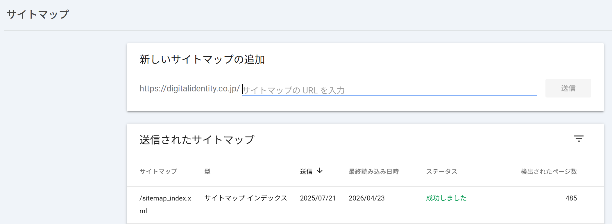

*（図）Search Consoleの「サイトマップ」設定画面*

**【Note】**

画像や動画を多く扱うサイトでは、通常のXMLサイトマップに画像・動画専用の情報（`<image:image>`や`<video:video>`タグなど）を追加した「画像サイトマップ」「動画サイトマップ」を作成すると、画像検索・動画検索でのインデックスを促進できるとされています。ニュースメディアでは同様に「ニュースサイトマップ」も有効です。

正規URLの指定に使うのが**canonicalタグ**です。

**【用語定義】**

**canonicalタグ（rel="canonical"）**
同じ内容、または似た内容のページが複数のURLで存在する場合に、「正規のURLはこちらです」とGoogleに伝えるためのタグ。URLの正規化（重複コンテンツの整理）に使われます。

**【Warning】**

同じ内容のページが、パラメータ違いなどで複数のURLからアクセスできる状態を放置すると、**重複コンテンツ**として扱われ、評価が分散してしまう可能性があります。canonicalタグやリダイレクトで、優先すべきURLを明示することが重要です。

### 8. クローラの制御：robots.txtとmeta robots

クローラー（**bot**）は、サイト内のあらゆるページを無制限にクロールするわけではありません。サイトごとに**クロールバジェット**（クロールに割り当てられる量の目安）が存在するため、価値の低いページのクロールを抑え、重要なページに巡回を集中させる工夫が必要になります。

**【用語定義】**

**bot（クローラー）**
Webサイトを自動的に巡回するプログラムの総称。GoogleやBingの検索エンジンクローラーのほか、生成AIサービスが使う専用クローラー（OpenAIのGPTBot、AnthropicのClaude-Webなど）も含まれます。

botの動作を制限する方法は、大きく3つあります。

| 方法 | 単位 | 対象 |
| --- | --- | --- |
| meta robots | ページ単位 | HTMLファイル |
| X-Robots-Tag | ページ単位 | 非HTMLファイル（PDF・画像など） |
| robots.txt | サイト・ディレクトリ単位 | すべてのファイル |

**meta robots**は、HTMLの`<head>`内に記述し、そのページ単位でクロール・インデックスの可否を指定するタグです。content属性はカンマ区切りで複数指定できます。

| content属性の値 | 制御内容 |
| --- | --- |
| index / follow（デフォルト） | インデックスさせる／リンクを辿らせる。記述がなければこの挙動になる |
| noindex | ページをインデックスさせない |
| nofollow | ページ上のリンクを辿らせない |
| none | noindex, nofollowと同じ意味 |
| nosnippet | 検索結果にスニペットを表示させない |
| max-snippet:[数値] | スニペットの最大文字数を指定する |
| max-image-preview:[設定] | 検索結果のサムネイル画像サイズを指定する（none/standard/large） |
| unavailable_after:[日時] | 指定日時を過ぎると検索結果に表示しなくする |

noindexを使う代表的な場面には、サイト内検索結果ページ（特に0件ヒットのページ）、質の低いページ、キャンペーンページ、会員限定ページなどがあります。noindexを指定する際は、長期的にはnofollowと同じ意味になるとGoogleも説明しているため、**「noindex, nofollow」**とセットで記述するのが基本です。

**【用語定義】**

**X-Robots-Tag**
PDFや画像など、meta robotsを記述できない非HTMLファイルに対して、クロール・インデックスの制御を行うためのHTTPヘッダー。Google Search Central（公式ドキュメント）によれば、meta robotsで指定できるものと同じルールを、サーバーの設定でHTTPレスポンスに追加する形で指定します。

**robots.txt**は、サイトのルート直下（`https://www.example.com/robots.txt`）に設置する、クロールの可否をサイト・ディレクトリ単位で指定するテキストファイルです。基本構文は次の3要素で構成されます。

- **User-agent**：対象クローラの指定（*は全クローラ）

- **Disallow / Allow**：アクセス拒否／許可の指定

- **対象パス**：ディレクトリ・ファイルの指定

*（図）図1：robots.txtの基本構文（例：User-agent: * ／ Disallow: /no/）*

DisallowとAllowを併用すると、Disallowで拒否したディレクトリの一部だけを許可することも可能です。記述の優先順位は、より対象パスが限定されている条件が優先されるため、記述順は問いません。

**【Point】**

特定のクローラだけを制御したい場合は、User-agentトークンを個別指定します。代表例として、画像用は`Googlebot-Image`、生成AIの学習用途では`Google-Extended`（Gemini等）、OpenAIの学習用クローラは`GPTBot`などがあります。「*」（全クローラ対象）を指定してもGoogleの広告品質チェック用クローラ（AdsBot）は対象にならない点に注意が必要です。

**【Warning】**

meta robotsとrobots.txtは、GoogleのクローラーだけでなくAIbot（生成AIの学習・回答生成用クローラー）にも基本的には有効ですが、すべてのAIbotが指示に従うことを保証するものではありません。機密性の高い情報の保護策としては過信せず、Digest認証など別の方法でアクセス制限をかけることが望ましいとされています。また、robots.txtは誰でも閲覧できるファイルであるため、管理者用ページなどセキュリティ上センシティブなパスを記述しないことも重要です。

Googlebotは1日1回程度robots.txtを取得しますが、サーバーが5xxエラーを長期間返し続けると、Googleがサイト全体のクロールを停止する可能性があるため、robots.txtが正しく取得できているかはSearch Consoleで定期的に確認することが推奨されます。

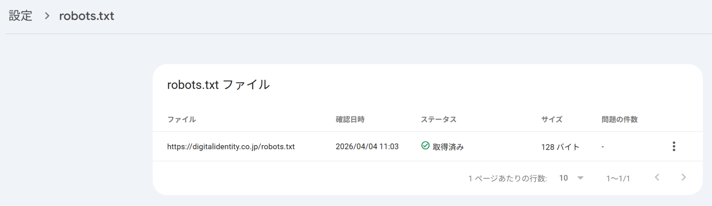

*（図）Search Consoleでrobots.txtの取得状況を確認する画面*

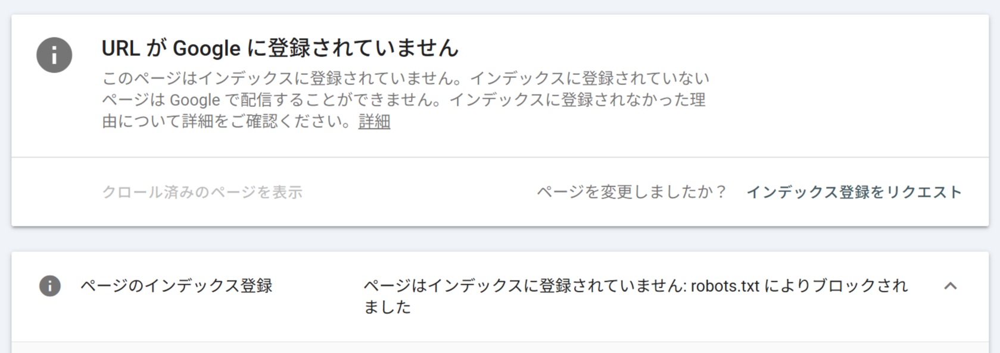

*（図）robots.txtによりブロックされたURLの表示例*

また、Googlebotがコンテンツを正しく認識するために、JavaScript・CSS・画像ファイルへのアクセスはブロックしないよう注意しましょう。

### 9. クロールの促進：URL検査・フィード・WebSub

クロールを「制限する」方法に対し、本セクションでは新規ページや更新ページを**いち早くクローラに発見してもらう**ための方法を扱います。XMLサイトマップ（前セクション）に加えて、代表的な方法が3つあります。

| 方法 | 特徴 | クロールの性質 |
| --- | --- | --- |
| URL検査ツール | Search Consoleから特定URLのクロールを個別にリクエストする | 能動的（手動で1件ずつ） |
| RSS/Atomフィード | 更新ページの一覧をXML形式で配信する | 受動的（クローラや購読者が定期的に取得） |
| WebSub（旧PubSubHubbub） | 更新をハブ経由でプッシュ通知する | 能動的（システムで自動化） |

**URL検査ツール**は、Search Console上部の検索ボックスにURLを入力し、[インデックス登録をリクエスト]をクリックすることでクロールを要求できる機能です。

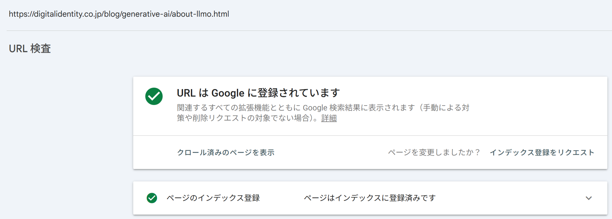

*（図）URL検査ツールで「URLはGoogleに登録されています」と表示された結果画面*

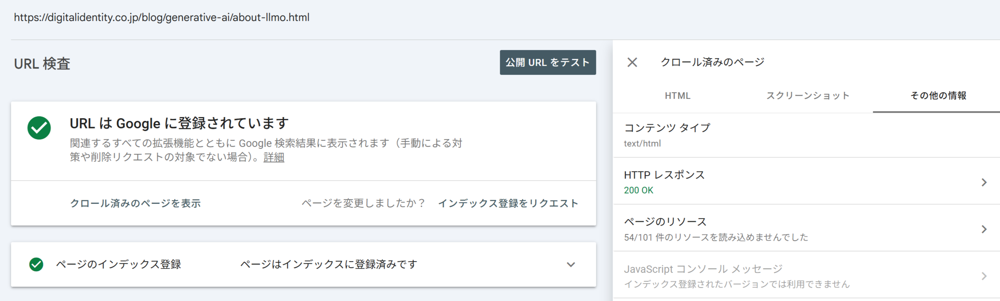

*（図）URL検査ツールで確認できるHTTPレスポンスの詳細*

あわせて次の確認も可能です。

- **HTTPレスポンスの確認**：HTTPステータスコードや、HTTPヘッダーによるcanonical設定などを確認できる
- **レンダリングチェック**：Googlebotが認識しているページのスクリーンショットを確認できる。表示内容が実際のユーザー向け表示と大きく異なる場合は、クローラへの偽装行為（クローキング）と誤認識されるリスクもある

**RSS/Atomフィード**は、更新ページのURL・更新日・タイトル・要約などを配信する仕組みです。全URLを網羅するXMLサイトマップとは役割が異なり、直近の更新情報を効率よく伝えることに向いています。RSSとAtomの2形式がありますが、Atomのほうが仕様が明瞭であるとされ、新規に作成する場合はAtom形式が選ばれる傾向にあります。フィードを用意したら、Search Consoleへの登録に加え、トップページのhead要素に`<link rel="alternate">`でフィードのURLを記述して存在を伝えます。

**【用語定義】**

**WebSub（旧称PubSubHubbub）**
コンテンツの更新をハブ（Hub）経由でクローラやフィードリーダーにプッシュ通知する仕組み。出版者（サイト運営者）がハブに更新を伝え、ハブが購読者（Googlebotなど）へ通知することで、更新を都度手動リクエストせずに能動的なクロールを実現できます。エンジニアによるシステム実装が必要です。

**【Note】**

これらの手法は、いずれも「Googleが自主的にクロールしてくれるのを待つのではなく、更新をこちらから積極的に伝える」という発想に基づきます。特にニュース記事など速報性が求められるコンテンツでは、フィードやWebSubの活用がクロール頻度の向上に有効とされています。ただし、URL検査ツールとWebSubは検索エンジンのクローラに対してのみ有効で、生成AIのクローラには基本的に効果がありません。

### 10. エラー対応とスパムへの対策

SEOでプラスの評価を積み上げる前提として、まずはマイナス評価につながる要因を取り除くことが重要です。本セクションでは**エラーへの対応**と**スパムへの対策**の基本を扱います。

**エラー対応**では、まず「自サイトのエラー（内部エラー）」と「外部サイトへのリンク切れ（外部エラー）」を区別します。内部エラーは自社で解決可能ですが、外部サイトのエラー自体は解決できないため、リンクの変更・削除で対応します。

| ステータスコード | 意味 |
| --- | --- |
| 200 | 正常（OK） |
| 301 / 302 | 恒久的 / 一時的なリダイレクト |
| 401 / 403 | 認証が必要 / アクセス禁止 |
| 404 | ページが見つからない（Not Found） |
| 500 / 503 | サーバー内部エラー / サービス利用不可 |

ユーザーやGooglebotがリンクをたどって到達できるページでエラーが起きている場合は、修正が必須です。Search Consoleの[インデックス作成]→[ページ]で発生状況を確認できます。どうしても404を返さざるを得ない場合は、デフォルトのエラーページではなく、次のようなユーザーフレンドリーな404ページを用意することが推奨されています。

- 探しているページが見つからないことを、平易な言葉で明確に伝える
- サイトの他ページと同じデザイン（ナビゲーション含む）にする
- 人気記事やホームページへのリンクを設置する

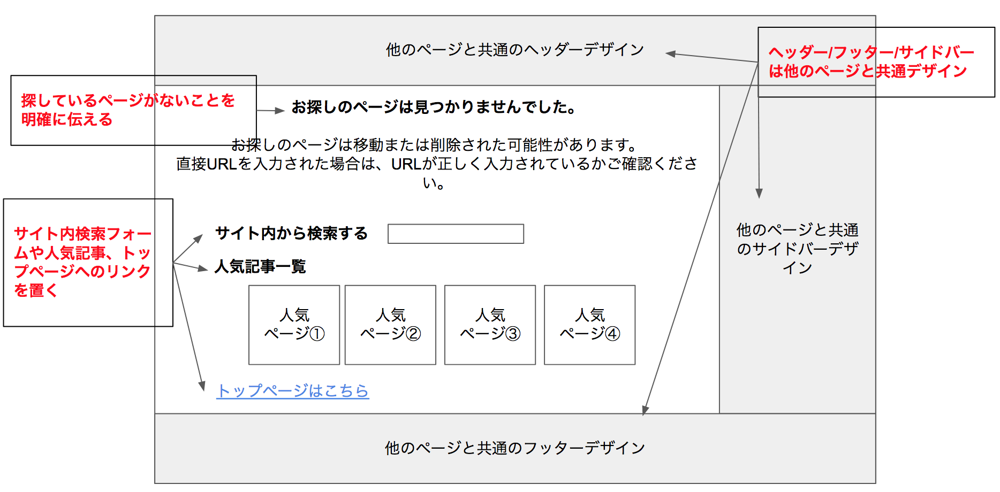

*（図）ユーザーフレンドリーな404ページのレイアウト例*

**【Warning】**

独自の404ページを用意する際、システムによってはステータスコード200（正常）を返してしまう「ソフト404」と呼ばれる状態になることがあります。この場合、削除された記事などが重複コンテンツとして扱われてしまう可能性があるため、404エラーページであっても正しく404のステータスコードを返す必要があります。

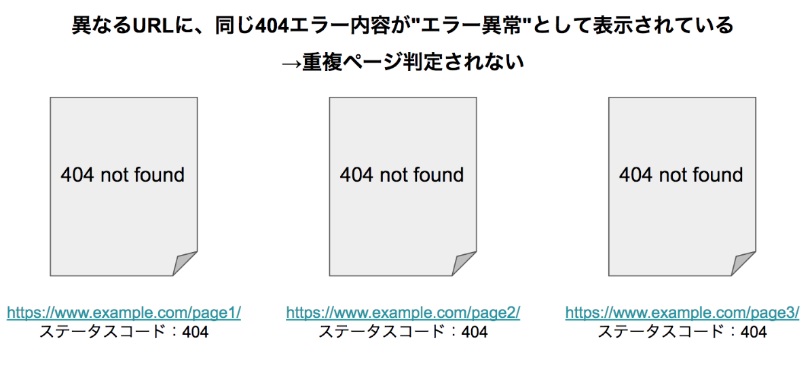

*（図）異なるURLで同じ404内容が正しくステータスコード404として返されている例*

続いて**スパムへの対策**です。Googleは2018年にSpamBrainという仕組みを導入し、より高度なスパム行為を検出できるようになっています。スパム行為は大きく3つに分類されます。

| 分類 | 関連アップデート | 代表例 |
| --- | --- | --- |
| 価値の低いコンテンツ | パンダアップデート | コピーコンテンツ、自動生成コンテンツ、キーワードの乱用、広告のみのコンテンツ |
| 質の低い被リンク | ペンギンアップデート | リンクの売買、同一IP/テンプレートからの大量リンク |
| クローラへの偽装行為 | - | 隠しテキスト・隠しリンク、クローキング、不正なリダイレクト |

**【用語定義】**

**クローキング**
ユーザーとクローラに対して、異なるコンテンツやURLを見せる行為。検索順位の操作やユーザーへの詐欺行為に使われるためペナルティ対象です。PC/モバイルを別URLで運用している場合に、対応するページが正しく1対1でリダイレクトされない「不正なモバイルリダイレクト」も同様に問題視されます。

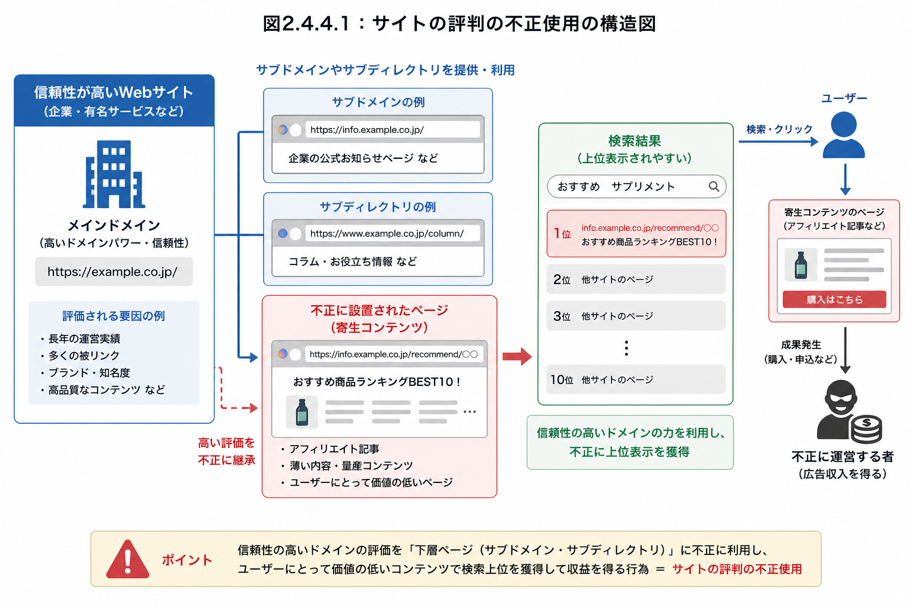

*（図）サイトの評判の不正使用（Site Reputation Abuse）の構造図*

被リンクに関しては、広告やスポンサー活動を目的としたリンクそのものが問題なのではなく、**ランキング操作を目的としたリンクの売買**が問題とされます。こうした関係性のあるリンクには、次のような`rel`属性を付与してGoogleに関係性を伝える必要があります。

| rel属性 | 意味 |
| --- | --- |
| rel="sponsored" | 広告・スポンサー活動を目的としたリンク |
| rel="nofollow" | リンク先ページをクロールさせたくない場合 |
| rel="ugc" | ブログコメントやフォーラム投稿など、ユーザー生成コンテンツのリンク |

**【Point】**

悪意ある第三者が意図的に低品質な被リンクを送り、対象サイトの評価を下げようとする行為を「逆SEO」と呼びます。過去から現在まで不正行為をしていなくても被害に遭う可能性があるため、Search Consoleで定期的に被リンク状況を確認することが推奨されます。質の低い被リンクが見つかり、自分で削除・修正できない場合の最終手段として、Search Consoleの「リンクの否認」機能が用意されています。

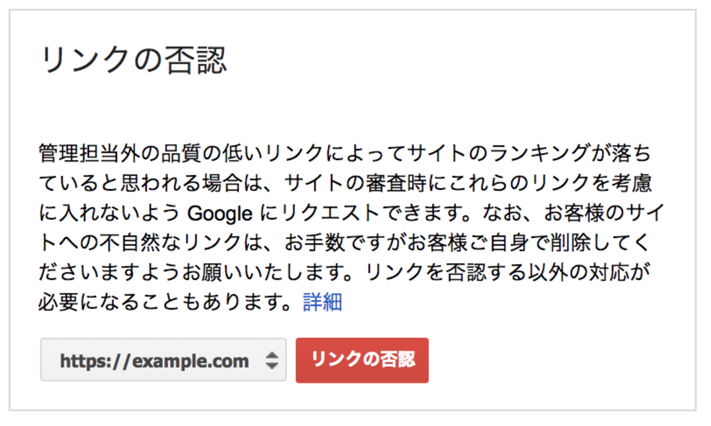

*（図）Search Consoleの「リンクの否認」申請画面*

**【Warning】**

これらのスパム行為がGoogleに認識されると、Search Consoleの[手動による対策]レポートに検出され、検索結果から除外される可能性があります。仮に一時的に順位が上がったとしても、いずれペナルティを受けるリスクがあるため、スパム行為による成果は資産にはならないとされています。

### 11. 表示速度の基本：Webページが表示されるまで

**Core Web Vitals**は、Googleが2020年5月に発表した、Webページのユーザーエクスペリエンス（UX）を評価するための指標群です。詳しくは後述しますが、まずはその土台となる「表示速度がなぜ重要か」「表示までにどんな処理が起きているか」を理解しましょう。

表示速度がビジネスに与える影響は、さまざまな調査で報告されています。例えば、表示に3秒以上かかると過半数のユーザーが離脱する、表示が1秒遅れるごとにコンバージョン率が最大20%減少するといった傾向が知られています。

**【Note】**

読み込みが1秒から3秒に伸びると直帰率は約32%上昇し、1秒から10秒まで伸びると123%上昇するという調査結果も報告されています。表示速度は、単なる技術指標ではなく、売上やコンバージョンに直結するビジネス指標として捉えることが重要です。

ブラウザがURLをリクエストしてから画面に表示されるまでの流れは、大きく3つの処理領域に分けて捉えられます。

- **ネットワーク処理**：ブラウザとサーバー間のデータの送受信

- **サーバー処理**：リクエストを受けてHTMLを組み立てる

- **レンダリング処理**：受け取ったデータを画面に描画する

*（図）図1：表示速度に関わる3つの処理領域*

**【用語定義】**

**TTFB（Time To First Byte）**
ブラウザがサーバーにリクエストを送ってから、最初の1バイトが返ってくるまでの時間。Googleは200ミリ秒以内に収めることを推奨しています。この後、ブラウザはHTMLを解析し、CSSや画像など必要なファイルを追加でリクエストし、すべて揃った時点でページを画面に組み立てて表示します。

ブラウザは受け取ったHTMLを解析し、`<title>`や`
`のようにHTML内に直接書かれた情報はそのまま処理する一方、`<link>`（CSS）、`<script>`（JavaScript）、``（画像）のように外部データを参照する要素に出会うたびに、追加のリクエストをサーバーへ送ります。この一連の流れのどこにボトルネックがあるかを見極めることが、高速化の出発点です。

**【Note】**

3領域それぞれに専門的な高速化技術（画像・コードの圧縮、キャッシュの活用、サーバー構成の見直しなど）が存在します。実装の詳細はエンジニアリングの領域ですが、次のセクションでは、SEO担当者がエンジニアと技術的な会話ができるレベルを目安に、代表的な高速化手法を掘り下げて解説します。難易度はやや上がりますが、要件定義や課題の切り分けに役立つ知識です。

### 12. ネットワークとレンダリングの高速化

ここでは、表示速度を構成する3領域のうち、**ネットワーク処理**と**レンダリング処理**の高速化の考え方を、やや実装寄りの視点で解説します。

**ネットワーク処理**に要する時間は、「通信量」「通信回数」「通信距離」の掛け算で決まるとされています。

| 要素 | 高速化の主な手法 |
| --- | --- |
| 通信量 | テキストファイルのMinify圧縮・gzip/Brotli圧縮、画像の適切な形式選択（WebP・AVIF等）と圧縮 |
| 通信回数 | HTTP/2・HTTP/3の活用、画像の遅延読み込み（Lazy Load） |
| 通信距離 | ユーザーに近いサーバーの選定、CDNの活用 |

**【用語定義】**

**gzip圧縮 / Brotli圧縮**
テキストファイル（HTML・CSS・JavaScript）を圧縮してファイルサイズを削減する技術。gzipの圧縮率は約60〜80%、GoogleがgzipをさらにOSSで発展させたBrotliは約70〜90%とされ、Brotliの方が高圧縮ですがCPU負荷は大きくなる傾向があります。いずれもテキストファイルに効果的で、すでに圧縮済みの画像やPDFにはあまり効果がありません。

**CDN（Content Delivery Network）**
世界各地に配置したエッジサーバーを経由して、ユーザーに地理的・ネットワーク的に近い拠点からコンテンツを配信する仕組み。通信距離の短縮に加え、オリジンサーバーの負荷分散にも役立ちます。

画像ファイルは、ページ全体のファイルサイズの約4割を占めるとされる調査もあり、通信量削減の重要なターゲットです。主な画像形式の使い分けの目安を示します。

| 形式 | 特徴 | 向いている用途 |
| --- | --- | --- |
| JPEG | 非可逆圧縮。輪郭のはっきりした画像でノイズが出やすい | 写真 |
| PNG | 可逆圧縮。透過に対応 | 透過が必要な画像、色を優先したい画像 |
| WebP | Google開発。JPEG比25〜34%、PNG比26%程度の削減が見込める | Web用画像全般（現在は主要ブラウザが対応） |
| SVG | ベクター形式。拡大しても粗くならない | ロゴ・アイコンなど単純な図形 |
| AVIF | 次世代形式。WebPよりさらに高圧縮 | 今後活用が広がると見込まれる形式（2024年8月にGoogle検索が対応） |

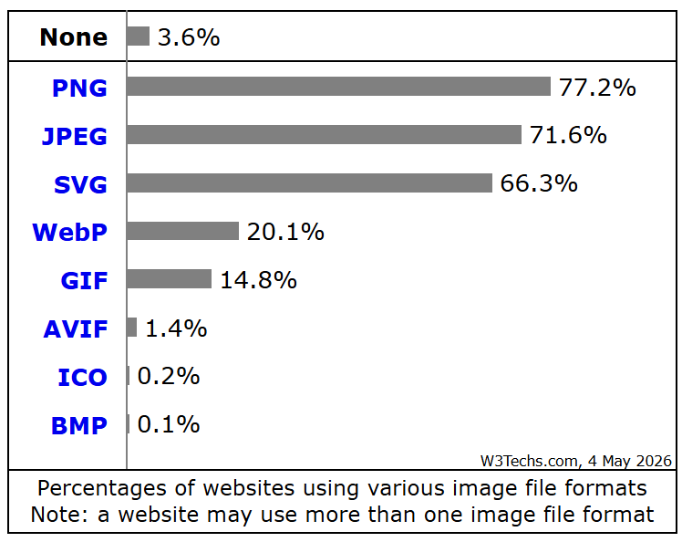

*（図）主要な画像ファイル形式の利用率（W3Techs調べ）*

通信回数の観点では、通信プロトコルの進化も重要です。HTTP/1.1は1つの接続で1つのリクエストしか処理できない制約がありましたが、**HTTP/2**では1つの接続内で複数のストリームを多重化でき、**HTTP/3**ではTCPに代わりUDPベースの「QUIC」を採用することで、接続確立の高速化やパケットロスへの耐性が向上しています。

**【Note】**

HTTP/2は主要ブラウザにおいてHTTPS通信であることが前提となっています。そのため、HTTP/2以降の通信高速化の恩恵を受けるうえでも、HTTPS化（後述）は欠かせない土台になっています。

続いて**レンダリング処理**です。ブラウザはHTMLから**DOMツリー**、CSSから**CSSOMツリー**を構築し、両者を組み合わせて**レンダリングツリー**を作り、要素の位置とサイズを決める「レイアウト」、描画命令を作る「ペインティング」を経て画面に表示します。

- **DOMツリー**：HTMLの解析結果

- **CSSOMツリー**：CSSの解析結果

- **レンダリングツリー**：レイアウト→ペインティング→画面表示

*（図）図1：レンダリングツリー構築までの流れ*

レンダリング処理の高速化には、CSS・JavaScript・画像それぞれで押さえるべきポイントがあります。

| 対象 | 高速化のポイント |
| --- | --- |
| CSS | ファーストビューに必要なCSSを早期に（head要素内で）読み込み、シンプルなセレクタ（id・class名）を使う |
| JavaScript | body要素の最後に配置する、または`async`・`defer`属性で非同期読み込みにする |
| 画像 | HTML/CSSで`width`・`height`をあらかじめ指定し、レイアウト計算の停止を防ぐ |

**【Point】**

`async`属性は読み込みが完了した順に実行されるため、jQueryとその依存ライブラリのように実行順序が重要なスクリプトには不向きです。順序を保ちたい場合はHTMLの記述順で実行される`defer`属性を使いましょう。順序が問題にならない場合は、読み込み完了次第すぐ実行される`async`属性のほうが高速です。

### 13. キャッシュ活用とサーバー処理

基本的な高速化に続いて、それを補完・省略しながら表示を高速化する技術として**キャッシュ**と、SEO担当者が概要を知っておくべき**サーバー処理**の高速化を扱います。

**【用語定義】**

**キャッシュ**
過去に利用したデータを一定期間保存し、再利用する仕組み。フランス語のcaché（隠された）が語源です。保存場所によって「ブラウザキャッシュ」（ユーザーの端末に保存）と「サーバーキャッシュ」（サーバー側に保存）の2種類に分けられます。

ブラウザキャッシュは、サーバー側でファイル形式ごとにキャッシュの保持期間を指定して有効化します。Googleは、キャッシュ期間を少なくとも1週間、更新頻度の低い静的ファイルは最大1年間にすることを推奨しています。

**【Warning】**

更新頻度の高いファイルに長いキャッシュ期間を設定すると、ユーザーに古い内容が表示され続けるリスクがあります。この問題を避けるには、ファイル更新のたびにファイル名にハッシュ値（フィンガープリント）を埋め込み、ファイル名が変わることでキャッシュを強制的に更新させる方法が一般的です（例：`style.css`→`style-28f2c4….css`）。

ブラウザが必要なリソースを検知する前に先読みしておく仕組みとして、**Resource Hints**があります。

| 種類 | 処理内容 |
| --- | --- |
| dns-prefetch | ドメイン名からIPアドレスを割り出すDNSルックアップだけを事前に行う |
| preconnect | DNSルックアップに加え、TCP接続まで事前に行う |
| prefetch | 画像やJavaScriptなど、特定リソースを事前にダウンロードする |
| prerender | 次に遷移する可能性の高いページをレンダリングまで事前に行う（1ページのみ指定可、負荷が高いため利用は慎重に） |

**【Note】**

prerenderは非推奨の方向にあり、後継としてページ内にJSON形式でルールを記述する「Speculation Rules API」への移行が進んでいます（2025年時点ではGoogle Chromeが先行対応）。dns-prefetchは負荷が非常に軽く、外部ドメインへのリンクが多いページでは積極的に活用しやすい施策です。

Googleは「PageSpeed Module」というHTTPソフトウェア用の拡張モジュールも提供しており、ファイルの結合・圧縮・画像最適化・キャッシュ活用などをまとめて自動化できます。ただし初回レスポンス時にサーバーのCPU・メモリを消費するため、低スペックなサーバーでは逆効果になる場合もあります。

最後に**サーバー処理の高速化**です。サーバー処理はプログラミングやデータベースの専門知識が求められる領域ですが、概要を理解しておくとエンジニアとの会話がスムーズになります。

| 高速化の方向性 | 内容 |
| --- | --- |
| 処理を分離する | 画像配信用サーバー、データベース専用サーバーなどに役割を分割し、1台あたりの負荷を下げる |
| 処理マシンを増強する | サーバーの台数を増やす、またはスペック（CPU・メモリ）を上げる |
| プログラム処理を高速化する | データベースへの問い合わせ回数の削減、SQLの最適化、テーブル設計の見直し |
| ミドルウェアの設定を見直す | 同時処理プロセス数、キャッシュ設定などのパラメータ調整 |
| バージョンを最新化する | PHP・データベース・Webサーバーソフトなどのバージョンアップによる性能向上 |

**【Point】**

サーバー処理の高速化はインフラコストや専門知識を要するため、SEO担当者単独で完結させる領域ではありません。ただし、「なぜ遅いのか」の切り分け（ネットワークかレンダリングかサーバーか）ができるだけでも、エンジニアとの連携における提案の質が大きく変わります。

### 14. Core Web Vitals：LCP・INP・CLSを深く理解する

**Core Web Vitals**は、Googleが2020年5月に発表した、Webページのユーザーエクスペリエンス（UX）を評価するための指標群です。読み込み速度・操作の反応性・視覚的な安定性を、専門知識がなくても扱えるようスコア化したものです。

| 指標 | 何を測るか | 良好とされる目安 |
| --- | --- | --- |
| **LCP**（Largest Contentful Paint） | ページ内で最も大きな要素（画像・テキストなど）が表示されるまでの時間 | 2.5秒以内 |
| **INP**（Interaction to Next Paint） | クリック・タップ・キー入力など、ユーザーの操作に対する応答性 | 200ミリ秒未満 |
| **CLS**（Cumulative Layout Shift） | 読み込み中に要素が予期せず動く、レイアウトのズレ | 0.1未満 |

Google公式の説明によれば、これらの指標は**実際のユーザーの利用データ（フィールドデータ）**をもとに評価され、あるページが「合格」と判定されるには、訪問の75パーセンタイル（多くのユーザー）で良好な体験が実現されている必要があります。Core Web Vitalsは2021年6月からランキングシグナルとして使用されていますが、当初の指標「FID（初回入力遅延）」は2024年3月に「INP」へ置き換えられるなど、指標自体も更新され続けています。

**【Point】**

Google自身も、良好なCore Web Vitalsはユーザー体験の向上に役立つものであり、コアとなるランキングシステムが評価しようとする方向性とも合致すると説明しています。ただし、関連性の高い優れたコンテンツに、優れたページエクスペリエンスが勝ることはないともGoogleは明言しており、コンテンツの質がまだ磨けていない段階では、Core Web Vitalsの改善よりコンテンツの質向上を優先すべきとされています。楽天やYahoo!ニュースなど、Core Web Vitals改善が収益向上につながった事例も報告されています。

**LCP**は、ビューポート内で最も大きい画像・動画・背景画像・テキストブロックなどが表示されるまでの時間です。LCPは4つの構成要素（サブパート）に分解でき、それぞれ目安となる時間配分が示されています。

| LCPの構成要素 | 内容 | 目安の割合 |
| --- | --- | --- |
| TTFB | リクエストから最初のバイトが届くまで | 約40% |
| リソース読み込みの遅延 | LCP要素の読み込みが始まるまでの遅延 | 10%未満 |
| リソースの読み込み時間 | LCP要素そのものの読み込みにかかる時間 | 約40% |
| 要素のレンダリング遅延 | 読み込み完了から画面に描画されるまで | 10%未満 |

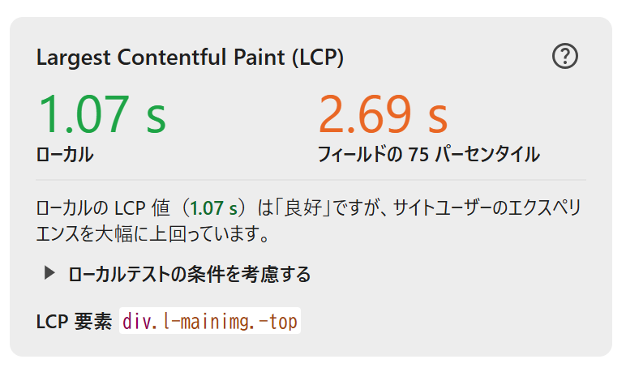

*（図）Chrome DevToolsで確認できるLCPの実測値*

代表的な改善策には、LCP要素をJavaScriptで動的に追加せず初期HTMLに含める、画像に`fetchpriority="high"`を付与する、レンダリングを妨げるCSSを削減・インライン化する、といった方法があります。

**INP**は、ページ滞在中に行われたすべてのクリック・タップ・キー入力のうち、最も応答が遅かったものを評価する指標です（ホバーやスクロールは対象外）。旧指標のFIDが「最初の操作」だけを測っていたのに対し、INPは**滞在中のすべての操作**を評価するため、より実態に近いUX評価ができるとされています。

| INPの構成要素 | 内容 |
| --- | --- |
| 入力遅延 | 操作からブラウザが処理を開始するまでの時間。他の重い処理でメインスレッドが塞がれていると悪化する |
| 処理期間 | イベントコールバック（操作に応じて実行されるJavaScript）の実行時間。INP全体の約40%を占めるとされる |
| 表示の遅延 | 処理完了後、実際に画面が新しい表示に切り替わるまでの時間 |

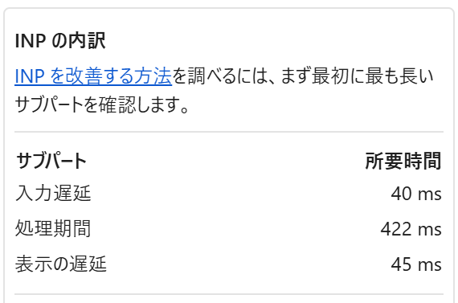

*（図）Chrome DevToolsで確認できるINPの内訳（サブパート別の所要時間）*

INPの改善策としては、不要なJavaScriptの削減、重い処理を細かいタスクに分割する（`setTimeout`・`scheduler.yield()`・`requestIdleCallback`などを利用）、DOM操作を伴わない処理をWeb Workerに逃がす、DOMツリーを小さく保つ（Lighthouseはbody内ノード数が800を超えると警告）といった方法が挙げられます。タグマネージャー（GTM）が肥大化しているケースも、INP悪化の原因になりやすいため、不要なタグの棚卸しが有効です。

**CLS**は、読み込み中に要素が予期せず動く「レイアウトシフト」の合計をスコア化した指標です。CLSスコアは次の計算式で求められます。

**【Note】**

CLSスコア＝「インパクトの割合」（画面のうち動いた範囲の割合）×「距離の割合」（要素が移動した距離の割合）。例えば、画面の50%を占める要素が画面高さの14%分movementした場合、0.5×0.14＝0.07がそのシフトのスコアになります。値が大きいほど、視覚的な安定性が損なわれていることを意味します。

CLSは他の2指標に比べて原因が特定しやすく、改善もしやすい指標とされています。代表的な原因と対策は次の通りです。

| よくある原因 | 改善策 |
| --- | --- |
| 画像・動画の高さ未指定 | `width`・`height`属性、またはCSSの`aspect-ratio`で領域を確保する |
| サイズ可変の広告枠 | 広告コンテナに`min-height`などでサイズを明示する |
| アニメーションによる要素移動 | レイアウトに影響する`margin`等ではなく、`transform`・`opacity`を使う |
| Webフォントの読み込み時のサイズ差（FOUT/FOIT） | 類似のフォールバックフォントを指定する、``で先読みする |

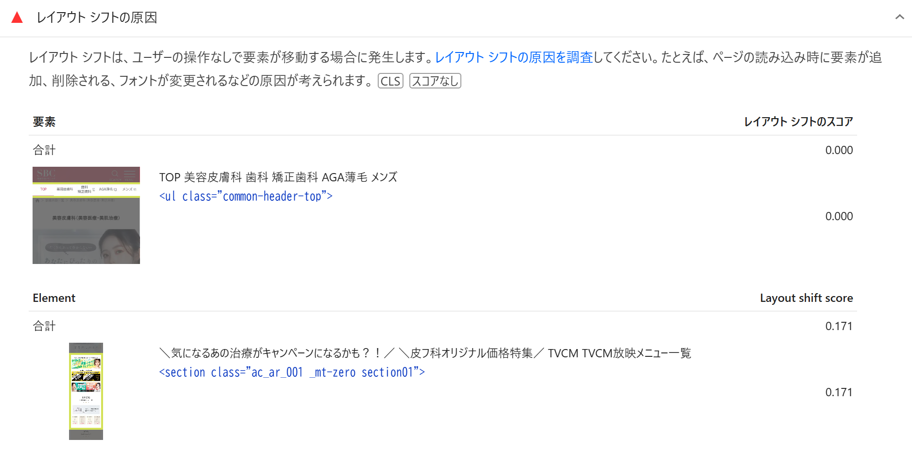

*（図）PageSpeed Insights（Lighthouse）で確認できるレイアウトシフトの原因の詳細*

### 15. 測定ツールの使い分け：Search Console・Lighthouse・PageSpeed Insights

Core Web Vitalsを測定するツールには、それぞれ異なる特徴があります。まず、計測データには性質の異なる2種類があることを理解しておきましょう。

**【用語定義】**

**フィールドデータ**
実際のユーザーから収集された実測データ。GoogleがChromeユーザーの利用状況から集める「CrUX（Chrome User Experience Report）」がこれにあたり、Search ConsoleやPageSpeed Insightsで確認できます。

**ラボデータ**
決められた条件下でシミュレーション的に計測されたデータ。Lighthouseが該当し、端末スペックやネットワーク状況に結果が左右されます。十分なアクセス数がなくCrUXデータが集まらないページでも計測できます。

3つのツールは、調査できるページの範囲や参照するデータソースが異なります。

| ツール | 調査可能ページ | データソース | 特徴 |
| --- | --- | --- | --- |
| **Search Console** | 自社管理の公開ページのみ | CrUX（フィールドデータ） | サイト全体のCWV傾向を把握し、「不良／改善が必要」なURL群を特定できる |
| **PageSpeed Insights** | 公開ページのみ | CrUX＋Lighthouseラボデータ | URLを入力するだけで実ユーザーデータと計測環境データの両方を即座に確認できる |
| **Lighthouse** | 非公開ページも含めて全て | ラボデータのみ | 開発環境での詳細なデバッグに向き、認証が必要なページもテストできる |

実務では、**Search Consoleで問題のあるURL群を特定 → Lighthouseで技術的な原因を深掘り → 改善を実施 → PageSpeed Insightsで効果を検証**という流れで使い分けるのが典型的なパターンです。

Search Consoleの「ウェブに関する主な指標」レポートでは、LCP・INP・CLSそれぞれについて、良好・改善が必要・不良の3段階でURLが分類されます。

| 指標 | 良好 | 改善が必要 | 不良 |
| --- | --- | --- | --- |
| LCP | 2.5秒以下 | 4秒以下 | 4秒超 |
| INP | 200ミリ秒以下 | 500ミリ秒以下 | 500ミリ秒超 |
| CLS | 0.1以下 | 0.25以下 | 0.25超 |

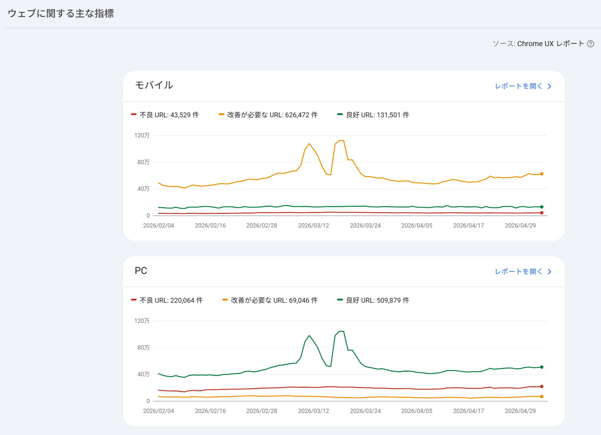

*（図）Search Console「ウェブに関する主な指標」レポート（モバイル／PC別のURL数推移）*

**【Note】**

Search Consoleでは、プライバシー保護の観点から、影響を受けているURLが個別にではなく「URLグループ」（ユーザー体験が類似すると考えられるURLの集合）としてまとめて表示されます。1つのグループを改善すると、同グループに属する複数ページの改善につながるという利点もあります。

Lighthouseは、パフォーマンス・ユーザー補助（アクセシビリティ）・おすすめの方法・SEOの4項目を100点満点で採点します。パフォーマンススコアは、FCP・Speed Index・LCP・TBT（Total Blocking Time）・CLSの加重平均で算出され、特にTBT（重み30%）とLCP・CLS（各25%）の影響が大きくなっています。

**【Point】**

PageSpeed Insightsには「このURL」（特定ページ単体）と「オリジン」（ドメイン全体の平均）という2つの集計範囲があります。「このURL」が「オリジン」より明確に悪い場合はページ固有の問題、両者が同程度に悪い場合はサイト全体・インフラ側の問題である可能性が高く、この比較から課題の切り分けができます。

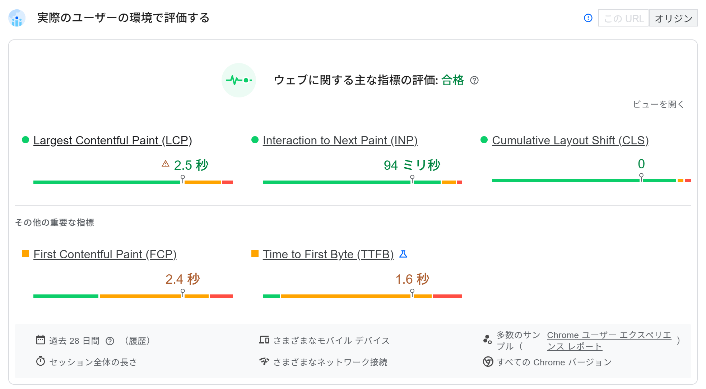

*（図）PageSpeed Insightsの「実際のユーザーの環境で評価する」フィールドデータ表示*

### 16. セキュリティ：HTTPS化

URLの先頭にある**HTTPS**は、ブラウザとWebサーバー間の通信を暗号化する仕組みです。通信内容の盗聴・改ざんを防ぐHTTP（Hypertext Transfer Protocol）の安全版として普及しました。

**【用語定義】**

**HTTPS（HTTP Secure）**
SSL/TLSプロトコルによる暗号化の上でHTTP通信を行う仕組み。通信データの暗号化、改ざんの検知、通信相手（サーバー）の認証という3つのセキュリティ上の役割を持ちます。日本国内でChromeがHTTPS経由で読み込んだページの割合は、2025年時点で95%に達しているとされています。

Google Search Central（公式ブログ、2014年）は、**HTTPS化を検索のランキングシグナルとして使用する**と発表しました。

**【Point】**

ただしGoogle自身の説明によれば、HTTPSは全体の検索クエリの1%未満にしか影響しない軽量なシグナルであり、質の高いコンテンツなど他の評価要素と比べると影響は小さいとされています。とはいえ、HTTPSはユーザーの通信を保護する基本的な仕組みであり、現在ではほぼすべてのサイトで標準的に導入されています。

HTTPS化は、ランキングシグナルとしての意味だけでなく、次のような点でもサイト運営に関わります。

- 多くのブラウザで、HTTP接続のページに「保護されていません」といった警告が表示されるため、HTTPS化はユーザーの信頼確保につながる
- 通信を高速化する新しいプロトコル（HTTP/2やHTTP/3）は、HTTPS接続が前提となっている
- フォームでの個人情報送信など、ユーザーの信頼が特に重要なページでは必須の対応とされている

**【Warning】**

SSL/TLS証明書の期限切れや、証明書のドメイン不一致、HTTPSページ内にHTTPのリソース（画像・CSS・JavaScriptなど）が混在している場合、ブラウザにセキュリティ警告が表示され、ユーザーの離脱につながります。HTTPS化の設定後は、Chrome DevToolsなどで証明書・TLS接続・リソースの配信経路に問題がないか確認することが推奨されます。

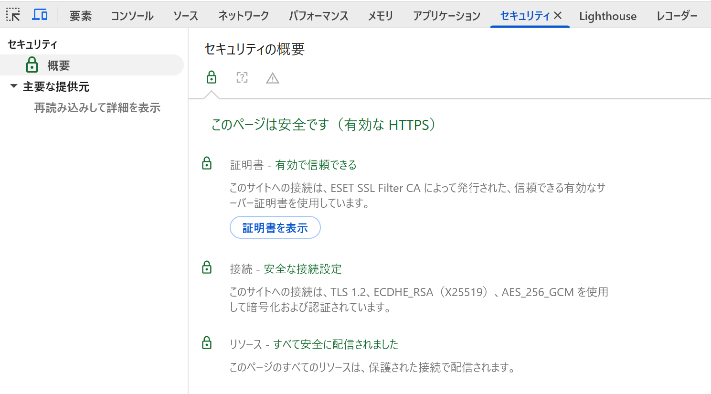

*（図）Chrome DevToolsのセキュリティタブでHTTPS接続状態を確認する画面*

## まとめ

- GoogleはわかりやすくPredictableなURL構造を推奨しており、サイトの構成を反映した短く明確なURLが望ましい
- URLの永続化とは、公開・インデックス済みのURLを変更せずに使い続けることで、やむを得ず変更する場合は301リダイレクトで評価を引き継ぐ
- title・meta description・見出し（h要素）・alt属性は、検索エンジンにページ内容を伝える基本的なHTML要素であり、初出時にそれぞれ役割を理解しておく必要がある
- 1URL1コンテンツの原則のもと、重複コンテンツはURLの相違パターンごとに301リダイレクトかcanonicalを使い分けて正規化する
- MECEなカテゴリ設計にはロジックツリー（WHAT/WHY/HOW）が役立ち、URLはキーワードを含め短くハイフン区切り・小文字で命名する
- 内部リンクはクローラーがページを発見する手がかりにもなり、ナビゲーション・パンくずリスト・メインコンテンツからのリンクにはそれぞれ異なる役割がある
- XMLサイトマップには正規URL（canonicalで指定したURL）のみを含めるべきで、canonicalタグは重複コンテンツの整理に使う
- meta robotsやrobots.txtでクローラの動きを制御できるが、すべてのAIbotが指示に従う保証はなく、robots.txtは誰でも閲覧できる点にも注意が必要
- URL検査ツール・RSS/Atomフィード・WebSubは、新規ページや更新ページのクロールを促進する手段であり、受動的・能動的な性質が異なる
- エラーは自サイト（内部）と外部サイトのリンク切れに分けて対応し、404はソフト404にならないよう正しいステータスコードを返す。スパムは価値の低いコンテンツ・質の低い被リンク・クローラへの偽装行為に大別される
- 表示速度はネットワーク処理・サーバー処理・レンダリング処理の3領域で決まり、TTFBなど各処理のボトルネックを切り分けることが高速化の出発点になる
- ネットワーク処理は通信量・通信回数・通信距離で決まり、圧縮技術やHTTP/2・HTTP/3、CDNが有効。レンダリング処理はCSS・JavaScript・画像それぞれの読み込み方法の工夫で改善できる
- キャッシュの活用（ブラウザキャッシュ・サーバーキャッシュ）やResource Hintsは表示を補完的に高速化する技術であり、サーバー処理の高速化はエンジニアとの連携が前提となる
- Core Web Vitalsは読み込み速度（LCP）・応答性（INP）・視覚的安定性（CLS）の3指標で構成され、それぞれ複数の構成要素（サブパート）に分解して原因を特定できる
- Search Console・Lighthouse・PageSpeed Insightsは、調査対象ページとデータソース（フィールドデータ／ラボデータ）が異なり、目的に応じて使い分ける
- GoogleはHTTPS化を2014年からランキングシグナルとして使用しているが、コンテンツの品質などと比べると影響は軽微な、軽量シグナルである

## 確認テスト

### Q1（単一選択）

MECE（ミーシー）なカテゴリ設計として、最も適切なものはどれか。

- A. 重複がなく、抜け漏れもない状態でカテゴリを分類すること　✅**（正解）**
- B. カテゴリ同士が重複していても、抜け漏れさえなければよい
- C. できるだけ多くのカテゴリに、同じページを重複して登録すること
- D. カテゴリ分けは一切行わず、すべてのページをフラットに並べること

**解説**：MECEとは「重複なく、抜け漏れなく（Mutually Exclusive and Collectively Exhaustive）」分類されている状態を指します。

### Q2（単一選択）

「URLの永続化」の考え方として、最も適切なものはどれか。

- A. URLはSEO評価のリセットのために定期的に変更すべきである
- B. 公開・インデックス済みのページのURLは、内容が存在する限りできるだけ変更しない　✅**（正解）**
- C. URLの永続化はSNSでの拡散には一切関係しない
- D. ブランド名を変更した場合、URLも即座に変更しなければならない

**解説**：URLの永続化とは、公開・インデックス済みのページのURLを、内容が存在する限り変更せずに使い続けるという考え方です。W3C創設者のティム・バーナーズ=リー氏も「Cool URIs don’t change」と述べています。

### Q3（単一選択）

やむを得ずページのURLを変更する場合の対応として、最も適切なものはどれか。

- A. 旧URLは放置し、新URLだけを新たに公開する
- B. URLを変更する際は、必ずページも削除しなければならない
- C. 旧URLから新URLへ301リダイレクトを設定し、評価をできる限り引き継ぐ　✅**（正解）**
- D. リダイレクトを設定すると、かえって評価が下がるため避けるべきである

**解説**：やむを得ずURLを変更する場合は、旧URLから新URLへ301リダイレクトを設定し、それまで蓄積された評価をできる限り引き継ぐことが望ましいとされています。

### Q4（複数選択）

title要素・meta description・h要素の扱いとして、正しいものをすべて選べ。

- A. h要素は階層（h1→h2→h3…）を飛ばさず、装飾目的だけで使うべきではない　✅**（正解）**
- B. meta descriptionは検索結果のスニペットに使われることがあり、ページごとにユニークな記述が推奨される　✅**（正解）**
- C. title要素はページ内容を端的に表し、サイト内でユニークな内容にすることが望ましい　✅**（正解）**
- D. h1タグはすべてのページで完全に同じ文言に統一しなければならない

**解説**：title・meta description・h要素はいずれもページごとにユニークで、階層や役割を意識した記述が推奨されます。h1をロゴ画像などで全ページ共通・同一文言にすることは、下層ページでは不適切とされています。

### Q5（単一選択）

img要素のalt属性の役割として、最も適切なものはどれか。

- A. ページの表示速度を自動的に向上させる属性である
- B. 画像のファイルサイズを圧縮するための属性である
- C. リンク先のURLを指定するための属性である
- D. 画像が表示されない場合の代替テキストであり、検索エンジンが画像内容を理解する手がかりにもなる　✅**（正解）**

**解説**：alt属性は画像が表示されない場合の代替テキストとして定義されており、スクリーンリーダーでの読み上げや、検索エンジンによる画像内容の理解にも使われます。

### Q6（単一選択）

「1URL1コンテンツの原則」が守られていない例として、最も適切なものはどれか。

- A. 検索条件が異なるにもかかわらず、常に同一のURL（例：search.php）で結果が表示される状態　✅**（正解）**
- B. 1つのURLに1つのまとまったコンテンツが対応している状態
- C. 各ページにユニークなtitleとdescriptionが設定されている状態
- D. ページネーションの各ページが、それぞれ自己参照のcanonicalを持っている状態

**解説**：検索条件によって表示内容が異なるにもかかわらず同一URLになっている状態は、「同一URLに異なるコンテンツが表示されるケース」に該当し、1URL1コンテンツの原則が守られていません。

### Q7（複数選択）

URLの正規化の方法として、正しいものをすべて選べ。

- A. 301リダイレクトは、旧URLへのアクセスを正規URLへ転送し、評価もあわせて引き継ぐ　✅**（正解）**
- B. Googleは基本的に301リダイレクトを推奨しており、できない場合の代替としてcanonicalを案内している　✅**（正解）**
- C. canonicalタグは、ユーザーを転送せずに正規URLを検索エンジンへ伝える　✅**（正解）**
- D. canonicalタグは常に相対パスで記述しなければならない

**解説**：301リダイレクトとcanonicalはどちらも正規化の手段ですが、性質が異なります。canonicalタグは絶対パスでの記述が推奨されています。

### Q8（単一選択）

ロジックツリーのうち、「頂点に解決したい問題や課題を置き、その原因をMECEに分解していく」手法はどれか。

- A. WHATツリー
- B. WHYツリー　✅**（正解）**
- C. HOWツリー
- D. SWOTツリー

**解説**：WHYツリーは、頂点に解決したい問題・課題を配置し、その原因をMECEに分類していく手法で、課題解決型サイトなどに適しています。

### Q9（複数選択）

内部リンクの設計で重要とされる観点として、正しいものをすべて選べ。

- A. どのページからも他のページへ辿れる、双方向のリンク構造にする　✅**（正解）**
- B. 常にトップページ・最上位カテゴリへ戻れるリンクを用意する　✅**（正解）**
- C. 関連するページ・上位カテゴリへリンクを張る　✅**（正解）**
- D. リンクは一方向にのみ張り、行き止まりのページを作る

**解説**：内部リンクの設計では、双方向リンク・関連ページへのリンク・上位階層への復帰リンクの3点が重要とされています。行き止まりになる一方向のリンクは避けるべきとされています。

### Q10（単一選択）

クローラビリティの観点で、注意が必要とされるリンク形式はどれか。

- A. href属性を持つ通常のテキストリンク（aタグ）
- B. パンくずリストのリンク
- C. href属性を伴わない、JavaScriptのonclickだけで遷移するリンク　✅**（正解）**
- D. グローバルナビゲーションのリンク

**解説**：href属性を伴わないJavaScriptのみのリンクはGoogleが非推奨としており、クローラビリティの観点で注意が必要です。href属性と併用すれば通常のリンクと同様に評価されます。

### Q11（単一選択）

XMLサイトマップに含めるべきURLとして、Google公式ガイドラインが推奨しているものはどれか。

- A. 重複しているURLも含め、サイト内のすべてのURLをできる限り含める
- B. アクセス数が少ないURLだけを含める
- C. XMLサイトマップにはURLを1つも含めない方がよい
- D. canonicalで指定した正規URLのみを含める　✅**（正解）**

**解説**：Google公式のガイドラインでは、XMLサイトマップには正規URL（canonicalで指定したURL）のみを含めることが推奨されています。

### Q12（単一選択）

XMLサイトマップの制約に関する説明として、正しいものはどれか。

- A. 1ファイルのURL数は50,000個以下、ファイルサイズは50MB以下（圧縮前）に収める必要がある　✅**（正解）**
- B. 1ファイルに含められるURLは無制限である
- C. XMLサイトマップは必ずルートディレクトリに設置しなければならない
- D. 画像や動画専用のサイトマップを作成することはできない

**解説**：XMLサイトマップは1ファイルにつきURL数50,000個以下、ファイルサイズ50MB以下（圧縮前）という制約があり、超える場合は複数ファイルに分割してサイトマップインデックスでまとめます。robots.txtと異なり設置場所も自由です。

### Q13（単一選択）

meta robotsのcontent属性に「noindex」を指定した場合の効果として、最も適切なものはどれか。

- A. そのページの表示速度が向上する
- B. そのページがインデックスされないようになる　✅**（正解）**
- C. そのページの検索順位が自動的に1位になる
- D. そのページへの外部リンクがすべて無効になる

**解説**：meta robotsのcontent属性に「noindex」を指定すると、そのページはインデックスされないようになります。

### Q14（単一選択）

X-Robots-Tagの説明として、最も適切なものはどれか。

- A. HTMLページにのみ使用できる、meta robotsの別名
- B. クロールバジェットを自動的に増やすための申請フォーム
- C. PDFや画像などmeta robotsを記述できない非HTMLファイルに対して、HTTPヘッダーでクロール・インデックスを制御する仕組み　✅**（正解）**
- D. XMLサイトマップの別の呼び方

**解説**：X-Robots-Tagは、PDFや画像など、meta robotsを記述できない非HTMLファイルに対して、HTTPヘッダーでクロール・インデックスの制御を行う仕組みです。

### Q15（複数選択）

クロールを促進する手段として、正しいものをすべて選べ。

- A. WebSubでハブ経由の更新通知を行う　✅**（正解）**
- B. Search ConsoleのURL検査ツールで、個別にクロールをリクエストする　✅**（正解）**
- C. RSS/Atomフィードで更新ページの情報を配信する　✅**（正解）**
- D. robots.txtで全クローラのアクセスを禁止する

**解説**：URL検査ツール・フィード・WebSubはいずれもクロールを促進する手段です。robots.txtで全クローラのアクセスを禁止することは、クロールの制限であり促進ではありません。

### Q16（単一選択）

「ソフト404」の説明として、最も適切なものはどれか。

- A. 404エラーページを一切用意しない状態
- B. 404エラーページのデザインをサイトの他ページと統一した状態
- C. リンク切れを完全に検出できるツールのこと
- D. 存在しないページに対して、ステータスコード200を返してしまっている状態　✅**（正解）**

**解説**：ソフト404とは、独自の404エラーページを用意した際に、本来返すべき404ではなくステータスコード200を返してしまっている状態を指します。これにより重複コンテンツとして扱われる可能性があります。

### Q17（複数選択）

スパム行為の3分類として、正しいものをすべて選べ。

- A. 価値の低いコンテンツ（コピーコンテンツ、キーワードの乱用など）　✅**（正解）**
- B. クローラへの偽装行為（隠しテキスト、クローキングなど）　✅**（正解）**
- C. 画像にalt属性を正しく設定する行為
- D. 質の低い被リンク（リンクの売買など）　✅**（正解）**

**解説**：スパム行為は「価値の低いコンテンツ」「質の低い被リンク」「クローラへの偽装行為」の3つに大別されます。alt属性を正しく設定することはスパムではなく推奨される対応です。

### Q18（複数選択）

Webページの表示速度に関わる3つの処理領域として、正しいものをすべて選べ。

- A. レンダリング処理（受け取ったデータを画面に描画する）　✅**（正解）**
- B. インデックス処理（クロールしたページをデータベースに登録する）
- C. ネットワーク処理（ブラウザとサーバー間のデータの送受信）　✅**（正解）**
- D. サーバー処理（リクエストを受けてHTMLを組み立てる）　✅**（正解）**

**解説**：表示速度はネットワーク処理・サーバー処理・レンダリング処理の3領域に分けて捉えられます。インデックス処理は検索エンジン側の仕組みであり、表示速度の3領域には含まれません。

### Q19（単一選択）

HTTP/2の特徴として、最も適切なものはどれか。

- A. 1つのTCPコネクション内で複数のストリームを多重化し、順不同でデータを処理できる　✅**（正解）**
- B. 1つのコネクションで1組のリクエスト・レスポンスしか処理できない
- C. 常にHTTP接続（非暗号化）が前提となっている
- D. 画像の圧縮形式の一種である

**解説**：HTTP/2は1つのTCPコネクション内で複数の仮想的な通信路（ストリーム）を多重化でき、順不同でデータを処理できるため、通信回数によるネットワーク処理の遅延が軽減されます。

### Q20（単一選択）

キャッシュに関する説明として、最も適切なものはどれか。

- A. キャッシュを設定すると、常にファイルの中身を書き換えずに配信し続けなければならない
- B. キャッシュには保存場所によってブラウザキャッシュとサーバーキャッシュの2種類がある　✅**（正解）**
- C. 更新頻度の高いファイルには、必ず長期間のキャッシュを設定すべきである
- D. キャッシュはネットワーク処理やレンダリング処理とは無関係な仕組みである

**解説**：キャッシュは保存場所によってブラウザキャッシュとサーバーキャッシュに分かれます。更新頻度の高いファイルは、ファイル名にフィンガープリントを埋め込むなどしてキャッシュの更新漏れを防ぐ工夫が必要です。

### Q21（複数選択）

Core Web Vitalsを構成する3つの指標として、正しいものをすべて選べ。

- A. CTR（Click Through Rate）：クリック率
- B. INP（Interaction to Next Paint）：操作への応答性　✅**（正解）**
- C. CLS（Cumulative Layout Shift）：視覚的な安定性　✅**（正解）**
- D. LCP（Largest Contentful Paint）：読み込み速度　✅**（正解）**

**解説**：Core Web VitalsはLCP（読み込み速度）・INP（応答性）・CLS（視覚的安定性）の3指標で構成されます。CTR（クリック率）はCore Web Vitalsには含まれません。

### Q22（単一選択）

Core Web Vitalsの指標の変遷についての説明として、正しいものはどれか。

- A. Core Web Vitalsの指標は発表以来、一度も変更されていない
- B. LCPは2024年に廃止され、現在は使われていない
- C. 2024年3月に、それまで使われていたFID（初回入力遅延）がINPに置き換えられた　✅**（正解）**
- D. Core Web Vitalsはランキングシグナルとして使われたことは一度もない

**解説**：Core Web Vitalsは2021年6月からランキングシグナルとして使用されており、指標も更新されています。2024年3月には、それまでのFID（初回入力遅延）がINPに置き換えられました。

### Q23（単一選択）

CLSスコアの計算方法として、最も適切なものはどれか。

- A. 要素が移動した距離（ピクセル数）そのものがCLSスコアになる
- B. インパクトの割合と距離の割合を足し合わせた値がCLSスコアになる
- C. CLSスコアはページの読み込み時間から自動的に算出される
- D. インパクトの割合と距離の割合を掛け合わせた値がCLSスコアになる　✅**（正解）**

**解説**：CLSスコアは「インパクトの割合（動いた要素が画面に占める割合）」と「距離の割合（要素が移動した距離の割合）」を掛け合わせて算出されます。

### Q24（単一選択）

Search Console・Lighthouse・PageSpeed Insightsの違いに関する説明として、最も適切なものはどれか。

- A. Lighthouseは非公開ページを含めて調査でき、端末環境に依存するラボデータを提供する　✅**（正解）**
- B. 3つのツールはすべて同じデータソース・同じ調査対象ページを扱う
- C. Search Consoleは非公開ページの調査に特化したツールである
- D. PageSpeed Insightsではフィールドデータもラボデータも一切参照できない

**解説**：Lighthouseは非公開ページも含めて調査でき、その場でシミュレーション計測したラボデータを提供します。一方Search Consoleは自社管理の公開ページのみ、PageSpeed Insightsは公開ページのフィールドデータとラボデータ両方を扱います。

### Q25（単一選択）

HTTPS化とGoogleのランキングシグナルの関係について、公式ブログが示している見解として、最も適切なものはどれか。

- A. HTTPS化は検索順位に一切影響しない
- B. HTTPS化はランキングシグナルとして使用されているが、コンテンツの品質など他の要素と比べると影響は軽微である　✅**（正解）**
- C. HTTPS化さえすれば、他の要素に関わらず必ず1位になれる
- D. HTTPS化はセキュリティ上の意味しかなく、SEOとは無関係な施策である

**解説**：Google公式は2014年にHTTPS化をランキングシグナルとして使用すると発表しましたが、全体のクエリの1%未満にしか影響しない軽量なシグナルであり、コンテンツの品質などと比べると影響は小さいとしています。

### Q26（複数選択）

HTTPSが持つセキュリティ上の役割として、正しいものをすべて選べ。

- A. データ改ざんの検知　✅**（正解）**
- B. 通信データの暗号化　✅**（正解）**
- C. ページの表示速度を自動的に2倍にすること
- D. 通信相手（サーバー）の認証　✅**（正解）**

**解説**：HTTPSは通信データの暗号化・改ざんの検知・通信相手の認証という3つのセキュリティ上の役割を持ちます。表示速度を「自動的に2倍にする」機能ではありません。

### Q27（単一選択）

わかりやすいURLの考え方として、ガイドの記述に最も近いものはどれか。

- A. 内容と無関係でも短い連番ID（例：/p?id=8421）にする
- B. 対策キーワードをURLの中で何度も繰り返す
- C. 内容が推測できる意味のある語を使う（例：/blog/cheese-recipe）　✅**（正解）**
- D. 階層をできるだけ深くし、パラメータを多く付与する

**解説**：URLは内容が推測できる意味のある語で構成すると、ユーザーにも検索エンジンにも分かりやすくなります。（スターターガイド『わかりやすいURLを使用する』）

### Q28（単一選択）

ドメイン名やTLD（「.com」「.guru」など）がGoogleのランキングに与える影響について、ガイドの記述に最も近いものはどれか。

- A. 「.com」ドメインは常に上位表示されやすい
- B. ドメイン名にキーワードを含めると順位が大きく上がる
- C. 「.org」は「.com」より信頼され、ランキングが上がる
- D. ドメイン名/URL中のキーワードやTLDの種類は、ランキングにほとんど影響しない（特定国向けのccTLDを除く）　✅**（正解）**

**解説**：ドメイン名やURL中のキーワード、TLDの種類は基本的にランキングにほとんど影響しません（特定の国のユーザーを狙うccTLDのケースを除く）。（スターターガイド『Googleが重要でないと考えること』）
