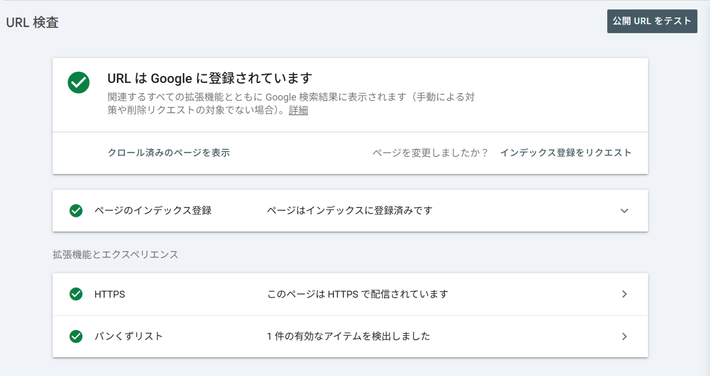
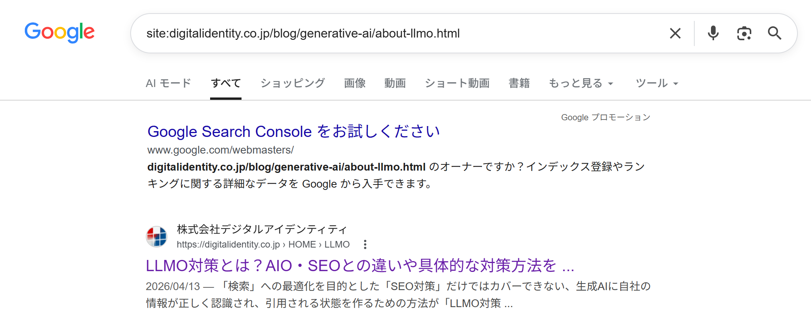

# 第10章　Search Console（基礎）

> フェーズ: practice ／ 目安: 約18分

Google Search Consoleへのサイト登録（所有権確認）、URL検査ツールの使い方、そしてサイト全体の構造・インデックス状況を把握する基本を理解する

## 学習目標

- Search Consoleがどのようなツールかを説明できる
- 「ドメインプロパティ」と「URLプレフィックスプロパティ」の違いを理解する
- サイトの所有権確認が必要な理由を理解する
- URL検査ツールでできることを理解する
- サイト全体のURLを取得・整理し、全体を把握することの重要性を理解する
- クロールとレンダリングの健全性を確認する基本的な観点を理解する

## 本文

### 1. 登録：Search Consoleとは

**Google Search Console**は、Googleが無料で提供している、サイト運営者向けのツールです。自分のサイトがGoogle検索でどのように扱われているかを確認・管理できます。

**【用語定義】**

**Search Console**
Googleが提供する、Webサイト運営者向けの無料ツール。検索結果での表示状況、クロール・インデックスの状態、検索パフォーマンス（クリック数・表示回数など）を確認できます。GA4がサイト**訪問後**の行動を計測するのに対し、Search Consoleは**検索結果に表示される前後**の情報を扱う点が特徴です。

Search Consoleを利用するには、まず自分のサイトを**プロパティ**として登録する必要があります。登録方法には大きく2種類あります。

| プロパティタイプ | 対象範囲 | 所有権確認の方法 |
| --- | --- | --- |
| **ドメインプロパティ** | サブドメインを含む、ドメイン全体（http/https/wwwの有無を問わない） | DNSレコードへの追記が必要 |
| **URLプレフィックスプロパティ** | 指定したURL（例：https://www.example.com/）配下のみ | HTMLファイルのアップロード、HTMLタグの追加など複数の方法から選択可能 |

**【Point】**

Googleはドメイン全体のデータを包括的に管理できるドメインプロパティの利用を推奨していますが、サブドメインで運営するブログなど、特定の範囲だけを個別に分析したい場合はURLプレフィックスプロパティが適しています。

### 2. 登録：所有権確認

Search Consoleにサイトを登録する際は、**そのサイトの管理者本人であること**を証明する「所有権の確認」が必要です。

**【Warning】**

所有権が確認される前でも、プロパティを追加した時点からデータの収集自体は始まりますが、所有権が確認されるまでは、詳細な情報の閲覧や各種機能の利用はできません。登録したら早めに所有権確認を完了させることが重要です。

所有権確認の主な方法には、次のようなものがあります。

- 指定されたHTMLファイルをサイトのサーバーにアップロードする
- 指定されたHTMLタグをサイトの``内に追加する
- ドメインのDNS設定にTXTレコードを追加する
- 連携しているGoogleアナリティクスのアカウントを利用する

### 3. インデックス：URL検査ツール

Search Consoleの**URL検査ツール**を使うと、特定のURLが現在Googleにどう認識されているかを個別に確認できます。

**【用語定義】**

**URL検査ツール**
指定したURLについて、インデックス登録されているか、登録されていない場合はその理由、モバイル対応の状況、構造化データの検出状況などを確認できるSearch Consoleの機能。

*（図）図：URL検査ツールの結果画面。指定したURLがインデックス登録済みか、HTTPSやパンくずリストの状態などを個別に確認できる*

URL検査ツールで確認できる主な情報は次のとおりです。

- そのページが現在インデックスに登録されているかどうか
- インデックスされていない場合、その原因（クロールされていない、robots.txtでブロックされている等）
- 最後にGooglebotがそのページをクロールした日時
- ページで検出された構造化データ（後の章で学びます）の有無

**【Note】**

新しく公開したページや、大きく内容を更新したページについて、URL検査ツールから「インデックス登録をリクエスト」することもできます。ただし、リクエストしたからといって必ずすぐにクロール・インデックスされるとは限りません。

### 4. 把握：サイト全体のURLを取得・整理する

SEOの第一歩は、サイト内にどのようなページが存在しているかを正確に把握することです。個別のページの問題を見つけて改善することは比較的容易ですが、**サイトの全容を把握しないまま**その場しのぎの対応を続けても、本質的な改善にはつながりにくいとされています。

まず、サイトに存在する全URLを一覧化し、次のような視点で構造を確認・整理します。

- **URLの階層：**トップ→カテゴリ→詳細ページといった階層構造になっているか
- **URLの規則性：**命名ルールが統一されているか
- **URLの表記ゆれ：**末尾のスラッシュ有無、index.htmlなどファイル名の有無
- **title・descriptionの規則性：**空欄や重複、記述ミスがないか
- **不要なURL：**並び替え用や、テスト用など、インデックスすべきでないURLがないか
- **パラメータURL：**無限に生成されうるパラメータ付きURL（例：`?sort=asc`）がないか

URLの取得には、クロールツール（Screaming Frogなど）に加え、Search Consoleやsitemap.xmlで取得できるURLもあわせて集めます。クロールツールでは動的に生成されるページなど、URLが欠損する場合があるためです。取得したURLは、title・description・h1・ステータスコード・canonical・meta robotsなどのページ情報とあわせて、Excelやスプレッドシートで一覧化すると、サイト全体の傾向や違和感（命名ルールの不統一など）に気付きやすくなります。

*（図）図：「site:URL」で検索して、特定ページがインデックス登録されているかを確認した例。サイトの把握では、こうした演算子や各種ツールを併用してインデックス状況を確認する*

**【Note】**

sitemap.xmlは、検索エンジンに対して「どのページをクロール・インデックスしてほしいか」を明示するファイルです。必要なページが漏れなく記述されているか、逆に不要なページが混ざっていないかの確認にも役立ちます。

### 5. 把握：クロールとレンダリングの健全性確認

検索エンジンがページを評価・インデックスするためには、クローラーがURLに**アクセス（クロール）**し、さらにページの内容を**レンダリング**して把握する必要があります。このどちらかに問題があると、内容がどれだけ優れていても検索結果に正しく反映されません。

**【用語定義】**

**クロールの統計情報**
Googlebotが自サイトをどのようにクロールしているか、その履歴と傾向を確認できるSearch Consoleのレポート。クロールリクエストの合計数、レスポンスコード別のリクエスト数、ファイルタイプ別のクロール状況、クロールの目的（新規ページの検出か既存ページの更新か）などを確認できる。

クロール健全性を確認する主な観点は次のとおりです。

- robots.txtで重要ページが誤ってブロックされていないか
- 意図しないnoindexがページに付与されていないか
- 404エラーや500エラーが多発していないか
- クロール頻度・対象に急激な増減がないか

特に大規模サイトでは、動的に不要ページが生成されやすく、クロールバジェット（Googlebotがサイトに割り当てるクロールの量）が無駄に消費されているケースもあるため、定期的な確認が推奨されます。ページ数が1,000未満程度の小規模サイトであれば、リニューアルやCMS変更などのタイミングで確認すれば十分とされています。

レンダリングの健全性は、Search Consoleの**URL検査ツール**から「クロール済みページを表示」を選択することで確認できます。Googlebotが解釈したHTMLソースやスクリーンショットが表示され、JavaScriptで生成されるコンテンツが正しく認識されているか、意図しないリソースがブロックされていないかをチェックできます。

**【Point】**

インデックス状況は、コンテンツの追加・削除やアルゴリズムの変化によって日々変動します。「一度整理して終わり」にせず、定期的にモニタリングする体制を整えることが、場当たり的な対応にならないための土台になります。継続的なモニタリングの具体的な方法は、第11・12章で詳しく学びます。

## まとめ

- Search ConsoleはGoogleが無料で提供する、自サイトの検索結果での扱われ方を確認・管理するためのツールである
- プロパティにはドメイン全体を対象にする「ドメインプロパティ」と、特定URL配下のみを対象にする「URLプレフィックスプロパティ」がある
- サイトの管理者であることを証明する「所有権確認」を行わないと、Search Consoleの詳細機能は利用できない
- URL検査ツールでは、特定のURLのインデックス状況やクロール履歴、構造化データの検出状況を確認できる
- サイト全体のURLをクロールツールやSearch Console、sitemap.xmlから取得・整理することが、SEO戦略を立てる土台になる
- クロールの統計情報やURL検査ツールを使い、クロール・レンダリングの健全性を定期的に確認することが重要である

## 確認テスト

### Q1（単一選択）

Search Consoleの説明として、最も適切なものはどれか。

- A. サイト訪問後のユーザー行動（滞在・回遊・CV）を計測するツール
- B. 検索広告の入札単価やキーワードを管理するツール
- C. 自サイトが検索結果でどう扱われているかを確認・管理できるGoogleの無料ツール　✅**（正解）**
- D. 競合サイトの被リンクを網羅的に取得する有料ツール

**解説**：Search Consoleは検索結果での扱いを確認・管理する無料ツールです。訪問後の行動計測はGA4、広告管理はGoogle広告など、役割が異なります。

### Q2（単一選択）

「ドメインプロパティ」の特徴として、最も適切なものはどれか。

- A. 特定のURL配下のみを対象とする
- B. 所有権確認の方法はHTMLファイルのアップロードのみである
- C. ドメインプロパティは現在Googleでは利用できない
- D. サブドメインを含むドメイン全体を対象とし、http/https/wwwの有無を問わずまとめて扱う　✅**（正解）**

**解説**：ドメインプロパティは、サブドメインを含むドメイン全体を対象とし、http/https/wwwの有無を問わずまとめて1つとして扱われます。

### Q3（単一選択）

Search Consoleの所有権確認に関する説明として、正しいものはどれか。

- A. 所有権が確認されるまでは、詳細な情報の閲覧や各種機能の利用ができない　✅**（正解）**
- B. 所有権確認をしなくても、すべての機能をすぐに使うことができる
- C. 所有権確認の方法はDNSレコードへの追記のみである
- D. 所有権確認は一度も行う必要がない

**解説**：プロパティ追加時点からデータ収集は始まりますが、所有権が確認されるまでは詳細な情報の閲覧や機能の利用はできません。

### Q4（複数選択）

URL検査ツールで確認できる情報として、正しいものをすべて選べ。

- A. そのページがインデックスに登録されているかどうか　✅**（正解）**
- B. 最後にGooglebotがそのページをクロールした日時　✅**（正解）**
- C. ページで検出された構造化データの有無　✅**（正解）**
- D. そのページを閲覧したユーザーの氏名

**解説**：URL検査ツールでは、インデックス状況、最終クロール日時、構造化データの検出状況などを確認できます。個人を特定する情報は扱いません。

### Q5（単一選択）

URL検査ツールから「インデックス登録をリクエスト」した場合の説明として、最も適切なものはどれか。

- A. リクエストした瞬間に、必ず検索結果の1位に表示される
- B. リクエストしても、必ずすぐにクロール・インデックスされるとは限らない　✅**（正解）**
- C. リクエストは1サイトにつき生涯で1回しか行えない
- D. インデックス登録のリクエストという機能はSearch Consoleには存在しない

**解説**：インデックス登録をリクエストすることはできますが、リクエストしたからといって必ずすぐにクロール・インデックスされるとは限りません。

### Q6（複数選択）

サイト全体のURLを整理する際に確認すべき観点として、正しいものをすべて選べ。

- A. URLの階層や命名ルールの規則性　✅**（正解）**
- B. title・descriptionの重複や記述ミスの有無　✅**（正解）**
- C. 無限に生成されうるパラメータ付きURLの有無　✅**（正解）**
- D. サイト運営会社の資本金の額

**解説**：URLの階層・規則性、title・descriptionの重複や記述ミス、パラメータURLの有無などは、サイト全体を把握する上で確認すべき観点です。資本金の額はSEOのURL整理には関係ありません。

### Q7（単一選択）

サイトのURLを取得・整理することの意義として、最も適切なものはどれか。

- A. URLを整理しても、SEO戦略にはまったく関係しない
- B. URLは一度整理したら二度と確認する必要がない
- C. サイトの全容を把握することが、場当たり的でない改善施策を考えるための土台になる　✅**（正解）**
- D. URLの整理はクロールツールだけで完結し、Search Consoleの情報は不要である

**解説**：サイトの全容を正確に把握することは、部分的な対応に終始せず、本質的な改善施策を検討するための土台になります。クロールツールに加え、Search Consoleやsitemap.xmlの情報もあわせて活用することが推奨されます。

### Q8（単一選択）

クロールの健全性を確認する観点として、最も適切なものはどれか。

- A. 画像のalt属性が全ページで同一の文言に統一されているか
- B. 競合サイトより表示速度がわずかでも速いか
- C. 直帰率やセッション時間が改善しているか
- D. robots.txtで重要ページを誤ってブロックしていないか、404・500エラーが多発していないか　✅**（正解）**

**解説**：クロールの健全性は、robots.txtの誤ブロックや404・500エラーの多発などで確認します。alt統一や直帰率などはクロール健全性の観点ではありません。

### Q9（単一選択）

レンダリングの健全性を確認する方法として、最も適切なものはどれか。

- A. URL検査ツールで、Googlebotが取得・解釈したHTMLやスクリーンショットを確認する　✅**（正解）**
- B. ブラウザのソース表示で、サーバーが返す初期HTMLだけを確認する
- C. GA4のリアルタイムレポートで表示回数を確認する
- D. PageSpeed Insightsのスコアだけで判断する

**解説**：レンダリングの健全性は、URL検査ツールでGooglebotが解釈した後のHTMLやスクリーンショットを確認するのが確実です。初期HTMLや速度スコアだけでは判断できません。
