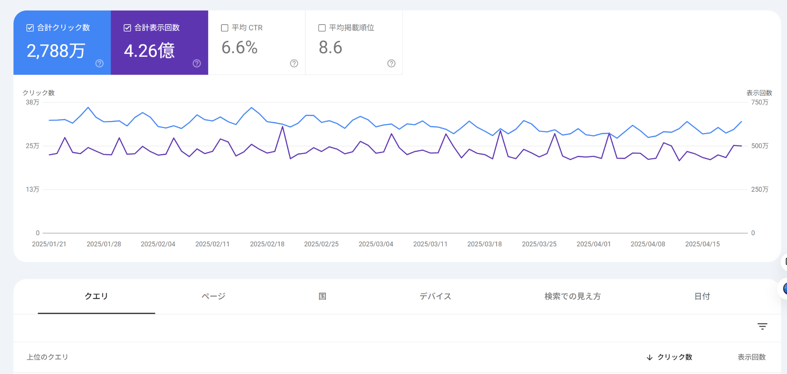
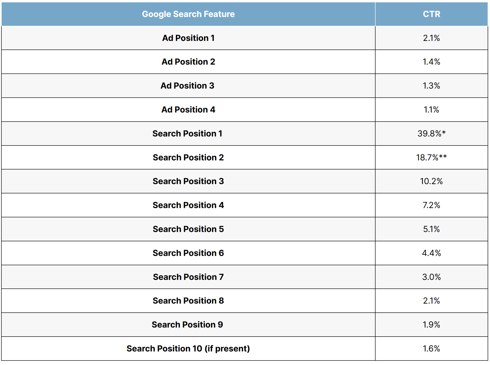

# 第11章　Search Console（分析）

> フェーズ: practice ／ 目安: 約22分

検索パフォーマンスレポートの4指標を理解し、順位分析やインデックス未登録の調査、検索からCVまでのファネル全体のモニタリングに活用する方法を学ぶ

## 学習目標

- 検索パフォーマンスレポートの4つの指標（クリック数・表示回数・CTR・掲載順位）を説明できる
- 検索パフォーマンスレポートを使った改善の考え方を理解する
- ページインデックス登録レポートの基本的な見方を理解する
- インデックス未登録の主な理由を理解する
- 検索からCVまでのファネル全体を、各種数値でモニタリングする考え方を理解する
- 検索順位が変動した際に、原因をどう切り分けて考えるかを理解する

## 本文

### 1. 検索パフォーマンス：クリック・表示回数・CTR・順位

Search Consoleの**検索パフォーマンスレポート**では、自サイトが検索結果でどう扱われているかを、次の4つの指標で確認できます。

*（図）図：Search Consoleの検索パフォーマンスレポート。合計クリック数・合計表示回数・平均CTR・平均掲載順位の4指標と、その推移グラフを確認できる*

| 指標 | 意味 |
| --- | --- |
| **クリック数** | ユーザーがGoogle検索の結果からサイトをクリックした回数 |
| **表示回数（インプレッション数）** | サイトが検索結果に表示された回数 |
| **CTR（クリック率）** | クリック数を表示回数で割った値（クリック数 ÷ 表示回数） |
| **平均掲載順位** | 検索結果におけるサイトの平均的な表示順位 |

**【用語定義】**

**CTR（Click Through Rate／クリック率）**
検索結果に表示された回数のうち、実際にクリックされた割合。同じ掲載順位でも、タイトルや説明文（スニペット）の魅力度によってCTRは変わります。

**【Note】**

掲載順位やタイトルが変わらなくても、CTRが下がることがあります。原因の一つが**ゼロクリックサーチ**です。ユーザーがAI Overview（第14章で学びます）や検索結果のスニペットだけで満足し、実際にはページへ遷移しないケースが増えているためです。CTRの変化を見る際は、こうした検索結果画面自体の変化も念頭に置くとよいでしょう。

これらの指標は、クエリ（検索キーワード）別・ページ別・国別など、さまざまな軸でフィルタリング・グループ化して確認できます。ただし、Search Consoleの管理画面では上位1,000件までしかデータが表示されない点に注意が必要です。ページ数の多い大規模サイトでは、後述するSearch Console APIやBigQueryとの連携も検討します（第12章で扱います）。

### 2. 改善：順位分析

検索パフォーマンスレポートは、単に数値を眺めるだけでなく、**改善につなげるための分析**に活用します。

**【Point】**

「表示回数は多いのにクリック数が少ない（CTRが低い）」ページは、タイトルやディスクリプション（スニペット）の改善余地があるサインです。逆に「掲載順位は低いのにクリック率が高い」クエリは、コンテンツの追加・強化によって順位向上が見込める可能性があります。

| 状況 | 考えられる改善の方向性 |
| --- | --- |
| 表示回数は多いが、CTRが低い | タイトル・ディスクリプションの見直し |
| 掲載順位が2ページ目以降（11位〜）にある | コンテンツの充実、内部リンクの強化 |
| 特定のクエリで順位が急落した | コアアップデートの時期や、ページの変更履歴と照らし合わせて原因を調査 |

*（図）図：検索結果の掲載順位別クリック率（CTR）の目安。1位で約40%、順位が下がるほど急激に低下し、2ページ目（11位以降）ではごくわずかになる*

順位データを取得する際は、対象キーワードが少なければ検索パフォーマンスレポートを都度確認する方法でも十分ですが、対策キーワードが多い場合はSearch Console APIやスプレッドシートのアドオンを使い、定期的に自動取得できる仕組みを整えると効率的です。取得した順位は、検索ボリュームの大きい重要キーワードは**キーワード単位**で、ミドル〜テールワードは**グループ単位**で可視化すると、全体の傾向を把握しやすくなります。

### 3. インデックス未登録の調査

Search Consoleの**ページ（インデックス作成）レポート**では、サイト内のどのページがインデックスに登録されていて、どのページが登録されていないか、その理由とあわせて確認できます。

**【用語定義】**

**ページ（インデックス作成）レポート**
サイト内のURLについて、インデックス登録の状況を一覧できるSearch Consoleの機能。「エラー」「有効（警告あり）」「有効」「除外」といったステータスに分類され、除外の場合はその理由も確認できます。

インデックス未登録の代表的な理由には、次のようなものがあります。

- **検出 - インデックス未登録：**Googleにページの存在は発見されたが、まだクロールされていない状態
- **クロール済み - インデックス未登録：**クロールはされたが、低品質と判断された等の理由でインデックスされていない状態
- **robots.txtによるブロック：**クロール自体が明示的に禁止されている状態

**【Warning】**

重要なページが意図せず「除外」に分類されている場合は、原因を特定して対処する必要があります。第10章で学んだURL検査ツールと組み合わせて、個別のページの状態を詳しく確認するとよいでしょう。

また、sitemap.xmlに記載しているURL数と、実際のインデックス数を比較することも有効です。両者に大きな乖離がある場合、想定以上に多くのページがインデックスされていない可能性があり、技術的または内容的な問題が潜んでいるサインになります。

### 4. ファネル：検索からCVまでのモニタリング

SEOは検索エンジンからの集客を経て、Webサイト上での購入や申し込みなどのコンバージョン（CV）につなげることを目的にしています。この検索からCVまでの流れは、下図のように**ファネル（漏斗）**の形状で捉えられます。

- **検索ボリューム**：すべての起点となる検索の母数

- **表示回数**：検索結果に表示された回数

- **クリック数（流入）**：CTRに応じてサイトへ流入

- **CV数**：CVRに応じて成果へ

*（図）図1：検索からCVまでのファネル*

SEOの基本的なモニタリングは、このファネルの流れを継続的にウォッチすることです。施策の実施翌日に効果が出るとは限りませんが、数値が上昇トレンドであれば一定の効果があったと判断できますし、施策なしに数値が変化した場合は、自サイトや競合、あるいはアルゴリズムに何らかの変化が起きた可能性を疑う材料になります。

**【用語定義】**

**インデックス数**
Search Consoleの「ページ」レポートから確認できる、Googleにインデックスされているページ数。前日までのデータが反映される。リアルタイムに近い状況を確認したい場合は、Google検索窓に「site:ドメイン名」と入力する「siteコマンド」も参考程度に使える（正確なインデックス数とは異なる点に注意）。

クリック数・表示回数・CTRに加えて、流入数・CV数・CVR（クリックからCVに至る比率）は、Google Analytics（GA4）を使って取得します。Search Consoleで確認できるクリック数はGoogle自然検索からの流入に限定されるため、Yahoo! JAPANなどを含む自然検索全体からの流入を把握するには、GA4の「トラフィック獲得」レポートで「Organic Search」を確認します。

**【Point】**

ビジネス本来のゴールはCV数そのものではなく、そこから生まれる売上や利益です。1ユニークユーザー（UU）あたりの売上・利益を示す「UU価値」、1CVあたりの売上・利益を示す「CV価値」まで追うことで、CV数だけを見ていては気付けない問題（流入は増えているが売上につながっていない、など）を発見できることがあります。

### 5. ファネル：順位変動の切り分けと原因調査

検索順位はSEOにおいて最も注視されやすい指標ですが、Googleは日々アルゴリズムを更新しているため、**小幅な順位の上下動は日常的に起こり得ます**。順位変動の本質を見誤らないために、次の2点を意識することが重要です。

- 1か月〜数か月単位で、一方向への変化傾向があるか
- 自サイトのみが変動しているか、競合サイトも含めて全体的に変動しているか

|  | 短期的変化 | 長期的変化 |
| --- | --- | --- |
| **自サイトのみの変動**
（評価の定着） | 小幅な変化は無視してよい。大幅な変化はスパム判定の可能性があり要調査 | 施策の効果の発現 |
| **全体的な変動**
（アルゴリズムの変更） | 順位変動理由の確認・対応が必要 |  |
| **特定キーワードのみの変動**
（検索意図の変化） | トレンドの急上昇、検索意図が曖昧な場合の一時的な変化 | 検索意図の恒常的な変化（例：初心者向け→比較検討者向け） |

主に自サイトの順位のみが変動している場合は、施策の効果や評価の定着が推測されます。一方、競合も含めて全体的に順位が変動している場合は、検索エンジンのアルゴリズム自体が変更された可能性が高く、上昇・下落したサイトを目視で確認し、共通する要素を探ることが手がかりになります。アルゴリズムアップデートへの具体的な対応は、第13章で詳しく学びます。

**【Note】**

検索順位の変動は、SEO評価の変化だけが原因とは限りません。キーワードの**検索意図**自体が変わることで、上位表示されるページの傾向が変わることもあります。定期的に検索結果画面（SERPs）をキャプチャして保存しておくと、後から順位変動の要因を分析する際の手がかりになります。

## まとめ

- 検索パフォーマンスレポートは、クリック数・表示回数・CTR・平均掲載順位の4指標でサイトの検索結果での状況を示す
- ゼロクリックサーチとは、ユーザーがAI Overviewやスニペットだけで満足しページへ遷移しないケースが増えている現象で、CTRが下がる一因になる
- 表示回数は多いがCTRが低いページはタイトル・ディスクリプションの見直し、順位が低いクエリはコンテンツ強化が改善の手がかりになる
- ページ（インデックス作成）レポートで、サイト内のインデックス登録状況とその理由を確認できる
- インデックス未登録には「検出-インデックス未登録」「クロール済み-インデックス未登録」など複数の状態があり、それぞれ原因が異なる
- SEOは検索ボリューム→表示回数→クリック数（流入）→CV数というファネルで捉えられ、Search ConsoleとGA4を組み合わせて継続的にモニタリングする
- CV数だけでなくUU価値・CV価値まで追うことで、売上・利益につながっているかというビジネス本来の視点で成果を評価できる
- 順位変動は自サイトのみか競合を含む全体的な変動かを見極め、短期的なノイズと長期的な傾向を区別して分析することが重要である

## 確認テスト

### Q1（複数選択）

検索パフォーマンスレポートに表示される指標として、正しいものをすべて選べ。

- A. 平均掲載順位　✅**（正解）**
- B. サイトの月間サーバー費用
- C. 表示回数（インプレッション数）　✅**（正解）**
- D. クリック数　✅**（正解）**

**解説**：検索パフォーマンスレポートには、クリック数・表示回数・CTR・平均掲載順位の4指標が表示されます。サーバー費用のような会計情報は含まれません。

### Q2（単一選択）

CTR（クリック率）の説明として、最も適切なものはどれか。

- A. サイトの表示速度を示す指標
- B. クリック数を表示回数で割った値　✅**（正解）**
- C. 検索結果に表示された広告の数
- D. インデックスに登録されたページの総数

**解説**：CTR（クリック率）は、クリック数を表示回数（インプレッション数）で割った値です。

### Q3（単一選択）

ゼロクリックサーチの説明として、最も適切なものはどれか。

- A. 検索結果に一切表示されなくなる現象
- B. サイトの表示速度が0秒になる現象
- C. ユーザーがAI Overviewやスニペットだけで満足し、ページへ遷移しないケースが増えている現象　✅**（正解）**
- D. 検索エンジンがクロールを完全に停止する現象

**解説**：ゼロクリックサーチとは、ユーザーがAI Overviewや検索結果のスニペットだけで満足し、実際にはページへ遷移しないケースが増えている現象です。掲載順位が変わらなくてもCTRが下がる一因になります。

### Q4（単一選択）

「表示回数は多いが、CTRが低い」ページに対する改善の方向性として、最も適切なものはどれか。

- A. サーバーのスペックを上げる
- B. そのページを検索結果から完全に除外する
- C. 何も対応する必要はない
- D. タイトルやディスクリプション（スニペット）を見直す　✅**（正解）**

**解説**：表示回数は多いのにクリックされにくい場合、検索結果に表示されるタイトルやディスクリプションに改善の余地があるサインと考えられます。

### Q5（単一選択）

「検出 - インデックス未登録」の状態の説明として、最も適切なものはどれか。

- A. Googleにページの存在は発見されたが、まだクロールされていない状態　✅**（正解）**
- B. ページがすでに検索結果の1位に表示されている状態
- C. サイト運営者がページを削除した状態
- D. そのページには一切アクセスできない状態

**解説**：「検出 - インデックス未登録」は、Googleがページの存在を発見したものの、まだクロールが行われていない状態を指します。

### Q6（単一選択）

重要なページが意図せず「除外」に分類されていた場合の対応として、最も適切なものはどれか。

- A. 特に何もせず放置してよい
- B. 原因を特定し、URL検査ツールなども併用して個別に状態を確認する　✅**（正解）**
- C. サイト全体をゼロから作り直す
- D. 除外は元に戻せないため諦める

**解説**：重要なページが除外されている場合は、原因を特定し、URL検査ツールなどを使って個別にページの状態を詳しく確認して対処する必要があります。

### Q7（単一選択）

検索からCVまでのファネルの流れとして、最も適切なものはどれか。

- A. CV数 → クリック数 → 表示回数 → 検索ボリューム
- B. 表示回数とCV数には、いかなる関係もない
- C. 検索ボリューム → 表示回数 → クリック数（流入） → CV数　✅**（正解）**
- D. 検索ボリュームはSEOのモニタリングには不要な指標である

**解説**：SEOにおける検索からCVまでの流れは、検索ボリュームを起点に、表示回数、クリック数（流入）、CV数へと絞り込まれていくファネルの形状で捉えられます。

### Q8（単一選択）

「UU価値」「CV価値」を追うことの意義として、最も適切なものはどれか。

- A. サーバー費用を正確に計算するために使う指標である
- B. UU価値やCV価値はSEOの評価とは無関係である
- C. CV数さえ増えていれば、他の指標を確認する必要はない
- D. CV数だけを見ていては気付けない、売上・利益とのつながりを把握できる　✅**（正解）**

**解説**：UU価値・CV価値は1UU・1CVあたりの売上や利益を示す指標で、CV数だけを追っていては気付けない「流入は増えているが売上につながっていない」といった問題を発見する手がかりになります。

### Q9（単一選択）

検索順位の変動を分析する際の考え方として、最も適切なものはどれか。

- A. 自サイトのみの変動か、競合を含めた全体的な変動かを見極め、短期的な変化と長期的な傾向を区別して分析する　✅**（正解）**
- B. 1日でも順位が下がったら、即座にページを全面的に作り直すべきである
- C. Googleはアルゴリズムを更新しないため、順位が変動することはない
- D. 順位変動の原因は、常にコンテンツの品質低下のみである

**解説**：順位変動を分析する際は、自サイトのみの変動か競合も含めた全体的な変動かを見極め、短期的なノイズと長期的な傾向を区別することが重要です。全体的な変動はアルゴリズムの変更が疑われます。

### Q10（単一選択）

検索結果画面（SERPs）を定期的にキャプチャして保存しておくことの利点として、最も適切なものはどれか。

- A. サーバーの保存容量を減らすことができる
- B. 後から順位変動の要因（検索意図の変化やSERPs要素の変化など）を分析する手がかりになる　✅**（正解）**
- C. キャプチャを保存すると、自動的に検索順位が上昇する
- D. Search Consoleのデータ保持期間が無制限になる

**解説**：検索結果画面を定期的にキャプチャし保存しておくことで、単なる順位の数値だけでは分からない、検索意図やSERPs要素の変化を後から振り返って分析する手がかりになります。
