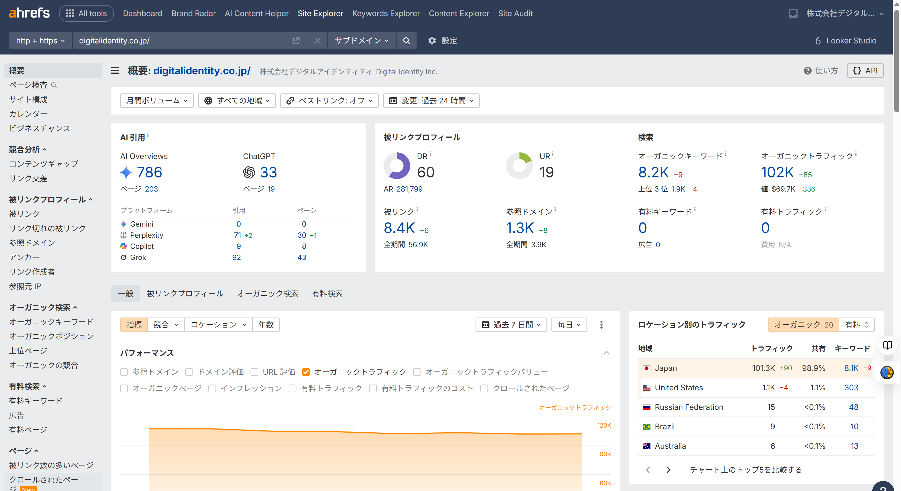
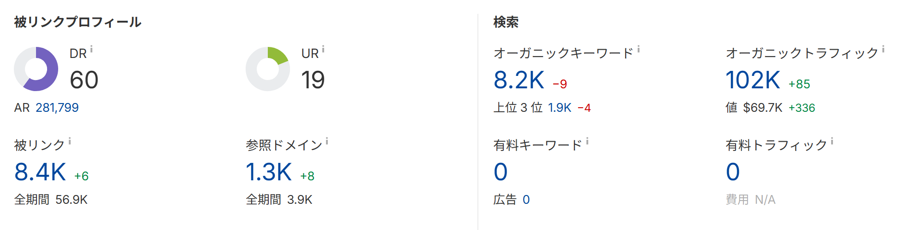

# 第12章　SEO分析・KPI

> フェーズ: practice ／ 目安: 約20分

KGIとKPIの関係を理解し、SEOにおける重要指標の選び方と、長期的にデータを記録・保存してモニタリングする体制の作り方を学ぶ

## 学習目標

- KGI（重要目標達成指標）とKPI（重要業績評価指標）の違いと関係性を理解する
- SEOでよく使われるKPIの例を理解する
- KPIを絞り込むことが重要な理由を理解する
- SEO改善施策に優先順位をつける考え方を理解する
- Search Consoleのデータ保持期間の制約と、長期保存の必要性を理解する
- 被リンク状況を継続的にモニタリングする観点を理解する

## 本文

### 1. KPI：重要指標

SEOの成果を評価する際は、GA4やSearch Consoleで確認できる数値の中から、**何を重要指標（KPI）として追うか**をあらかじめ決めておくことが重要です。

**【用語定義】**

**KGI（Key Goal Indicator／重要目標達成指標）**
組織やプロジェクトが最終的に達成したい目標を示す指標。「問い合わせ数を月間◯件にする」など、ビジネス上のゴールに近いもの。

**KPI（Key Performance Indicator／重要業績評価指標）**
KGIを達成するための中間指標。KGIという大きな目標に向けて、日々の施策の進捗を測るために設定します。

SEOにおいて、KPIとKGIの関係は次のような階層で捉えられます。

- **KGI**：問い合わせ数・売上など、最終目標

- **KPI（成果指標）**：自然検索経由のCV数・CV率

- **KPI（プロセス指標）**：流入数・掲載順位・表示回数

*（図）図1：KGIとKPIの階層関係（KPIツリーの一例）*

SEOでよく使われるKPIの例には、次のようなものがあります。

- **自然検索経由のセッション数・ユーザー数：**そもそもの流入規模
- **主要キーワードの掲載順位：**狙ったキーワードでの検索結果での位置
- **自然検索経由のキーイベント（CV）数・CV率：**流入がどれだけ成果につながっているか

*（図）図2：サードパーティツール（ahrefs）でドメインのオーガニックキーワード数・トラフィック・被リンクなどの指標をまとめて確認した例*

### 2. 改善：優先順位のつけ方

KPIを設定する際は、**指標を絞り込む**ことが重要とされています。

**【Point】**

追いかけるKPIが多すぎると、どの数値の変化に注目すべきかが分かりにくくなります。事業のフェーズや目的に応じて、主要なKPIを3〜5個程度に絞り込むことが実務上の一つの目安とされています。

また、事業のフェーズによって重視すべきKPIも変わってきます。

| フェーズ | 重視されやすいKPI |
| --- | --- |
| 集客の立ち上げ期 | 流入数、掲載順位、表示回数など、まずは「知ってもらう」ための指標 |
| 一定の集客が確保できた時期 | CV数・CV率など、KGIに直結する指標 |

**【Note】**

GA4・Search Consoleで得られる数値をもとに、「流入は多いがCVにつながっていないページ」「順位が僅差で2ページ目に留まっているキーワード」など、**改善の余地が大きい箇所から優先的に着手する**ことが、限られたリソースを効果的に使うための考え方です。

### 3. 記録：長期的なデータ保存とBigQuery連携

KPIを正しく評価するには、指標を選ぶだけでなく、**データを長期間にわたって記録・保存する仕組み**を整えることも欠かせません。Search Consoleの標準データ保持期間は**16か月**に制限されているため、「直近1年間のクリック数を前年と比較する」といった分析は、標準機能だけでは実現できません。

**【用語定義】**

**BigQuery**
Googleが提供する大規模データ分析基盤。Search Consoleの「一括データエクスポート」機能を使うと、検索クエリ・ページ・国・デバイスなどのデータを毎日自動でBigQueryへエクスポートでき、行数無制限かつ長期間のデータを蓄積できます。GA4や広告、CRMなど他のデータと統合した分析も可能になります。

Search Consoleのデータ保存方法には、主に次の3つがあります。

| 方法 | エクスポート可能な行数 | 特徴 |
| --- | --- | --- |
| Search Consoleの管理画面 | 最大1,000行 | 手軽だが、フィルタ機能が弱く行数も少ない |
| Search Analytics API | 最大50,000行 | 比較的手軽に自動化できるが、上限がある |
| 一括データエクスポート機能（BigQuery） | 無制限 | 大規模サイトや他データとの統合分析に向くが、費用や学習コストがかかる |

サイト全体のクリック数が月数千〜数万程度であれば、管理画面やAPIでの取得でも十分なケースが多いとされています。しかし、大規模サイトや、GA4・CRMなど他のデータと統合して分析したい場合は、BigQueryへの一括エクスポートが有効です。設定後は毎日自動でデータが蓄積されるため、早めに導入しておくと、後からアルゴリズムアップデート時の検証や、長期トレンドの比較がしやすくなります。

**【Point】**

保存したデータは、そのままでは活用しにくいため、Looker Studioなどのダッシュボードツールと連携し、テンプレート化しておくと、必要なときにすぐ取り出して分析できます。継続的な記録は、サイトが「いつ」「なぜ」「どう変化したか」を読み解くための資産になります。

### 4. モニタリング：被リンク状況の継続的な把握と異常検知

KPIのモニタリングは、順位・流入・CVといった数値が中心になりがちですが、**被リンク**の状況を継続的に把握することも、サイト外部からの評価を可視化する上で重要です。

**【用語定義】**

**被リンクモニタリング**
どんなサイトのどんなページから、どのくらいの被リンクを獲得しているかを継続的に確認すること。被リンクは蓄積される資産ではなく、現時点での外部評価を映す指標であるため、定期的な確認が必要とされる。

被リンクの分析には、Search Consoleの「リンク」レポート（外部リンク・内部リンク）を基本として使います。定期的にエクスポートしてデータを蓄積することで、新しく獲得したリンクの傾向（どんなページ・コンテンツにリンクが付きやすいか）を把握でき、コンテンツ強化やSNS発信の施策につなげられます。サードパーティツールを併用すれば、競合サイトとの被リンク状況の比較や、失われたリンクの把握も可能です。

*（図）図：サードパーティツールで被リンクの評価指標（ドメイン評価・被リンク数・参照ドメイン数など）を継続的に確認した例。増減の差分から異常にも気付ける*

また、順位や流入の急落を見落とさないためには、**異常検知の仕組み**をあらかじめ整えておくことも有効です。GA4の「カスタムインサイト」やLooker Studioの「グラフのアラート」機能を使うと、特定の条件（例：特定ページのセッション数が一定割合以上低下）に合致した際に通知を受け取れます。

**【Note】**

順位データや検索クエリの傾向も、長期間保存しておくことで、新たに発生したキーワードや、逆に消滅したキーワードに気付きやすくなります。季節性のあるキーワードでは、需要が高まり始めるタイミングが年々変化することもあり、**長期データがあって初めて見えてくる傾向**も少なくありません。

## まとめ

- KGIは最終的なビジネス目標、KPIはKGI達成のための中間指標であり、両者は階層構造で関係している
- SEOのKPIには自然検索経由のセッション数、掲載順位、CV数・CV率などがある
- 追いかけるKPIは3〜5個程度に絞り込むことで、注目すべき変化が見えやすくなる
- 事業のフェーズに応じて重視すべきKPIは変わり、GA4・Search Consoleのデータから改善余地の大きい箇所を優先する
- Search Consoleのデータ保持期間は16か月に制限されているため、長期的な分析にはBigQueryなどへのデータ保存基盤が必要になる場合がある
- 被リンクは蓄積資産ではなく現状の外部評価を示す指標であり、Search Consoleやサードパーティツールで定期的にモニタリングする
- GA4のカスタムインサイトやLooker Studioのアラート機能を使うことで、順位・流入の異常を早期に検知できる体制を整えられる

## 確認テスト

### Q1（単一選択）

KGIとKPIの関係についての説明として、最も適切なものはどれか。

- A. KGIとKPIは全く同じ意味で、使い分ける必要はない
- B. KGIは最終的な目標を示し、KPIはKGIを達成するための中間指標である　✅**（正解）**
- C. KPIは最終目標で、KGIはその中間指標である
- D. KGIとKPIはSEOには一切関係のない用語である

**解説**：KGI（重要目標達成指標）は最終目標を示し、KPI（重要業績評価指標）はKGIを達成するための中間指標という関係にあります。

### Q2（複数選択）

SEOでよく使われるKPIの例として、正しいものをすべて選べ。

- A. 自然検索経由のセッション数・ユーザー数　✅**（正解）**
- B. 主要キーワードの掲載順位　✅**（正解）**
- C. 自然検索経由のキーイベント（CV）数・CV率　✅**（正解）**
- D. 社員の有給休暇取得率

**解説**：自然検索の流入数、掲載順位、CV数・CV率はSEOでよく使われるKPIの例です。有給休暇取得率はSEOのKPIとは関係ありません。

### Q3（単一選択）

KPIを設定する際の考え方として、最も適切なものはどれか。

- A. 追いかけるKPIはできるだけ多く、20個以上設定すべきである
- B. 主要なKPIを3〜5個程度に絞り込むことで、注目すべき変化が見えやすくなる　✅**（正解）**
- C. KPIは一度設定したら、事業フェーズが変わっても変更してはならない
- D. KPIはGA4やSearch Consoleとは無関係に決めるべきである

**解説**：追いかけるKPIが多すぎると重要な変化を見失いやすくなるため、主要なKPIを3〜5個程度に絞り込むことが実務上の目安とされています。

### Q4（単一選択）

事業フェーズとKPIの関係についての説明として、最も適切なものはどれか。

- A. 集客の立ち上げ期でも、一定の集客確保後でも、重視すべきKPIは常に同じである
- B. 集客の立ち上げ期は流入数や掲載順位、一定の集客確保後はCV数・CV率が重視されやすい　✅**（正解）**
- C. 事業フェーズはSEOのKPI設定には一切関係しない
- D. KPIは事業開始時に一度決めたら、二度と見直してはいけない

**解説**：集客の立ち上げ期は流入数・掲載順位などが重視されやすく、一定の集客が確保できた後はCV数・CV率などKGIに直結する指標が重視される傾向にあります。

### Q5（単一選択）

Search Consoleの標準的なデータ保持期間として、最も適切なものはどれか。

- A. 1週間
- B. 16か月　✅**（正解）**
- C. 無期限に保存される
- D. 1時間

**解説**：Search Consoleの標準データ保持期間は16か月に制限されているため、それを超える長期分析にはBigQueryなど別のデータ保存基盤が必要になります。

### Q6（単一選択）

Search Consoleの「一括データエクスポート」機能でBigQueryにデータを送る利点として、最も適切なものはどれか。

- A. 行数無制限でデータを蓄積でき、GA4など他データとの統合分析もしやすくなる　✅**（正解）**
- B. エクスポートできる行数が最大1,000行に制限される
- C. 分析にかかる費用が必ず無料になる
- D. Search Consoleの管理画面が使えなくなる

**解説**：BigQueryへの一括データエクスポートは行数無制限で毎日自動的に蓄積でき、GA4や広告、CRMなど他のデータと統合した分析も可能になります。

### Q7（単一選択）

被リンクのモニタリングに関する説明として、最も適切なものはどれか。

- A. 被リンクは一度獲得すれば永久に価値が保証されるため、確認は不要である
- B. 被リンクは現時点での外部評価を映す指標であり、継続的な確認が必要とされる　✅**（正解）**
- C. 被リンクはSEOの評価にまったく関係しない
- D. 被リンクの確認にはSearch Consoleは一切使えない

**解説**：被リンクは蓄積される資産というより現時点での外部評価を表す性質を持つため、Search Consoleなどを使って継続的にモニタリングすることが推奨されます。

### Q8（単一選択）

順位や流入の異常を早期に検知する仕組みとして、最も適切なものはどれか。

- A. 毎日手作業ですべてのページを目視確認する以外に方法はない
- B. GA4のカスタムインサイトやLooker Studioのアラート機能を使い、条件に合致した際に通知を受け取る　✅**（正解）**
- C. 異常検知の仕組みを作ることは、SEO業務には不要である
- D. アラート機能は、順位や流入のデータには対応していない

**解説**：GA4のカスタムインサイトやLooker Studioのグラフのアラート機能を使うことで、指定した条件に合致した際に通知を受け取り、異常を早期に検知できます。
