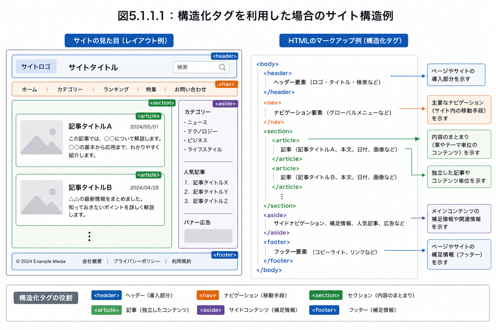
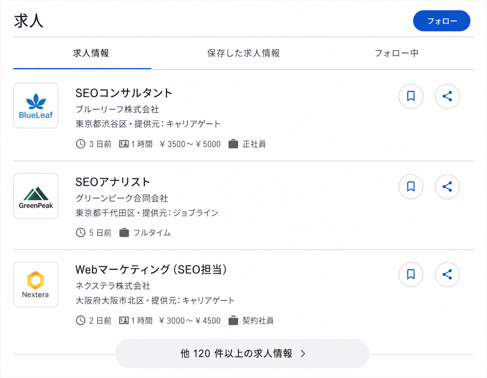
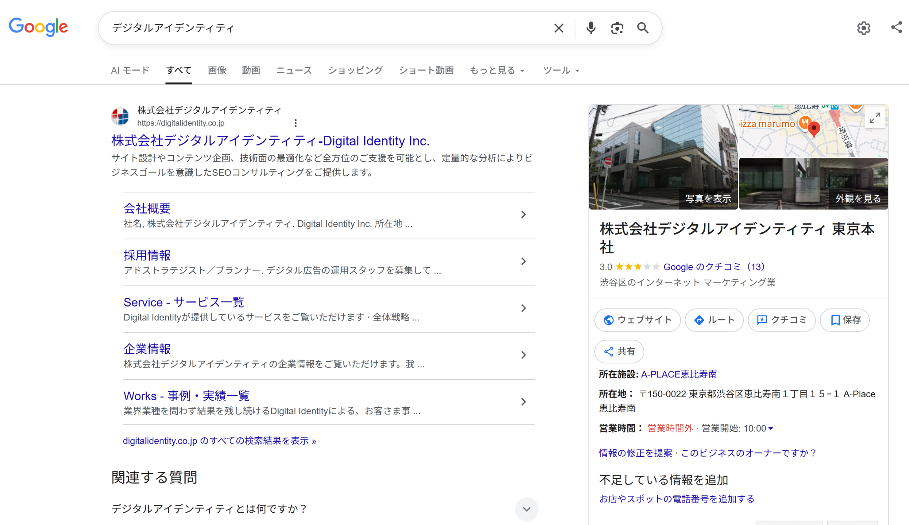
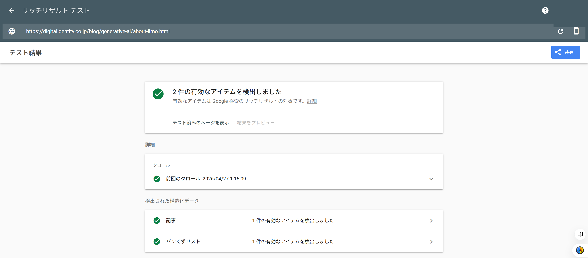
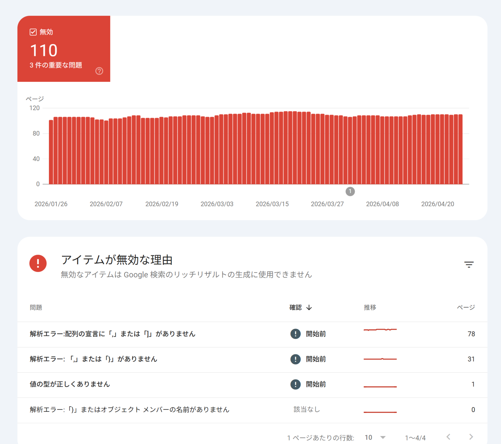

# 第18章　構造化データ

> フェーズ: ai ／ 目安: 約24分

文書構造を伝えるHTMLタグと、意味を伝える構造化マークアップの違いを理解し、JSON-LDによるArticle・FAQ・Organization・Breadcrumb等の実装方法を学ぶ

## 学習目標

- 構造化タグ（section・article等）と構造化マークアップの違いを理解する
- section・article・aside・navなど構造化タグの意味と正しい使い分けを理解する
- 構造化データとリッチリザルト・ナレッジパネルの関係を理解する
- 構造化マークアップの3形式（Microdata・RDFa Lite・JSON-LD）の違いとJSON-LDが推奨される理由を理解する
- Organization・WebSite・BreadcrumbListの具体的なプロパティと実装方法を理解する
- Product・Article・FAQなど主要タイプの実装方法と、検証ツールによる確認方法を理解する

## 本文

### 1. 基本：構造化タグと構造化マークアップの違い

「構造化データ」と一口に言っても、実は**文書の構造を伝えるもの**と**情報の意味を伝えるもの**の2種類があります。混同しやすいため、まずこの違いを整理します。

|  | 構造化タグ | 構造化マークアップ |
| --- | --- | --- |
| 伝える内容 | 文章の「まとまり」の構造（本の章・目次・補足情報など） | 要素の「意味」（これは商品名である、これは価格である、など） |
| 具体例 | ``, ``, ``, ``など | Article, FAQ, Organizationなどのschema.orgタイプ |
| ブラウザでの見え方への影響 | 基本的に見た目は変わらない | 基本的に見た目は変わらない（検索結果側で変化する） |

**【用語定義】**

**構造化タグ**
HTML5で定義されている`<section>`（見出しを持つ文章のまとまり）、`<article>`（独立した記事）、`<nav>`（ナビゲーション）、`<aside>`（補足情報）などのタグ。文書全体の「アウトライン（構造）」を検索エンジンに明示的に伝える役割を持ちます。

1998年、World Wide Webの考案者であるW3CのTim Berners-Lee氏は「セマンティックWeb」（意味を持つWeb）という構想を提唱しました。Web上のデータをコンピュータが理解できる形で意味付けし、より適切に情報を扱える状態を目指す考え方です。例えば人間は「Tシャツ」という単語を見れば、それが袖丈の短い洋服であると即座に理解できますが、文字の並びとしか認識できないコンピュータには、本来その理解ができません。構造化タグと構造化マークアップは、この溝を埋めるための仕組みとして登場しました。

**【Note】**

例えば、未知の商品名（架空の造語など）が使われている場合、検索エンジンはその言葉だけでは何を指すのか判断できません。構造化マークアップによって「これは商品名であり、食品である」といった意味を明示することで、検索エンジンやAIがより正確に情報を理解できるようになります。AIの活用が広がるほど、こうしたセマンティックWebの重要性は増すと考えられています。

### 2. 実践：構造化タグの種類と記述方法

HTML文書のbody要素では、検索エンジンに正しい情報を伝えられるよう、適切なアウトライン（文書構造）を形成することが大切です。構造化タグを使えば、この文書構造を検索エンジンに明示的に伝えられます。

| 構造化タグ | 意味と解説 | 本にたとえると |
| --- | --- | --- |
| `` | 見出しを付けられる文章のまとまり。1つの見出し（h要素）＋本文＋補足情報で構成される | 「章」 |
| `` | 独立した記事・コンテンツであることを示す。ブログでは記事全体、ニュースサイトでは個々のニュースが該当する | 本「全体」 |
| `` | 本文と関連するが区別すべき補足情報。サイドバーにも使われる | 「コラム」 |
| `` | グローバルナビゲーションやパンくずリストなど、主要ページへのリンク集 | 「目次」 |
| `` | 導入やナビゲーションの補助。文書のヘッダー情報を表す``タグとは別物 | 「表紙」 |
| `` | 作成者情報や著作権表示（Copyright）、関連文書へのリンクなど | 「裏表紙」 |



*（図）図：構造化タグを使ったサイト全体の構造例。左の見た目のレイアウトが、右のHTMLマークアップ（header・nav・section・article・aside・footer）に対応する*

この中で基本となるのが`<section>`です。見出しを付けられる文章のまとまりを「セクション」と呼び、セクションを区分するタグを「セクショニングコンテンツ」と呼びます。`<section>`を基本形として、そのうち「記事」「補足情報」「ナビゲーション」という特別な役割を持つものに、それぞれ`<article>``<aside>``<nav>`が定義されています。一方、`<header>`と`<footer>`は単体で成り立つセクションではなく、セクションに付属する要素であり、セクショニングコンテンツには含まれません。

例：1つの記事ページを構造化タグでマークアップする場合

- **<header>**：記事タイトル・日時

- **<section>**：本文の段落

- **<aside>**：補足情報

- **<footer>**：著者情報

*（図）図1：<article>全体の中に、<header>（タイトル・日時）・<section>（本文）・<aside>（補足）・<footer>（著者情報）を入れ子にして配置する例。この<header>と<footer>は、<article>に付属する文章のまとまりであり、ページ全体のheader/footerとは別物*

**【Point】**

このように構造化タグでマークアップしても、ブラウザの見た目そのものは変化しません。あくまで、文書構造と各文章のまとまりの意味を検索エンジンに明示する役割を持ちます。

### 3. 実践：構造化タグの正しい使い分け

構造化タグの利用では、間違いや混乱がよく発生します。ここでは頻出する3つの誤用を確認します。

**1. 独立セクションにも<article>ではなく<section>を使ってしまう**

`<section>`と`<article>`はどちらも「セクション」を区切るセクショニングコンテンツですが、`<article>`は`<section>`に「他から独立しても成立する」という性質が加わったものと理解すると整理しやすくなります。

1本の記事を段落分けする場合

1つの記事＝1つの独立したコンテンツのため、記事全体を`<article>`で囲み、その中の各段落を`<section>`で区切る（article内に複数section）

複数の記事を並べる場合

「人気記事一覧」のような1つのまとまりを`<section>`で囲み、独立した記事それぞれを`<article>`で囲む（section内に複数article）

「その部分だけを抜き出して独立ページとして成立するか」を基準に、成立するなら`<article>`、それ以外は`<section>`を使うのが基本的な考え方です。

**2. 既存の<div>をそのまま構造化タグに置換してしまう**

`<div>`タグは複数の要素をまとめる役割を持つため、構造化タグと混同されがちです。しかし`<div>`には文書構造の明示や意味付けの役割は一切なく、あくまでCSSでデザイン範囲を区切るための便宜的な要素です。そのため、文書構造とまったく関係のない箇所（引用部分の装飾など）で使われることも多く、既存の`<div>`を機械的に構造化タグへ置き換えることはできません。既存HTMLに構造化タグを導入する際は、いったん`<div>`の存在を無視して文書構造から構造化タグを追記し、その後で`<div>`との統合を進めるとよいとされています。

- **意味のまとまりに
見出しを付けられるか**：いいえ → <div>

- **他のセクションから
独立して成り立つか**：いいえ → <section>

- **<article>**：はい

*（図）図2：<div>・<section>・<article>の使い分けフローチャート*

**3. <section>内の見出しをすべて<h1>から書き始めてしまう**

WHATWG（Web標準化団体）は「ドキュメントには複数のトップレベル見出しを含められる」としており、複数の`<h1>`を使っても、Googleが文法上の理由で検索順位を下げることはないと公言しています。ただし、`<section>`のたびにすべて`<h1>`で書いてしまうと、階層ごとに`<h1>`が出現し、人の目には文書構造がわかりづらくなります。見出しレベル（h1〜h6）は、ネストされたセクションの階層に対応させ、文書全体で1つのアウトラインとして一貫させることが推奨されます。

**【Warning】**

構造化タグを記述しても、それ自体が検索順位に直接影響することはないとされています。ただし、適切なアウトライン構成は、検索エンジンやAIがコンテンツを正確に認識する助けになり、結果的にユーザーにとっても理解しやすいコンテンツにつながります。

### 4. 基本：構造化データとは

**構造化データ**とは、ページ内の情報が「何を意味しているか」を、検索エンジンにも分かる形式で明示するためのマークアップです。

**【用語定義】**

**構造化データ（構造化マークアップ）**
検索エンジンやクローラーがコンテンツの内容を理解しやすくするための、決められた形式のデータ。例えば「これは記事のタイトルである」「これは著者名である」といった情報の意味を、機械にも分かる形で伝えます。

**リッチリザルト**
構造化データを実装することで、検索結果に表示される可能性がある拡張表示。星評価やパンくずリスト、FAQの折りたたみ表示など、通常のテキストリンクより多くの情報を表示できます。

**エンリッチリザルト**
リッチリザルトのうち、求人情報やレシピなど、ユーザーが検索結果内で直接操作できる双方向性を持つもの。ポップアップやインタラクティブなウィジェットとして、より視覚的に際立つ形式で表示されます。



*（図）図：JobPosting構造化データによる「求人」のエンリッチリザルトの例。検索結果内で勤務地・給与・雇用形態などが直接表示される*

構造化データが利用されるのは検索結果の拡張表示だけではありません。パソコンでは画面右側、スマートフォンでは上部に表示される**ナレッジパネル**（Googleが収集した知識データベース「ナレッジグラフ」をもとにした拡張表示）にも、構造化マークアップの情報が活用されていると考えられています。

Google Search Central（公式ドキュメント）は、構造化データの主なフォーマットとして**JSON-LD**を推奨しています。JSON-LDは、HTMLの本文とは別に、ページの意味情報だけをまとめて記述できる形式です（詳しくは次のセクションで説明します）。

### 5. 実践：構造化マークアップの3つの形式とJSON-LD

要素に意味を付与する構造化マークアップですが、普及当初は複数の規格が乱立していました。そこで2011年、Google・Microsoft・Yahoo!・Yandexが共同で**schema.org**プロジェクトを立ち上げ、規格の統一を図りました。現在はschema.orgが定めるタイプとプロパティの体系に沿って、構造化マークアップが行われています。

**【用語定義】**

**タイプ（Type）**
「Article（記事）」「Organization（組織）」のように、モノ・コトを表す分類概念。最上位の「Thing」を頂点に、ロジックツリー状に分類されています。

**プロパティ（Property）**
タイプごとに定義された属性。例えば「Corporation（企業）」タイプは、住所やロゴ画像などのプロパティを持ちます。タイプは、自身の上位階層のタイプが持つプロパティも利用できます。

schema.orgが定め、かつGoogleがサポートしている記述形式には、Microdata・RDFa Lite・JSON-LDの3つがあります。

| 形式 | 特徴 | メリット | デメリット |
| --- | --- | --- | --- |
| **Microdata** | HTMLタグの属性（itemscope・itemtype・itempropなど）に直接意味を埋め込む | 構造化データと実際のHTMLが一致しやすい | HTML属性が増えてソースが煩雑になり、メンテナンスコストが高い |
| **RDFa Lite** | RDFa（XHTML向けのセマンティックWeb技術）を簡素化した形式 | XHTMLでも利用可能 | ソースが煩雑。Googleの構造化データマークアップ支援ツールが非対応 |
| **JSON-LD** | JSON形式で、HTML本文と分離して記述する | HTMLソースに影響しない。人間にもコンピュータにも読みやすい。不可視データの記述量が少ない | 可視データはHTML本文とJSON-LDの2箇所に同じ内容を書く必要がある |

3形式を比べると、MicrodataとRDFa Liteは記法が類似している一方、JSON-LDは大きく異なります。JSON-LDはコンピュータが読み取りやすく、HTML本文とも分離できるため、Googleも推奨しており、管理のしやすさの面でも扱いやすい形式です。以降のセクションでは、JSON-LDによる具体的な実装例を紹介します。

JSON-LDは、HTML文書のどこに書いても機能しますが、`<head>`要素内に記述するのが一般的です。基本的な記述の骨組みは次のとおりです。

| キー名 | 意味 |
| --- | --- |
| `@context` | 使用する語彙（ボキャブラリー）を定義。通常は`https://schema.org`を指定 |
| `@type` | タイプ名を定義（例：Article、Organizationなど） |
| `@id` | 一意に識別するためのID。URLで指定する |
| @の付かないキー名 | タイプが持つプロパティをラベル付けする（name、descriptionなど） |

**【Warning】**

JSON-LDはHTML本文と分離して記述するため、記事内容を更新した際にJSON-LDの更新を忘れると、実際のHTML内容と構造化データの内容が食い違ってしまいます。この不一致はGoogleのスパムポリシーに抵触する可能性があるため、コンテンツ更新時は必ずJSON-LD側も見直しましょう。CMSで記事を管理している場合は、該当箇所が自動的に反映されるようテンプレート側で管理すると、ミスを防ぎやすくなります。

### 6. 実践：Organization・WebSite・BreadcrumbListの実装

ここからは代表的なタイプについて、JSON-LDの具体的な記述例を確認していきます。

**組織情報（Organization）**

組織の名称・ロゴ・住所・電話番号などを構造化マークアップすることで、検索結果のナレッジパネルなどに活用される可能性があります。「Organization」には、Corporation（企業）・EducationalOrganization（教育機関）・LocalBusiness（地域ビジネス）・NGO（非営利組織）など、多くのサブタイプが用意されており、実態に最も近いサブタイプを選ぶことで、より正確な情報を伝えられます。



*（図）図：Organization（組織）情報の構造化マークアップは、検索結果のナレッジパネルなどに活用される（自社「デジタルアイデンティティ」の例）*

**コード例：Corporation（JSON-LD）**

```html
<script type="application/ld+json">
{
  "@context": "https://schema.org",
  "@type": "Corporation",
  "name": "株式会社サンプル",
  "url": "https://example.com/",
  "logo": "https://example.com/img/logo.png",
  "telephone": "03-0000-0000",
  "address": {
    "@type": "PostalAddress",
    "postalCode": "150-0022",
    "addressRegion": "東京都",
    "addressLocality": "渋谷区",
    "streetAddress": "恵比寿南1-15-1"
  },
  "description": "サンプル株式会社の事業概要"
}
</script>
```

主なプロパティは、`name`（企業名）、`url`（サイトURL）、`logo`（ロゴ画像URL。112×112px以上を推奨）、`telephone`（電話番号）、`address`（住所。中に`PostalAddress`タイプを呼び出し、postalCode・addressRegion・addressLocality・streetAddressで構成）、`description`（事業概要）です。`{}`で囲むことで別タイプを入れ子にできる点がポイントです。

**Webサイト情報（WebSite）**

サイトのトップページに`WebSite`タイプを記述することで、検索結果に表示されるサイト名を検索エンジンに伝えられます。構造化マークアップがない場合もGoogleがページ内容から自動生成しますが、意図したサイト名を希望する場合はWebSite構造化データが最も重要だとGoogleが明言しています。

**【用語定義】**

**WebSiteタイプのサイト名に関する注意点**
1つのドメイン（またはサブドメイン）につき1つの一貫したサイト名のみがサポートされます。サブディレクトリごとに異なるサイト名を指定しても反映されません。また、対象キーワードを意図的に含めた名前や、「〇〇が得意な会社」のような一般的すぎる名称は、Googleに採用されにくいとされています。構造化データだけでなく、`og:site_name`やtitleタグでも同じサイト名を使うことが推奨されます。

**パンくずリスト（BreadcrumbList）**

パンくずリストを構造化マークアップすると、検索結果画面でURLの代わりにパンくずリストが表示される場合があり、ユーザーが日本語でページの位置を把握しやすくなるため、クリック率の向上も期待できます。`BreadcrumbList`タイプの中に、階層の数だけ`ListItem`を並べて記述します。

**コード例：BreadcrumbList（JSON-LD）**

```html
<script type="application/ld+json">
{
  "@context": "https://schema.org",
  "@type": "BreadcrumbList",
  "itemListElement": [
    { "@type": "ListItem", "position": 1,
      "item": "https://example.com/", "name": "トップページ" },
    { "@type": "ListItem", "position": 2,
      "item": "https://example.com/blog/", "name": "ブログ" },
    { "@type": "ListItem", "position": 3,
      "item": "https://example.com/blog/seo/", "name": "SEO" }
  ]
}
</script>
```

`position`はパンくずの位置（「1」が起点）、`item`はURL、`name`はページ名を表します。なお、トップページに付けた`name`は検索結果に表示されるサイト名には影響しません。サイト名を指定したい場合は前述の`WebSite`タイプを利用します。

### 7. 実践：Product・Article・FAQの実装

**商品・クチコミ情報（Product / AggregateRating）**

商品名・画像・価格などを構造化マークアップすると、検索結果に評価や価格帯が表示されることがあります。商品情報には`Product`タイプ、口コミの集計には`AggregateRating`タイプを使用します。

**コード例：Product（JSON-LD、一部抜粋）**

```html
{
  "@type": "Product",
  "name": "商品名",
  "image": ["https://example.com/img1.png"],
  "description": "商品の説明文",
  "sku": "item-001",
  "brand": { "@type": "Brand", "name": "ブランド名" },
  "offers": {
    "@type": "Offer",
    "price": "8000",
    "priceCurrency": "JPY",
    "availability": "https://schema.org/InStock"
  },
  "aggregateRating": {
    "@type": "AggregateRating",
    "ratingCount": "144",
    "ratingValue": "4.5"
  }
}
```

価格が幅を持つ場合は、`Offer`の代わりに`AggregateOffer`を使い、`lowPrice`・`highPrice`で価格帯を表現できます。

**【Warning】**

クチコミ情報の構造化マークアップには注意点があります。評価対象となる商品・店舗の構造化マークアップと1対1で記載すること、カテゴリ単位ではなく特定の製品・サービスを対象とすること、マークアップした評価は必ずページ本文にも表示することが求められます。ページに表示されていないクチコミ評価をマークアップすると、検索エンジンに無視されたり、スパムと判断される可能性があります。

### 8. 実践：記事情報とE-E-A-T、検証ツールの活用

**記事情報（Article）**

記事のタイトル・画像・公開日・著者情報を構造化マークアップすると、検索結果に署名日が表示されたり、Googleニュースなど他サービスで活用されたりする場合があります。「Article」には、NewsArticle（ニュース記事）・BlogPosting（ブログ記事）・TechArticle（技術記事）などのサブタイプがあります。

**コード例：Article（JSON-LD）**

```html
<script type="application/ld+json">
{
  "@context": "https://schema.org",
  "@type": "Article",
  "headline": "記事のタイトル",
  "image": "https://example.com/img.png",
  "author": { "@type": "Person", "name": "著者名" },
  "datePublished": "2026-01-01T00:00:00+09:00",
  "dateModified": "2026-02-01T00:00:00+09:00",
  "description": "記事の詳細な概要"
}
</script>
```

主なプロパティは、`headline`（タイトル）、`image`（記事を表す画像）、`datePublished`／`dateModified`（公開日・更新日。ISO 8601形式で時刻まで含めることが推奨される）、`author`（作成者。PersonまたはOrganizationタイプを呼び出す）です。第7章で学んだE-E-A-Tの観点からも、著者情報や公開日を明示することは重要とされています。検索エンジンがコンテンツの専門性を認識しやすくなるとともに、ユーザーも情報の鮮度を判断しやすくなるためです。

**FAQ（FAQPage）**

よくある質問とその回答を`FAQPage`タイプで構造化マークアップすると、検索結果に質問と回答が折りたたみ表示されることがあります。`mainEntity`の中に`Question`を並べ、それぞれの`acceptedAnswer`として`Answer`を記述します。

**マークアップの検証・確認方法**

構造化マークアップは、正しく記述しないと検索結果に反映されません。Googleやschema.orgは、確認のための無料ツールをいくつか提供しています。

| ツール | 確認できる内容 |
| --- | --- |
| スキーマ マークアップ検証ツール | schema.orgの構文として正しく記述できているかを検証する（Google固有の検証は行われない） |
| リッチリザルト テスト | Googleの検索結果でリッチリザルトとして表示される対象になるか、プレビューも含めて確認する |
| Search Consoleの拡張レポート | 公開後のサイトで、構造化データにエラーが発生していないかを継続的に監視する |



*（図）図：リッチリザルト テストの結果画面。指定URLがリッチリザルトの対象になるか、検出された構造化データ（記事・パンくずリストなど）を確認できる*



*（図）図：Search Consoleの拡張レポート。公開後のサイトで構造化データのエラーを継続的に監視できる（無効な項目とその理由が一覧表示される）*

**【Note】**

構造化データマークアップのエラー自体が、サイトの評価を直接下落させることはないとされています。ただし、検索エンジンに正しい情報を伝えるという本来の役割を果たせなくなるため、サイト更新時にはSearch Consoleで定期的にチェックすることが推奨されます。

**【Warning】**

実際にユーザーが閲覧する内容と構造化データの内容が大きく乖離していたり、存在しないクチコミを記載する、料理以外の手順を「レシピ」として記載するなど、ユーザーを欺くようなマークアップはスパムと判定される可能性があります。スパムと判定された場合はSearch Consoleの「手動による対策」にアラートが表示され、リッチリザルトの表示対象から外れることがあります（ただし、通常の検索順位への影響はないとされています）。

Google公式ドキュメントでは、構造化データを実装した企業の効果事例が具体的な数値とともに紹介されています。

| 企業 | 報告されている効果 |
| --- | --- |
| Rotten Tomatoes | 10万ページに構造化データを追加し、クリック率が25%増加 |
| The Food Network | 全ページの80%で検索結果の機能を有効化し、アクセス数が35%増加 |
| Nestlé | リッチリザルトを表示するページのクリック率が、表示しないページより82%高い |

## まとめ

- 構造化タグ（section・article等）は文書の構造を、構造化マークアップ（schema.org）は要素の意味を検索エンジンに伝えるもので、役割が異なる
- section・article・aside・nav・header・footerにはそれぞれ役割があり、divとの混同や見出しレベルの誤用に注意が必要
- 構造化データは、ページ内の情報の意味を検索エンジンにも分かる形式で明示するマークアップであり、リッチリザルトやナレッジパネルに活用される
- 構造化マークアップにはMicrodata・RDFa Lite・JSON-LDの3形式があり、HTML本文と分離でき読み取りやすいJSON-LDがGoogleに推奨されている
- Organization・WebSite・BreadcrumbListはそれぞれ組織情報・サイト名・階層構造を伝えるタイプで、具体的なプロパティを組み合わせて実装する
- Product・Article・FAQなど主要タイプの実装では、ページ本文の内容と構造化データの内容を一致させることが重要である
- 構造化マークアップはスキーマ マークアップ検証ツールやリッチリザルトテスト、Search Consoleで検証・監視でき、実装しても必ずリッチリザルトとして表示されるとは限らない

## 確認テスト

### Q1（単一選択）

構造化タグと構造化マークアップの違いとして、最も適切なものはどれか。

- A. 構造化タグは要素の意味を伝え、構造化マークアップは文書の構造を伝える
- B. 構造化タグは文書の構造を伝え、構造化マークアップは要素の意味を伝える　✅**（正解）**
- C. 両者は全く同じ役割を持ち、区別する必要はない
- D. 構造化タグも構造化マークアップも、ブラウザの見た目を大きく変化させる

**解説**：構造化タグ（section・article等）は文章のまとまりの構造を伝え、構造化マークアップ（schema.org）は要素の意味を伝えるという違いがあります。

### Q2（複数選択）

構造化タグの説明として、正しいものをすべて選べ。

- A. は見出しを付けられる文章のまとまりを表す基本のタグである　✅**（正解）**
- B. は独立した記事・コンテンツであることを示す　✅**（正解）**
- C. とはセクショニングコンテンツであり、単体で成り立つセクションである
- D. は本文に関連する補足情報を表す　✅**（正解）**

**解説**：とはセクションに付属する要素であり、単体で成り立つセクショニングコンテンツではありません。

### Q3（単一選択）

タグと構造化タグの関係についての説明として、最も適切なものはどれか。

- A. 既存のタグはそのまま構造化タグに置き換えられる
- B. タグには文書構造の明示や意味付けの役割はなく、機械的な置換はできない　✅**（正解）**
- C. タグは構造化タグの上位互換であり、常にを使うべきである
- D. タグを使うと、検索順位が自動的に下がる

**解説**：タグはCSSのデザイン範囲を区切るための便宜的な要素であり、文書構造や意味を明示する役割を持たないため、既存のを機械的に構造化タグへ置換することはできません。

### Q4（単一選択）

構造化データの説明として、最も適切なものはどれか。

- A. ページのデザインを自動生成するツール
- B. ページ内の情報の意味を、検索エンジンにも分かる形式で明示するマークアップ　✅**（正解）**
- C. サイトの表示速度を計測する指標
- D. 広告の出稿費用を管理するシステム

**解説**：構造化データは、ページ内の情報が何を意味しているかを検索エンジンにも分かる形式で明示するためのマークアップです。

### Q5（単一選択）

構造化マークアップの3形式のうち、GoogleがSEO上推奨しており、HTML本文と分離して記述できる形式はどれか。

- A. Microdata
- B. RDFa Lite
- C. JSON-LD　✅**（正解）**
- D. CSV

**解説**：JSON-LDはHTML本文と分離して記述でき、コンピュータが読み取りやすい形式であるため、Googleが推奨しています。

### Q6（単一選択）

JSON-LDのデメリットとして、最も適切なものはどれか。

- A. HTML属性が増えすぎてソースが煩雑になる
- B. XHTMLでしか利用できない
- C. 可視データについては、HTML本文とJSON-LDの2箇所に同じ内容を記述する必要がある　✅**（正解）**
- D. 検索エンジンにまったく読み取られない

**解説**：JSON-LDはHTML本文と分離して記述するため、可視データについては同じ内容を2箇所に書く必要があり、更新時に食い違いが起きないよう注意が必要です。

### Q7（複数選択）

BreadcrumbListの構造化マークアップについて、正しいものをすべて選べ。

- A. BreadcrumbListの中にListItemを階層の数だけ記述する　✅**（正解）**
- B. positionプロパティでパンくずリストの中での位置を指定する　✅**（正解）**
- C. トップページに付けたnameは、検索結果のサイト名として必ず採用される
- D. パンくずリストを構造化マークアップすると、検索結果でURLの代わりに表示される場合がある　✅**（正解）**

**解説**：トップページのnameはパンくずリスト内の表示に使われるだけで、検索結果のサイト名には影響しません。サイト名はWebSiteタイプで指定します。

### Q8（単一選択）

クチコミ情報を構造化マークアップする際の注意点として、最も適切なものはどれか。

- A. カテゴリ単位でまとめて評価をマークアップするのが望ましい
- B. ページ本文に表示されていない評価も自由にマークアップしてよい
- C. 評価対象となる商品・店舗の構造化マークアップと1対1のセットで記載し、ページ本文にも必ず表示する　✅**（正解）**
- D. クチコミ件数が少ない場合は、実際より多い件数を記載してもよい

**解説**：クチコミ情報は、評価対象の構造化マークアップと1対1で記載し、特定の製品・サービスを対象とし、マークアップした内容は必ずページ本文にも表示する必要があります。

### Q9（単一選択）

Articleタイプの構造化マークアップがE-E-A-Tの観点からも重要とされる理由として、最も適切なものはどれか。

- A. 著者情報や公開日を明示することで、検索エンジンがコンテンツの専門性や鮮度を認識しやすくなるため　✅**（正解）**
- B. Articleタイプを記述すると、必ず1位に表示されるため
- C. 著者情報を記載すると、記事の文字数が自動的に増えるため
- D. E-E-A-Tとarticleタイプは無関係である

**解説**：著者情報（author）や公開日（datePublished）などを明示することで、検索エンジンはコンテンツの専門性を認識しやすくなり、ユーザーも情報の鮮度を判断しやすくなります。

### Q10（複数選択）

構造化データの検証・確認に使えるツールとして、正しいものをすべて選べ。

- A. スキーマ マークアップ検証ツール　✅**（正解）**
- B. リッチリザルト テスト　✅**（正解）**
- C. Search Consoleの拡張レポート　✅**（正解）**
- D. Googleキーワードプランナー

**解説**：Googleキーワードプランナーは検索ボリュームを調べるツールであり、構造化データの検証には使いません。

### Q11（単一選択）

Google公式が報告している、構造化データ実装の効果事例として、正しいものはどれか。

- A. Rotten Tomatoesは構造化データの実装によりクリック率が低下した
- B. Rotten Tomatoesは構造化データを実装したページでクリック率が25%増加した　✅**（正解）**
- C. 構造化データの実装効果について、Googleは一切事例を公開していない
- D. 構造化データは必ず表示速度を2倍にする効果がある

**解説**：Google公式ドキュメントでは、Rotten Tomatoesが10万ページに構造化データを追加し、クリック率が25%増加した事例が報告されています。
