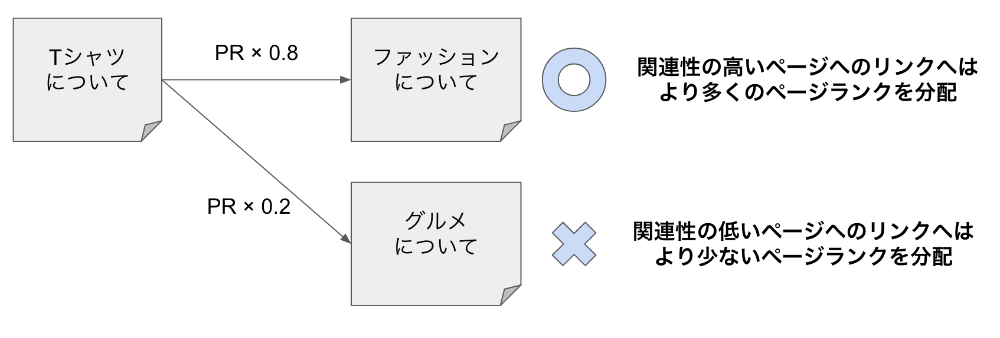
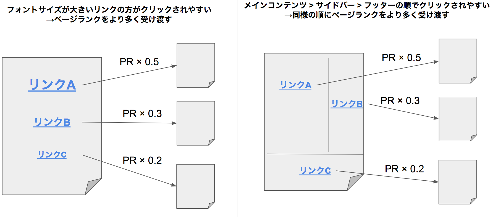
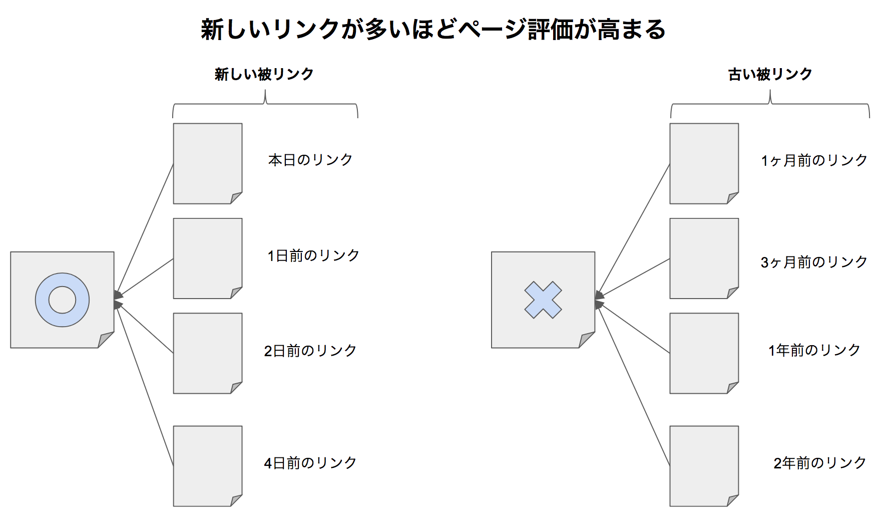
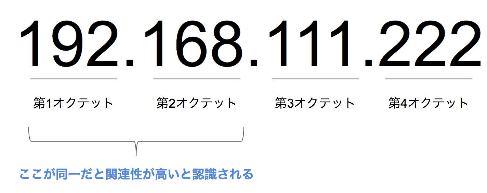
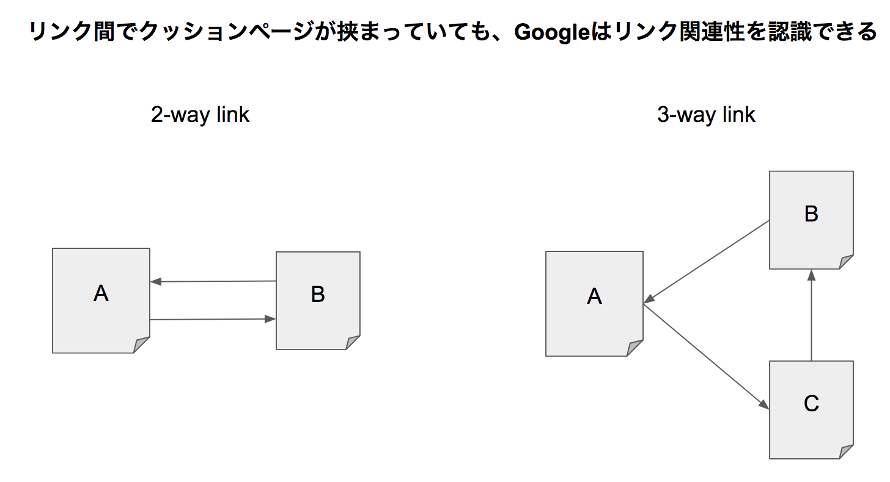
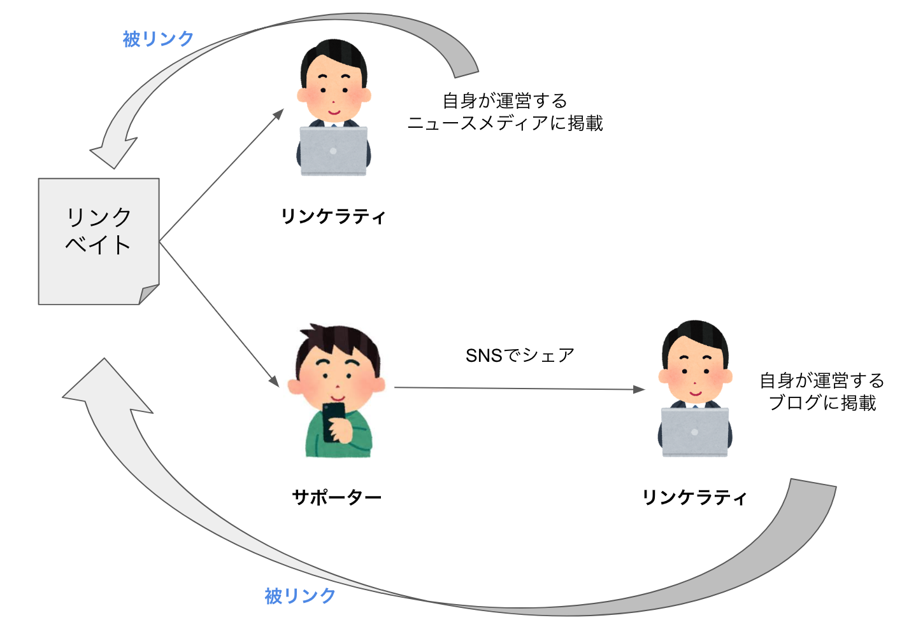
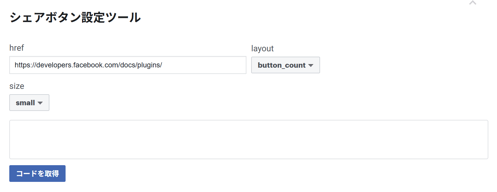
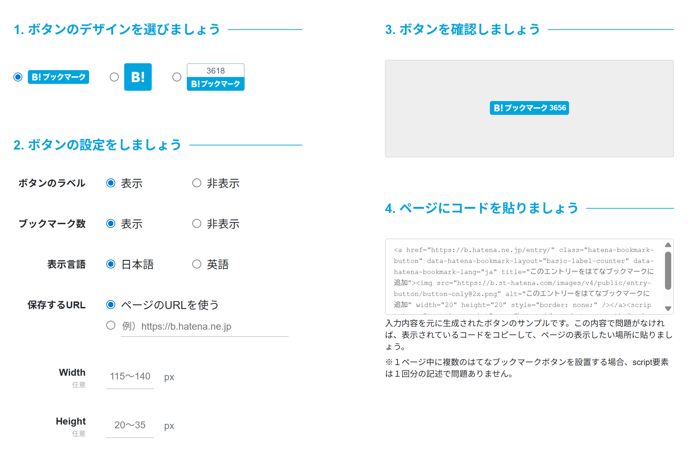

# 第19章　ブランドSEO

> フェーズ: ai ／ 目安: 約22分

指名検索の重要性、被リンクの評価要素とリンクビルディングの具体的な手法、レビュー・SNS・サイテーションを理解する

## 学習目標

- 指名検索とは何かを理解する
- 外部評価が「被リンク」と「サイテーション」の2要素に大別されることを理解する
- 被リンクの4つの評価要素（ページランク・掲載状況・関連性・リンクエイジ）の考え方を理解する
- コントローラブルな被リンク獲得方法（自社サイト・サテライトサイト・リンクベイト）を理解する
- SNSでのリンク獲得に必要なOGP設定やシェアボタン設置の考え方を理解する
- サイテーション（言及）と被リンクの違いを理解する

## 本文

### 1. ブランド：指名検索

**指名検索**とは、企業名やブランド名、商品名など特定の固有名詞で検索されることです。第2章で学んだ検索意図の分類でいえば、多くの場合「Go（行きたい）」クエリに該当します。

**【用語定義】**

**指名検索**
「〇〇株式会社」「〇〇（商品名）」のように、固有名詞そのものを使って検索されること。すでにその企業・ブランドを知っているユーザーによる検索であるため、認知度の高さを反映する指標の一つと考えられています。

**【Point】**

指名検索が増えることは、単にアクセスが増えるだけでなく、ブランドの認知度が広がっていることの表れと捉えられます。これはSEOの数値だけで完結するものではなく、広告・PR・SNSなど、さまざまな活動の積み重ねの結果として表れるものです。本章で学ぶ被リンクやサイテーションの獲得も、この指名検索を増やす土台になります。

### 2. 基本：外部評価とは何か

SEOの評価は、大きく「内部評価」と「外部評価」の2つに分かれます。ここまでの章では主に内部評価を高める施策を扱ってきましたが、本章ではもう一方の**外部評価**を高める施策を扱います。

Googleのジョン・ミューラー氏は2015年、外部評価の重要性について次のように発言しています。

**【Note】**

「はっきり言うと、被リンクがないと上位表示は困難です。理屈では可能ですが、競合サイトがいると、実際すごく難しいでしょう」（Google ジョン・ミューラー氏、2015年）

自然言語処理アルゴリズムの発達により、コンテンツそのものの内容を評価する精度が上がってきたため、被リンクが占める評価の割合は、検索エンジン黎明期と比べると小さくなってきていると考えられています。しかし、それはあくまで相対的に小さくなっているだけであり、依然として重要な評価項目であり続けています。

外部要素の本質は、Googleの成り立ちにさかのぼると理解しやすくなります。Google創業者のLarry Page氏とSergey Brin氏は1998年、検索エンジンに関する論文を発表しました。当時の検索エンジンは、Web上の情報量が急増する中で、必要な情報が不要な情報に埋もれてしまう「低品質な検索結果」という課題を抱えていました。両氏はこの課題を解決するために、学術論文の世界を参考に「他ページからの引用情報」でページを評価する方法を考案します。論文の世界で被引用数が質を推定する手がかりになるように、Web上の「他ページからどれだけ、どのように引用されているか」を、ページの価値やページ内容を判断する材料にするという発想です。

**【用語定義】**

**外部要素**
他ページからの引用情報をもとにした評価要素の総称。「ページ価値」の判断材料になるものは第7章で学んだPage Quality評価に、「ページ内容」の判断材料になるものはNeeds Met評価の精度向上に、それぞれつながると考えられています。

外部要素は、大別すると次の2つに分かれます。

被リンク（バックリンク）

a要素による「明示的」な引用。検索エンジンが認識しやすく、評価しやすい

サイテーション

名前の言及などによる「暗示的」な引用。リンクがなくても成立する

被リンクの方が検索エンジンにとって認識・評価しやすいため、外部要素としての重要性は依然として被リンクの方が高いと考えられていますが、サイテーションも意識することで、ブランドの露出施策の幅は大きく広がります。次のセクションから、それぞれを詳しく見ていきます。

### 3. 実践：被リンクの4つの評価要素

被リンクは、a要素によって明示的にWebページと紐付けられる引用です。`rel="nofollow"`が設定されたリンクは基本的に評価対象外ですが、Googleが評価すべきと判断した場合は、nofollowリンクでも評価対象になり得るとされています。

被リンクの評価要素として、主に次の4つが挙げられます。これらは並列の関係ではなく、1つ目の「ページランク」がすべての基礎を形成しています。

- **①ページランク**：リンク元ページの評価

- **②掲載状況**：リンクの見え方・位置

- **③関連性**：リンク元と先の文脈

- **④リンクエイジ**：張られてからの経過時間

*（図）図1：被リンクの4つの評価要素。①ページランクが基礎となり、②〜④の要素が組み合わさって評価される*

**①リンク元のページ評価（ページランク）**

**【用語定義】**

**ページランク（PageRank）**
被リンクをもとに算出される、ページの品質ランク。「量：被リンク数が多いほど価値が高まる」「質：高品質なページからの被リンクほど価値が高まる」という2つの観点で構成されます。Googleの創業者が発表した論文で示された、被リンク評価の基礎となる考え方です。

ページランクの計算では、リンク元ページの評価をそのページからの発リンク数で割った値が、リンク先に分配されるイメージで説明されます。あわせて、他サイトからリンクを受けていないページにも一定の「初期パワー」が与えられる仕組みになっており、この初期パワーがあることで、被リンクの少ないページも適切に評価される設計になっているとされています。この分配の様子は、論文の中で「ランダムにリンクを辿るユーザー」に例えられていました。

ただし、現在のアルゴリズムはこの単純なランダムモデルから進化しており、「リーズナブルサーファーモデル」と呼ばれます。すべての発リンクに均等に評価を分配するのではなく、ユーザーが実際にクリックしやすいリンクに、より重点的に評価を分配する合理的なモデルです。



*（図）リーズナブルサーファーモデル：関連性の高いリンクへより多くのページランクを分配するイメージ*

**②リンク元ページにおけるリンクの掲載状況**

リーズナブルサーファーモデルでは、次のような掲載状況をもとに、クリックされやすさが判断されていると考えられています。

- アンカーテキストのフォントサイズ・色・書式（太字など）
- リンクの出現箇所（ファーストビュー、フッター、サイドバーなど）
- アンカーテキストの単語数

Googleのマット・カッツ氏も、サイドバーやフッターなど全ページ共通のリンク（サイトワイドリンク）の価値は、メインコンテンツ内のリンクよりも低いと述べています。ただし、これはあくまでページ内での相対的な評価の差であり、「アンカーテキストを大きくすれば評価が上がる」といった小手先の対応をしても意味はありません。



*（図）フォントサイズ・掲載位置に応じたページランクの分配イメージ*

**③リンク元とリンク先のコンテンツ・文脈的な関連性**

被リンク元のコンテンツと関連性が高いページへのリンクほど、より重点的に評価が分配されると考えられています。ユーザーにとって、閲覧中のコンテンツと関連性の高いページへのリンクが有益だからです。単純なコンテンツの関連性だけでなく、そのリンクが置かれている文脈（前後の文章がどのような話題か）も評価に含まれるとされ、これは自然言語解析技術の発展があって初めて実現した評価方法だと考えられています。

**④リンクが張られてからの経過時間（リンクエイジ）**

**【用語定義】**

**リンクエイジ**
被リンクが初めて張られてから（検索エンジンが認識してから）の経過時間。新しいリンクを継続的に獲得しているページを高く評価し、コンテンツの陳腐化を判別する手がかりの一つとして使われていると考えられています。



*（図）新しい被リンクと古い被リンクによるページ評価の違い*

**【Warning】**

「新しいリンクが多いほど評価される」という仕組みを逆手に取った、人工的な被リンクの急増はスパムシグナルとして認識される可能性があります。正当なサイトの被リンク獲得ペースは緩やかであり、時事性のあるトピックでもないのに被リンクが不自然に急増した場合は注意が必要です。

### 4. 実践：コントローラブルな被リンクの獲得方法

被リンクの獲得は「運任せ」に見られがちですが、明日からでも取り組めるコントローラブルな方法もあります。作り手の観点で整理すると、次の3つに分けられます。

| 作り手 | リンク元サイト | コントロール性 |
| --- | --- | --- |
| 自作 | 自社コーポレートサイト | コントローラブル |
| 自作 | サテライトサイト | コントローラブル |
| 他作 | 他サイト | アンコントローラブル |

**①自社コーポレートサイトからのリンク**

自社のコーポレートサイトからサービスサイトへのリンクは、被リンク効果に加えて、運営者情報を検索エンジンに伝え、信頼性を高めることにもつながります。サイドバーやフッターにリンクを置くだけでなく、サービス紹介ページや関連ニュース記事など、**メインコンテンツ内で言及するページ**を用意することが望ましいとされています。

**②サテライトサイトからのリンク**

**【用語定義】**

**サテライトサイト**
自社サイトと関連するが異なるテーマ・コンテンツを扱う、別の自社サイト。本サイトと競合しない切り口でユーザーを集め、価値あるコンテンツとして本サイトを紹介する運用が想定されています。

サテライトサイトを運用する際は、次の2点に注意が必要です。

- **関連性の高いサイトからの被リンク効果には上限がある：**リンク構造・トラフィック・ドメイン名・IPアドレスなどから見て関連性が高いと判断されるサイト同士は、被リンクの評価に一定の上限が設けられると考えられています
- **リンク獲得だけを目的にしたサテライトサイトはペナルティ対象になりうる：**Googleのマット・カッツ氏も「関連する2サイトをリンクすること自体は問題ないが、大量のサイト同士でリンクさせるのは問題」と述べています

**【Warning】**

Googleは、被リンクの多くがトップページに集中している、アンカーテキストの形式が同じ、サイトタイプが同じ、といった「分散性のないリンク構造」を人工的なリンクビルディングのシグナルとして監視しているとされています。自然な被リンクは分散する傾向にあるという前提を踏まえ、多数のサテライトサイトに労力を分散するより、本サイト自体の価値向上に注力する方が望ましいと考えられます。



*（図）IPアドレスのオクテット構成：第1〜第2オクテットが同一だと関連性が高いと判断される*



*（図）2-way linkと3-way linkの違い：クッションページを挟んでもGoogleはリンクの関連性を認識できる*

**③他サイトからのリンク（リンクベイト）**

他社からの被リンクはアンコントローラブルな要因が多いものの、「どうすれば自社メディアを他社に紹介してもらえるか」という企画の視点で取り組めます。こうしたリンクされやすい記事を**リンクベイト**と呼びます。



*（図）リンクベイトからリンケラティ・サポーターを経て被リンクが広がる構造*

**【用語定義】**

**リンクベイト（Link Bait）**
他サイトからのリンクを呼び寄せる「餌」となるコンテンツ企画。Baitは英語で「餌」の意味。

**リンケラティ（Linkerati）**
ブロガーやWebメディアの記者・執筆者など、実際にリンクを張れる立場にあるユーザー層。ソーシャルメディア利用者やオフラインの口コミ伝搬者は、リンケラティに記事の存在を伝えるサポーターの役割を担います。

| カテゴリ | 内容の例 |
| --- | --- |
| まとめ記事 | 「〇〇に関する〇個のまとめ」のような網羅型記事、インフォグラフィックス |
| 一次情報記事 | 「〇年度の内定率調査結果」のような、自社で実施したアンケート等の一次情報 |
| 流行記事 | 「速報！〇〇の謎解明」のような、鮮度が求められるニュース系の紹介・分析 |
| ユーモア記事 | 写真や動画などを使った、思わず紹介したくなるユーモアのある記事 |
| 煽り記事 | 固定観念を覆すような切り口の記事 |

**【Point】**

特に、ユーザーや顧客へのアンケートなどによる一次情報の作成は、リンクベイトとして有効とされています。定量的な統計データは他の記事に引用されやすく、プレスリリース配信サービスなどを通じて拡散させることも有効です。

**【Warning】**

リンク獲得のみを目的とした虚偽の情報（フェイクニュース）の発信は、SEO的にも社会的にも避けるべきです。Googleはフェイクニュースの検索順位を下げるアルゴリズムを導入しており、SNS各社も同様の対応を進めているとされています。

### 5. レビュー・SNS・サイテーション

ブランドに関する情報は、自社サイトの外でも広がっていきます。その中で重要な概念が**サイテーション**です。

**【用語定義】**

**サイテーション（Citation）**
Web上で、自社名やブランド名、商品名などが言及されている状態のこと。前セクションで学んだ「被リンク（バックリンク）」との決定的な違いは、**クリックできるリンクが付いていなくても成立する**点です。SNSでの言及や、レビューサイトでの評価なども、サイテーションの一種です。

検索エンジンがサイテーションとして認識する要素は、主に次の3つと考えられています。

- ブランド名（会社名・店舗名・サービス名など）
- 住所・電話番号
- a要素のリンクではない、テキストとして書かれたURL

|  | 被リンク（バックリンク） | サイテーション |
| --- | --- | --- |
| 成立条件 | クリック可能なリンクが必要 | リンクがなくても、名前の言及だけで成立 |
| SEOにおける位置づけ | Google自身がランキング要因として位置づけている | ウェブ検索のランキング要因かどうかをGoogleは明確にしていない |

**【Warning】**

サイテーションがウェブ検索の順位に直接影響するかどうかについて、Googleは明確な見解を示していません。「サイテーションを増やせば必ず順位が上がる」と断定することはできませんが、ブランドが多くの場所で言及される状態は、指名検索の増加やユーザーの信頼にはつながりやすいと考えられます。GoogleのGary Illyes氏も、SNSでの言及のされ方をGoogleが注視していると述べています。

ただし、そもそも検索エンジンがブランド名とWebページの関係性を認識していなければ、どれだけ他のページで引用されても評価にはつながりません。そのため、サイテーション効果を得るには、まず検索エンジンにWebページとブランド情報を紐付けて認識させる必要があります。具体的には、次のような対応が挙げられます。

- 自社の基本情報（NAP情報＝Name・Address・Phoneなど）を構造化マークアップする（第18章参照）
- 自社のSNSアカウントを作成し、概要欄に事業に関連するキーワードを含めて記載する
- 実店舗がある場合はGoogleビジネスプロフィールに登録する（次のセクションで詳述）
- iタウンページ、Indeed、Wantedlyなど、無料で利用できる情報メディアに掲載する

レビューやSNSでの言及は、第7章で学んだE-E-A-T（特に信頼性）にも関わってきます。多くのユーザーから言及・評価されている企業・商品は、第三者による評価という点で、信頼性の材料の一つになりうると考えられます。

なお、多くのSNS（X、Facebookなど）に投稿されるリンクには、`nofollow`属性が付与されており、通常の被リンクとしては扱われません。ただし、SNSでの拡散は、リンケラティに記事の存在を届け、他のサイトやメディアから紹介・言及される（サイテーションや被リンクを獲得する）きっかけになりやすいという点で、間接的な意味を持ちます。

**【Note】**

Google公式は2019年9月、nofollowが付いたリンクについて「評価対象から完全に除外するのではなく、あくまで判断材料の一つ（ヒント）として扱う」方針に変更したと発表しています。nofollowが付いていても、文脈によっては評価の手がかりとして参照される場合があるとされています。

### 6. 実践：SNSでのリンク獲得（OGP設定とシェアボタン）

SNSでの拡散は、前セクションで見たようにリンケラティからの被リンク・サイテーション獲得のきっかけになります。ここでは、SNSでの拡散を後押しするための実装面のポイントを紹介します。

**OGP設定による適切なページ情報の表示**

URLがSNSで共有された際に表示されるタイトル・説明文・画像は、**OGP（Open Graph Protocol）**を設定することで、サイト側が意図した内容に指定できます。設定していない場合、SNS側が自動生成した意図しない表示になることがあります。

**コード例：OGPの記述（head要素内）**

```html
<meta property="og:title" content="記事タイトル">
<meta property="og:type" content="article">
<meta property="og:url" content="https://example.com/article/">
<meta property="og:image" content="https://example.com/img/thumb.jpg">
<meta property="og:description" content="記事の概要説明文">
<meta name="twitter:card" content="summary_large_image">
```

| 項目名 | 必須 | 内容 |
| --- | --- | --- |
| `og:title` | ◯ | ページタイトル |
| `og:type` | ◯ | ページの型。トップページはwebsite、それ以外はarticleを指定することが多い |
| `og:url` | ◯ | ページURL（絶対パス） |
| `og:image` | ◯ | サムネイル画像URL（絶対パス） |
| `og:description` | - | ページの概要 |
| `twitter:card` | - | Xでの表示形式。`summary_large_image`を指定すると画像が大きく表示される |

**【Point】**

OGPは、全ページで同じtitleやdescription、imageを使い回すのではなく、ページごとにユニークな内容にすることが重要とされています。トップページはサイト名・サイト概要・ロゴ画像、記事ページは記事タイトル・記事概要・記事内画像、というように内容を分けることで、リンク先の内容が正確に伝わり、クリックやシェアを促しやすくなります。公開前には、X・Facebookそれぞれが提供する確認ツールで表示のプレビューをチェックすることが推奨されます。

**SNSシェアボタンの設置**

ユーザーが簡単に共有できるよう、SNSのシェアボタンを記事ページに設置します。設置場所は、記事を読み終えたタイミングで目に入る**記事末尾**に加えて、**記事冒頭**にも置くことが望ましいとされています。設置を検討したい代表的なボタンは、X（旧Twitter）・Facebook・はてなブックマークの3つです。



*（図）Facebook「シェアボタン設定ツール」の設定画面*



*（図）はてなブックマークボタンの設定画面*

**【Note】**

はてなブックマークは日本最大級のソーシャルブックマークサービスで、新着エントリーや人気エントリーに掲載されたブックマークにはnofollowが付与されず、純粋な被リンクとして扱われるとされています。ただし、宣伝目的などスパム行為と認識されたリンクにはnofollowが付与されることがあります。複数アカウントを使った自作自演のブックマークはアカウント停止の対象になりえますが、運営者アカウント自身によるブックマーク登録は問題ないとされています。

**ソーシャルメディアポリシーの整備**

SNSでの拡散を進める一方で、企業アカウント運用にはブランド毀損などのリスクも伴います。そのため、**ソーシャルメディアポリシー**を定めておくことが望ましいとされています。

**【用語定義】**

**ソーシャルメディアポリシー**
企業がSNSを利用する際の姿勢・対応方法を明文化したもの。アカウント運営者である社員の行動指針を示すことと、ユーザーに対して運営方針・責任の所在を示すことの2つの目的があります。社外秘情報の公開禁止、コメント対応方針、責任の所在の明記などが一般的な項目です。

あわせて、企業アカウントだけでなく、従業員個人のプライベートアカウントでの発信がブランド毀損につながるケースも増えているとされ、社外秘事項や自社・関係他社に関する発信について、従業員向けのガイドラインを別途整備することも重要とされています。

## まとめ

- 指名検索とは、企業名やブランド名など固有名詞での検索であり、ブランドの認知度を反映する指標の一つと考えられている
- SEOの評価は内部評価と外部評価に大別され、外部評価はさらに「被リンク（明示的な引用）」と「サイテーション（暗示的な引用）」の2要素に分かれる
- 被リンクの評価には、ページランク（基礎）・リンクの掲載状況・リンク元とリンク先の関連性・リンクエイジの4要素が関わると考えられている
- 被リンクは自社コーポレートサイト・サテライトサイト・他サイト（リンクベイト）という3つの切り口でコントローラブルに獲得を目指せる。ただしリンク獲得のみを目的とした人工的な施策はペナルティやスパム判定のリスクがある
- サイテーションはWeb上での名前の言及であり、被リンクと異なりクリック可能なリンクがなくても成立する。効果を得るには構造化マークアップやSNSアカウント整備で、検索エンジンに自社情報を認識させる必要がある
- OGP設定とSNSシェアボタンの設置は、SNSでの拡散を後押しし、間接的なリンク・サイテーション獲得につながる。あわせてソーシャルメディアポリシーの整備も重要である
- SNSのリンクにはnofollowが付与されることが多いが、Googleは2019年9月からnofollowを完全な除外ではなく判断材料の一つとして扱う方針に変更した

## 確認テスト

### Q1（単一選択）

指名検索の説明として、最も適切なものはどれか。

- A. 「SEO とは」のような、一般的な情報を調べる検索
- B. 複数語を組み合わせた具体的なロングテール検索
- C. 地域名を含めて近くの店舗を探す検索
- D. 企業名・ブランド名・商品名など固有名詞で検索されること　✅**（正解）**

**解説**：指名検索は固有名詞（企業・ブランド・商品名）での検索です。一般キーワードやロングテール、ローカル検索とは区別されます。

### Q2（単一選択）

外部要素の2つの分類として、最も適切な組み合わせはどれか。

- A. 被リンクとサイテーション　✅**（正解）**
- B. 内部リンクと外部リンク
- C. 検索ボリュームと競合性
- D. ページランクとドメインパワー

**解説**：外部要素は大別すると、明示的な引用である「被リンク」と、暗示的な引用である「サイテーション」の2つに分かれます。

### Q3（単一選択）

被リンクとサイテーションのうち、検索エンジンにとって認識・評価しやすいのはどちらか。

- A. サイテーション（名前の言及だけで成立するため）
- B. 被リンク（クリック可能な明示的リンクのため）　✅**（正解）**
- C. どちらも全く同じ精度で評価される
- D. どちらも検索エンジンには一切認識されない

**解説**：被リンクは明示的なリンクのため、名前の言及だけのサイテーションより検索エンジンが認識・評価しやすいとされます。

### Q4（複数選択）

被リンクの評価要素として、本文で紹介されたものをすべて選べ。

- A. リンク元のページ評価（ページランク）　✅**（正解）**
- B. リンク元ページにおけるリンクの掲載状況　✅**（正解）**
- C. リンク元とリンク先のコンテンツ・文脈的な関連性　✅**（正解）**
- D. リンク元サイトのサーバー契約プラン

**解説**：被リンクの評価要素として、ページランク・リンクの掲載状況・コンテンツ及び文脈的な関連性・リンクエイジの4つが挙げられます。サーバー契約プランは評価要素ではありません。

### Q5（単一選択）

リンクエイジについての説明として、最も適切なものはどれか。

- A. リンクの文字色を表す指標である
- B. リンク先ページの表示速度を表す指標である
- C. リンクが張られてからの経過時間を表し、新しいリンクを継続的に獲得しているページが高く評価されると考えられている　✅**（正解）**
- D. 被リンクの数を年齢に例えた冗談の表現にすぎない

**解説**：リンクエイジとは、被リンクが初めて張られてからの経過時間を表す考え方で、コンテンツの陳腐化を判別する手がかりの一つとされています。

### Q6（複数選択）

コントローラブルな被リンク獲得方法として、本文で紹介されたものをすべて選べ。

- A. 自社コーポレートサイトからのリンク　✅**（正解）**
- B. サテライトサイトからのリンク　✅**（正解）**
- C. リンクベイトによる他サイトからの自然なリンク獲得　✅**（正解）**
- D. リンクの売買による大量獲得

**解説**：自社コーポレートサイト・サテライトサイト・リンクベイトの3つがコントローラブルな獲得方法として紹介されました。リンクの売買はリンクスキームに該当し、ガイドライン違反です。

### Q7（単一選択）

リンクベイトの説明として、最も適切なものはどれか。

- A. リンク切れを検出するためのツール
- B. 自社サイト内のリンク構造を分析する手法
- C. リンクを購入するための取引仲介サービス
- D. 他サイトからのリンクを呼び寄せるための、企画性の高いコンテンツ　✅**（正解）**

**解説**：リンクベイトとは、他サイトからのリンクを呼び寄せる「餌」となる、企画性の高いコンテンツのことです。

### Q8（単一選択）

サイテーションと被リンクの違いとして、最も適切なものはどれか。

- A. サイテーションはクリック可能なリンクがなくても、名前の言及だけで成立する　✅**（正解）**
- B. サイテーションと被リンクは全く同じものである
- C. 被リンクはリンクがなくても成立し、サイテーションは必ずリンクが必要である
- D. サイテーションは被リンクの別の呼び方にすぎない

**解説**：サイテーションは、クリック可能なリンクが付いていなくても、名前の言及だけで成立する点が被リンクとの決定的な違いです。

### Q9（単一選択）

サイテーション効果を得るために必要な対応として、最も適切なものはどれか。

- A. 検索エンジンに自社情報を紐付けて認識させる必要はなく、言及されるのを待つだけでよい
- B. 自社の基本情報を構造化マークアップしたり、SNSアカウントを整備するなどして、検索エンジンにWebページとブランド情報を紐付けて認識させる　✅**（正解）**
- C. サイテーションはSEOと無関係なので、特に対応する必要はない
- D. 自社名を意図的に隠すことで、サイテーション効果が高まる

**解説**：検索エンジンがブランド名とWebページの関係性を認識していなければ、他ページでの言及も評価にはつながりません。構造化マークアップやSNSアカウントの整備などで、事前に紐付けを認識させることが重要です。

### Q10（単一選択）

OGPの設定に関する説明として、最も適切なものはどれか。

- A. 全ページで同じtitleやdescription、imageを使い回すことが推奨される
- B. OGPを設定すると、サイトの表示速度が自動的に向上する
- C. ページごとにユニークなtitle・description・imageを設定することが望ましい　✅**（正解）**
- D. OGPはFacebookでのみ有効で、他のSNSには一切影響しない

**解説**：OGPは全ページ共通ではなく、ページごとにユニークな内容にすることで、リンク先の内容が正確に伝わり、クリックやシェアを促しやすくなります。

### Q11（単一選択）

ソーシャルメディアポリシーの目的として、最も適切なものはどれか。

- A. SNSでの広告費用を削減すること
- B. フォロワー数を自動的に増やす仕組みを構築すること
- C. SNS上のすべてのコメントに返信することを義務付けること
- D. アカウント運営者の行動指針を示し、ユーザーに対して運営方針・責任の所在を示すこと　✅**（正解）**

**解説**：ソーシャルメディアポリシーは、アカウント運営者である社員の行動指針を示すことと、ユーザーに対して運営方針・責任の所在を示すことを目的としています。
