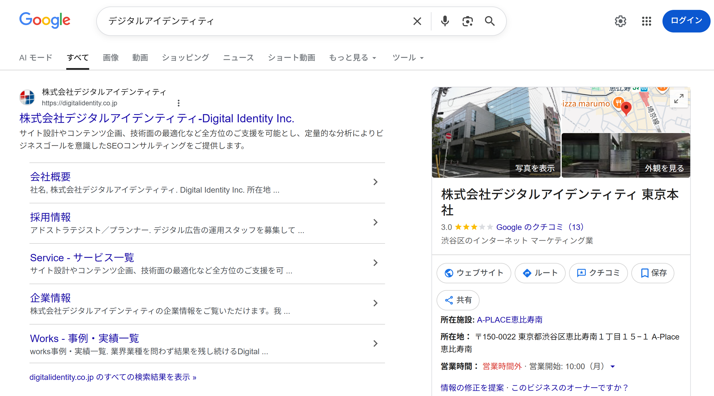
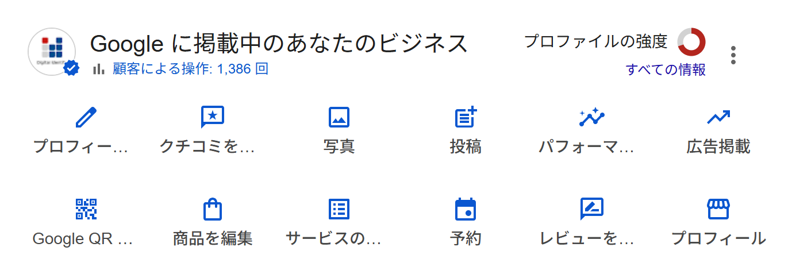
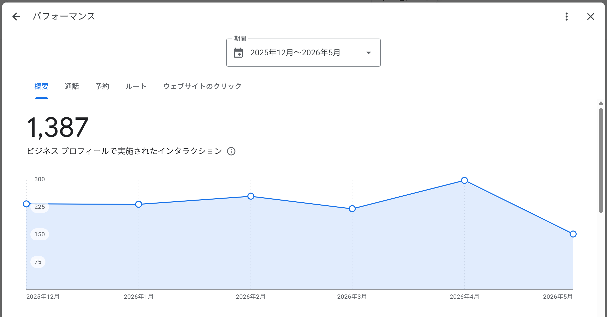
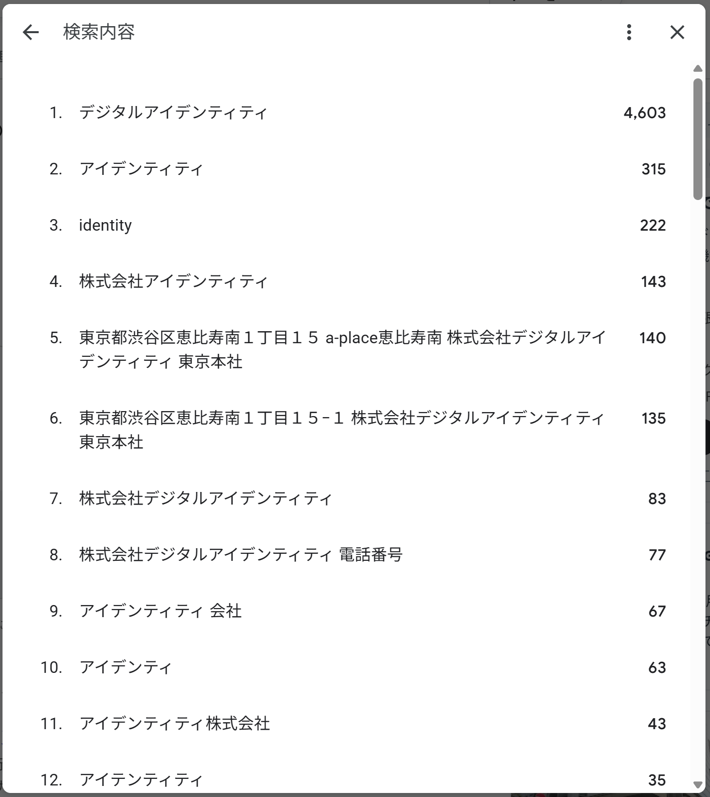
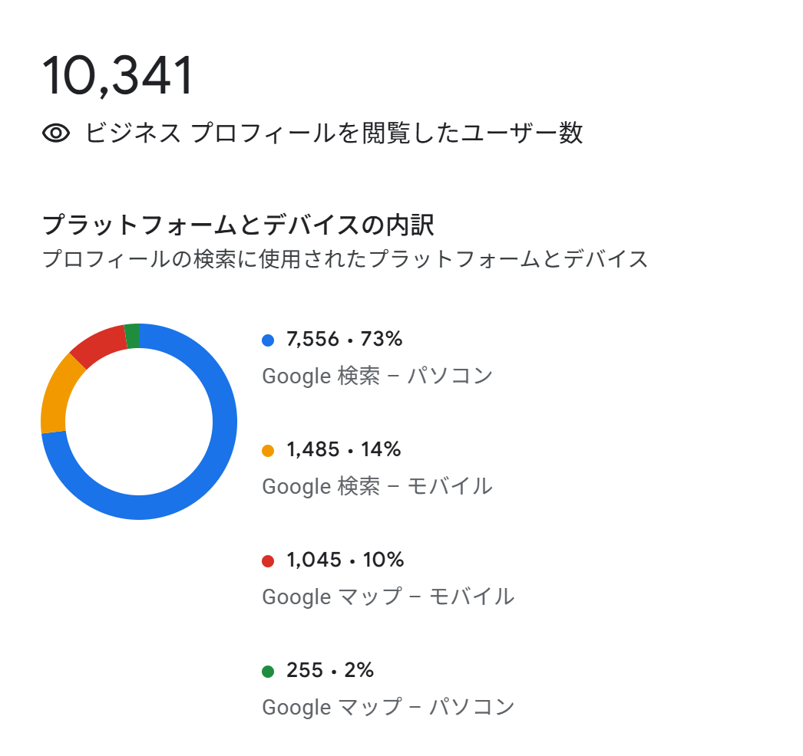

# 第20章　ローカルSEO

> フェーズ: ai ／ 目安: 約18分

地域ビジネスの検索結果での見え方を左右するローカル検索の仕組みと、Googleビジネスプロフィールの活用方法を学ぶ

## 学習目標

- ローカルSEOとは何か、通常のSEOとの違いを理解する
- ローカル検索の3つの評価指標（関連性・距離・知名度）を理解する
- ローカルパックやローカルファインダーなど、ローカル検索結果の種類を理解する
- Googleビジネスプロフィールに登録するメリットと、最適化の基本を理解する
- クチコミ（レビュー）の管理がローカルSEOに与える影響と、ステルスマーケティング規制の注意点を理解する

## 本文

### 1. 基本：ローカルSEOとは

Googleには、ユーザーの位置情報（GPS、Wi-Fi、IPアドレスなど）と検索クエリを組み合わせて、最も関連性の高い地域のビジネス情報を表示する**ローカル検索**という仕組みがあります。このローカル検索を対象にしたSEO施策を**ローカルSEO**と呼びます。

**【用語定義】**

**ローカルSEO**
特定の地域での検索結果において、自社のビジネスを上位に表示させるための施策。ユーザーの来店やサービス利用、認知向上を目的とする。「地域名＋業種・サービス名」のような、地域性の高い検索キーワード（ローカルキーワード）で検索されることが多い。

ローカルSEOの主な施策には、次のようなものがあります。

- **Googleビジネスプロフィールの最適化：**店舗情報の登録、写真・営業時間の更新、口コミへの対応
- **地域に特化したコンテンツの提供：**地域イベント、エリアに特化した近隣情報の発信
- **オンラインとオフラインの連携：**SNSでの情報発信、店舗とWebでのプロモーション連携

通常のSEOと比較すると、ローカルSEOでは地域にある実店舗やサービスが有利とされています。これは、Googleが「地域性」「実在性」「信頼性」を評価指標としており、実際に地域で営業している事業者の情報がローカル検索で優先表示されやすいためです。通常のSEOでは、データベース系ポータルサイトの一覧ページが強く難易度の高い領域（不動産・求人・医療など）でも、ローカル検索では中小の事業者が上位を獲得できる可能性があります。

| ビジネス | ローカルSEOが有効な理由 |
| --- | --- |
| 飲食店・カフェ・小売店 | 「渋谷 カフェ」など地域名を含むキーワードで検索されることが多い |
| 美容院・クリニック・治療院などのサービス業 | 地域名を含むキーワードでの検索が多く、新規・リピーター獲得につながる |
| 地域密着型の専門店・中小企業 | 大手と競合せず、地域内のユーザーにアプローチできる |
| 医療機関・歯科医院・薬局 | 「近くの歯医者」のように生活圏内での検索が多い |
| 多店舗展開しているチェーン店 | 店舗ごとにローカルSEOを強化することで、地域ごとの集客力を高められる |

**【Note】**

ローカルSEOと似た言葉に**MEO**（Map Engine Optimization）がありますが、これはGoogle公式の用語ではなく、日本で広まった通称です。MEOは主に「Googleマップ上での上位表示」に特化した施策を指すことが多く、ローカルSEOの一部と捉えるのが一般的です。本章では「ローカルSEO」という呼び方で統一します。

### 2. 基本：ローカル検索の評価指標と検索結果の種類

通常のGoogle検索アルゴリズムは、ランキング要素や重み付けが公開されていませんが、ローカル検索に関しては、Googleが公式に評価指標を公開しており、施策の方向性を立てやすくなっています。

**【用語定義】**

**関連性（Relevance）**
検索クエリと、ビジネスプロフィールやWebサイトの内容がどれだけ一致しているかを示す指標。

**距離（Distance）**
検索クエリに含まれるエリア、またはユーザーの現在地から、ビジネスの所在地までの物理的な距離。

**知名度・視認性（Prominence）**
オンライン／オフラインでのビジネスの有名度や信頼性。口コミの数・評価、被リンク、サイテーション（言及）などが影響する。

Googleが公式に明言しているローカル検索の評価指標は「関連性」「距離」「知名度」の3つですが、ローカル検索においてもコンテンツの品質やE-E-A-Tは基本になります。たとえば、閉店した店舗が「営業中」と表示されているなど、不正確な情報は検索品質評価ガイドライン上「信頼できない」と判断される対象になるとされています。

ローカル検索に対する検索意図（Visit-in-Person query）だとGoogleが解釈した場合、検索結果には次のような形式が表示されます。

- **ローカルパック**：地図と3件程度の周辺店舗情報

- **ローカルファインダー**：該当エリアの全店舗一覧

- **ローカルオーガニック検索**：ローカル性が加味された通常の検索結果

*（図）図1：主なローカル検索結果の形式*

ローカルパックはGoogleビジネスプロフィールの情報が基になっており、検索クエリの種類によって、口コミ・写真が大きく表示される「ローカルスナックパック」（飲食・サービス系）、評価を含まない「ローカルABCパック」（ブランド名・チェーン店など）といったバリエーションがあります。また、企業名・施設名など固有名詞での検索では、Wikipediaや公式サイトなどの情報を基にした**ナレッジパネル**が表示されることもあります。

*（図）図：企業名・施設名での検索で表示されるナレッジパネルの例（自社「デジタルアイデンティティ」の検索結果）*

**【Point】**

2015年以降、ローカルパックは通常の検索結果（自然検索枠）よりも上位に表示されることが増え、特に飲食店・美容院・宿泊施設などのカテゴリでは目立つ位置に定着しています。ローカル性のあるキーワードでは、通常のオーガニック検索対策だけでなく、ローカルパックへの対応が集客上重要になります。

### 3. 実践：Googleビジネスプロフィールの基本

**Googleビジネスプロフィール**は、Google検索やGoogleマップで使われる、店舗などのビジネス情報を管理するための無料ツールです。ローカルSEOにおいて最も影響力が大きい要素であり、登録は不可欠とされています。

**【用語定義】**

**Googleビジネスプロフィール**
店舗名、住所、営業時間、電話番号、口コミ、写真などのビジネス情報を無料で登録・管理できるGoogleのツール。管理にはビジネスオーナーとしての権限（オーナー確認）が必要。

*（図）図：Googleビジネスプロフィールの管理画面。プロフィール編集・クチコミ返信・写真・投稿・パフォーマンス確認などをここから行う*

Google公式ヘルプには「ローカル検索結果のランキングを改善するには、Googleビジネスプロフィールでビジネス情報を登録し、更新します」と明記されています。登録することで、Google検索での評価向上に加え、Googleマップの検索結果にも表示されるようになり、新たな集客チャネルの獲得にもつながります。

オーナー登録の大まかな流れは次のとおりです。

- **Googleアカウント取得**：会社・店舗のメールでも作成可

- **店舗情報の有無を確認**：Google検索・マップで検索

- **オーナー登録・認証**：電話・メール・ハガキ等で確認

*（図）図2：Googleビジネスプロフィールのオーナー登録の流れ*

既にGoogleに店舗情報が掲載されている場合は、その情報の「オーナー確認」を行います。掲載がない場合は新規登録が必要です。いずれの場合も、電話・メール・ハガキ郵送・動画・ライブビデオ通話のいずれかの方法でオーナー認証を行い、数日程度で登録が完了します。

**【Warning】**

ビジネス名には、正式名称にエリア名・価格・キャンペーン情報・宣伝文句などを含めてはいけません。たとえば正式名称が「〇〇ラーメン」の場合、「渋谷区駅前 〇〇ラーメン」「〇〇ラーメン 激安490円」のような表記はガイドライン違反となり、プロフィールが停止される可能性があります。ビジネスの説明文についても、無関係な内容や誇張表現、外部リンクの掲載は避ける必要があります。

登録できる主なビジネス情報には、名前・説明・住所・電話番号・営業時間・カテゴリ・メニュー・商品などがあります。特に**カテゴリ**は「事業に何が含まれるか」ではなく「事業が何であるか」という観点で選ぶことが推奨されており、メインカテゴリに紐づくサブカテゴリ（最大9つ）はユーザーには表示されないものの、ローカル検索のランキングに影響するとされています。また**営業時間**は、業種ごとに登録ルールが異なる点にも注意が必要です（例：飲食店は「座って食事できる時間」であり、ラストオーダーの時間ではない）。

### 4. 実践：投稿・Q&A・パフォーマンス機能の活用

Googleビジネスプロフィールには、ビジネス情報の登録機能に加えて、ユーザーとの交流や新規顧客へのアピールを目的とした機能も備わっています。

| 機能 | できること |
| --- | --- |
| 投稿機能 | 写真・動画、最新情報、特典、イベント、商品などを投稿し、検索結果やマップのプロフィール下部に表示できる |
| Q&A機能 | 顧客からの質問にオーナーが回答できる。よくある質問を先回りして登録することも可能 |
| クチコミ機能 | ユーザーが投稿した口コミに、オーナーが返信できる |
| パフォーマンス機能 | プロフィールの閲覧数、検索語句、通話・ルート検索・Webサイトクリックなどの行動データを確認できる |

**【Note】**

Q&A機能は全てのビジネスプロフィールで自動的にオンになっており、**オフにしたりユーザーからの質問を拒否したりすることはできません**。不適切な質問・回答があった場合はGoogleに削除申請できますが、必ず削除されるとは限らないため、オーナー自身が正しい回答を追加しておくことも有効な対応です。

投稿機能では、電話番号を投稿本文に含めると不承認になる場合があるなど、細かなルールがあります。イベント投稿は開始・終了日時が未指定の場合、公開から24時間で目立つ場所から表示されなくなる点も押さえておきましょう。

パフォーマンス機能では、ユーザーがどのような検索語句でプロフィールを見つけたか、ルート検索や通話ボタンのクリック数などを確認できます。定期的にこれらのデータを確認し、投稿内容や説明文の改善、集客施策の意思決定に活用することが、ローカルSEOの効果を最大化する上で重要です。

*（図）図：パフォーマンス機能で、プロフィールで実施されたインタラクション数の推移を確認した例*

*（図）図：パフォーマンス機能の「検索語句」。ユーザーがどんな語句でプロフィールを見つけたかがわかる*

*（図）図：プロフィールの閲覧に使われたプラットフォーム・デバイスの内訳*

### 5. 実践：クチコミの管理とステルスマーケティング規制

クチコミ（レビュー）への返信は、ローカル検索結果のランキング改善につながるとされています。Googleでのクチコミ数と評価（★スコア）はローカル検索結果のランキングに影響しており、クチコミ数が多く評価の高いビジネスほど、ランキングが上がりやすくなる傾向があります。

**【Point】**

悪い評価をつけられた場合も、真摯に受け止めて返信することが推奨されています。「企業が思慮深く返信すれば、消費者の多くが否定的なレビューを許容する傾向がある」といったデータもあり、クチコミ返信はユーザーの信頼度向上・リピーター獲得・検索順位向上に寄与するローカルSEOの基本施策とされています。

ユーザーからのクチコミを増やす施策には、会計時などタイミングを見計らって直接依頼する、フォローアップメールでレビュー依頼リンクを送る、店舗内にQRコードを設置するといった方法があります。

**【Warning】**

クチコミ投稿の見返りに金銭や割引などのインセンティブを提供したり、事業者側が一般ユーザーを装って自作自演のクチコミを投稿したりする行為はステルスマーケティング（ステマ）に該当します。2023年10月1日以降、ステマは景品表示法違反として法的に規制されており、Googleビジネスプロフィールのクチコミもその対象です。良い評価も悪い評価も公平に受け入れる姿勢が求められます。

Googleのポリシーに違反するクチコミ（トピックと関係がない、誹謗中傷、広告・スパムなど）は、クチコミ管理ツールから削除申請（報告）が可能です。ただし、単に内容に不満がある・気に入らないという理由だけでは削除対象にはなりません。

## まとめ

- ローカルSEOは、地域での検索結果で自社ビジネスを上位表示させるための施策で、地域にある実店舗やサービスは通常のSEOより有利になりやすい
- ローカル検索の評価指標は「関連性」「距離」「知名度（視認性）」の3つが公式に示されており、検索結果はローカルパック・ローカルファインダー・ローカルオーガニック検索などの形式で表示される
- Googleビジネスプロフィールはローカル検索結果の最も重要な情報源であり、正式名称の遵守など登録ガイドラインに従って正確な情報を維持することが求められる
- 投稿機能・Q&A機能・パフォーマンス機能を活用することで、ユーザーとの交流やビジネス情報の分析ができる
- クチコミ返信はローカル検索順位やユーザー信頼度の向上に寄与するが、インセンティブによるクチコミ収集や自作自演の投稿はステルスマーケティング規制の対象となるため避ける必要がある

## 確認テスト

### Q1（単一選択）

ローカルSEOの説明として、最も適切なものはどれか。

- A. 特定の地域での検索結果において、自社のビジネスを上位に表示させるための施策　✅**（正解）**
- B. 全国のユーザーに向けて、地域性を排除した情報を発信する施策
- C. 検索広告の入札単価を地域ごとに調整する施策
- D. Googleアルゴリズムとは無関係に行う店舗デザインの施策

**解説**：ローカルSEOは、特定の地域での検索結果において自社のビジネスを上位に表示させ、来店やサービス利用、認知向上につなげるための施策です。

### Q2（単一選択）

「MEO」に関する説明として、最も適切なものはどれか。

- A. Google公式が定めた正式な評価指標の名称である
- B. 主にGoogleマップ上での上位表示に特化した施策を指す、日本で広まった通称である　✅**（正解）**
- C. ローカルSEOとはまったく関係のない、広告専用の用語である
- D. 海外で最も一般的に使われているSEO専門用語である

**解説**：MEO（Map Engine Optimization）はGoogle公式の用語ではなく日本で広まった通称で、主にGoogleマップ上での上位表示に特化した施策を指します。ローカルSEOの一部と捉えるのが一般的です。

### Q3（複数選択）

Googleが公式に明言しているローカル検索の評価指標として、正しいものをすべて選べ。

- A. サイトの月間広告費
- B. 関連性（Relevance）　✅**（正解）**
- C. 距離（Distance）　✅**（正解）**
- D. 知名度・視認性（Prominence）　✅**（正解）**

**解説**：Googleが公式に明言しているローカル検索の評価指標は「関連性」「距離」「知名度（視認性）」の3つです。広告費はこれらに含まれません。

### Q4（単一選択）

ローカルパックの説明として、最も適切なものはどれか。

- A. 検索結果に一切表示されない非公開の情報
- B. 有料広告枠のみで構成される検索結果
- C. 検索結果の上部に地図とともに表示される、3件程度の周辺店舗・施設情報　✅**（正解）**
- D. Googleアカウントを持つユーザーにしか表示されない機能

**解説**：ローカルパックは、検索結果の上部に地図とともに3件程度（3パック）の周辺店舗・施設情報が表示される形式で、Googleビジネスプロフィールの情報が基になっています。

### Q5（単一選択）

Googleビジネスプロフィールの説明として、最も適切なものはどれか。

- A. 有料でのみ利用できる広告専用ツールである
- B. サイトの表示速度を計測するためのツールである
- C. 個人ブログの運営者専用に提供されているツールである
- D. Google検索やGoogleマップに使われる、店舗などのビジネス情報を管理するための無料ツールである　✅**（正解）**

**解説**：Googleビジネスプロフィールは、Google検索やGoogleマップで使われる店舗などのビジネス情報を無料で登録・管理できるツールです。

### Q6（単一選択）

ビジネス名の登録に関する説明として、最も適切なものはどれか。

- A. 正式名称に無関係な情報（エリア名・価格・宣伝文句など）を含めるとガイドライン違反となる可能性がある　✅**（正解）**
- B. エリア名や価格、キャンペーン情報を含めた方がユーザーに親切なので推奨される
- C. ビジネス名は空欄のままでも問題ない
- D. ビジネス名には必ず特殊記号を含める必要がある

**解説**：ビジネス名には、公式に使われている正式名称のみを登録する必要があります。エリア名・価格・キャンペーン情報・宣伝文句などの不要な情報を含めるとガイドライン違反となり、プロフィールが停止される可能性があります。

### Q7（単一選択）

GoogleビジネスプロフィールのQ&A機能に関する説明として、正しいものはどれか。

- A. 店舗側がいつでもオフにして、ユーザーからの質問を拒否できる
- B. 全てのビジネスプロフィールで自動的にオンになっており、オフにすることはできない　✅**（正解）**
- C. オーナー以外は質問にも回答にも一切関与できない
- D. Q&A機能は日本国内では利用できない

**解説**：Q&A機能は全てのビジネスプロフィールで自動的にオンになっており、店舗側がオフにしたりユーザーからの質問を拒否したりすることはできません。

### Q8（単一選択）

パフォーマンス機能で確認できる情報として、最も適切なものはどれか。

- A. 来店したユーザーの氏名や連絡先
- B. 競合他社の売上データ
- C. 検索語句、プロフィール閲覧数、通話やルート検索などのユーザー行動　✅**（正解）**
- D. 従業員の勤怠情報

**解説**：パフォーマンス機能では、検索語句、プロフィールの閲覧数、通話・ルート検索・Webサイトクリックなどのユーザー行動データを確認できます。個人を特定する情報は扱いません。

### Q9（単一選択）

クチコミへの対応に関する説明として、最も適切なものはどれか。

- A. 悪い評価は無視し、良い評価にだけ返信すればよい
- B. クチコミの数や評価はローカル検索結果に一切影響しない
- C. クチコミへの返信は禁止されている
- D. 悪い評価も真摯に受け止めて返信することが、信頼度向上やローカル検索順位の面で有効とされている　✅**（正解）**

**解説**：悪い評価も含めて真摯に返信することは、ユーザーとの信頼関係の構築やローカル検索順位の向上に寄与するとされています。

### Q10（複数選択）

ステルスマーケティング（ステマ）規制に抵触する可能性がある行為として、正しいものをすべて選べ。

- A. 会計時に「ご感想をGoogleマップにお願いします」と自然に依頼する
- B. クチコミ投稿の見返りに金銭や割引などのインセンティブを提供する　✅**（正解）**
- C. ビジネス側や関係者が、一般ユーザーを装って自作自演のクチコミを投稿する　✅**（正解）**
- D. 高評価のクチコミだけを依頼し、低評価の投稿を避けるよう働きかける　✅**（正解）**

**解説**：インセンティブの提供、自作自演の投稿、高評価のみを依頼する行為はステマに該当する可能性があります。単に感想の投稿を自然に依頼すること自体は問題ありません。
